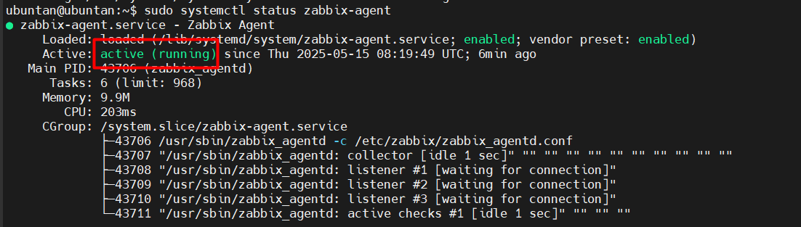
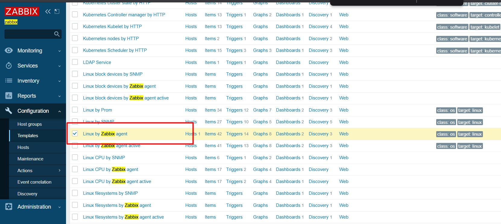
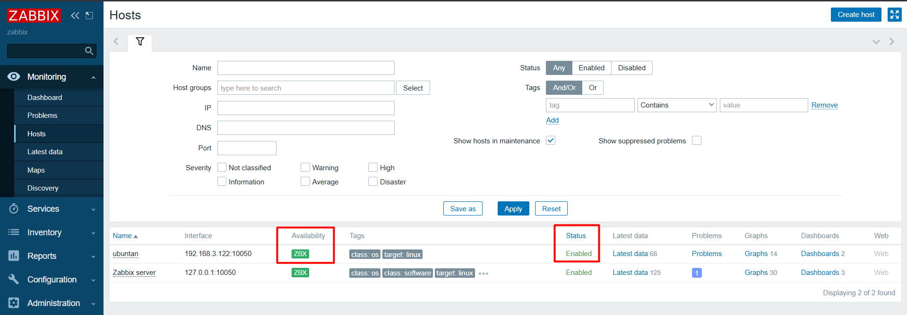

# Triển khai Zabbix agent trên ubuntu 22.04

## Giả định

- Zabbix server IP: `192.168.133.129`
- Máy ảo ubuntu là host cần giám sát (agent)

## Các bước triển khai

### 1. Cài đặt Zabbix agent

```bash
sudo apt update
sudo apt install -y wget gnupg2 lsb-release

# Thêm kho Zabbix chính thức
wget https://repo.zabbix.com/zabbix/6.0/ubuntu/pool/main/z/zabbix-release/zabbix-release_6.0-4+ubuntu22.04_all.deb

sudo dpkg -i zabbix-release_6.0-4+ubuntu22.04_all.deb

sudo apt update

# Cài Zabbix agent
sudo apt install -y zabbix-agent
```

### 2. Cấu hình Zabbix agent

Mở file cấu hình:

```bash
sudo vim /etc/zabbix/zabbix_agentd.conf
```

Chỉnh các dòng sau:

```bash
# Địa chỉ IP của Zabbix server
Server=192.168.3.115

# Địa chỉ IP của Zabbix server (để agent có thể gửi dữ liệu về server)
ServerActive=192.168.3.115

# Hostname của agent (tên này sẽ hiển thị trên Zabbix server)
Hostname=ubuntan
```

- Kiểm tra hostname của máy với lệnh `hostname`

### 3. Khởi động và kích hoạt Zabbix agent

```bash
sudo systemctl start zabbix-agent
sudo systemctl enable zabbix-agent
```

Kiểm tra trạng thái:

```bash
sudo systemctl status zabbix-agent
```

Kết quả đúng sẽ hiện Active: `active (running)`:



### 4. Mở port trên firewall

Nếu bạn đang sử dụng UFW, hãy mở port 10050:

```bash
sudo ufw allow 10050/tcp
```

### 5. Thêm host vào Zabbix Web UI

- **1. Truy cập giao diện web Zabbix:**

  - `http://192.168.3.115:8081/zabbix`

- **2. Đăng nhập:**

  - `Admin / zabbix`


- **3. Vào Configuration → Hosts → Create host.**

- **4. Nhập thông tin host:**

  - Host name: `ubuntu`
  - Visible name: `ubuntu` hoặc tùy chọn
  - Groups: Chọn `Linux servers` hoặc tạo mới
  - Agent interfaces: Nhập IP máy ubuntu

- **5. Chọn tab Templates:**

  - Nhấn Select → chọn `Template OS Linux by Zabbix agent` → Add



### 6. Kiểm tra kết nối

Vào **Monitoring** → **Hosts**, xem cột “Availability” (màu xanh là thành công).


