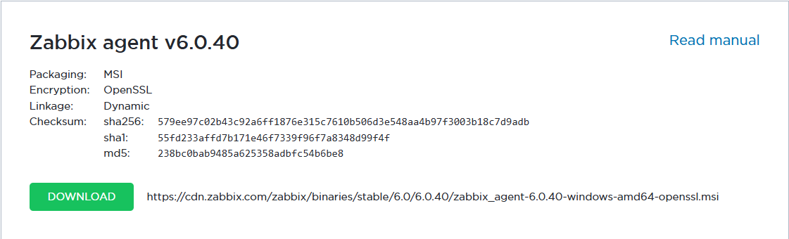
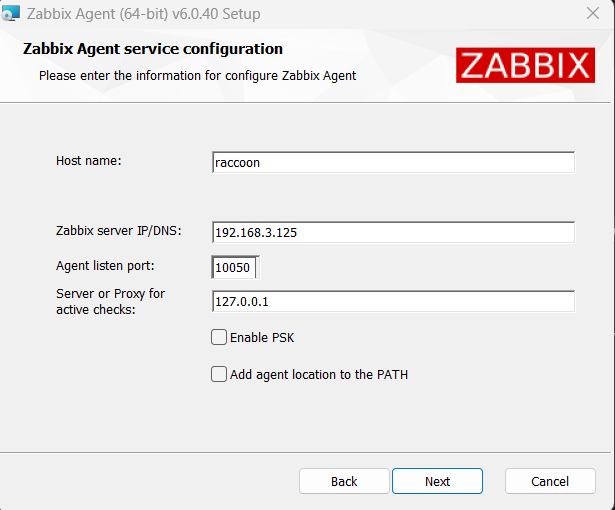
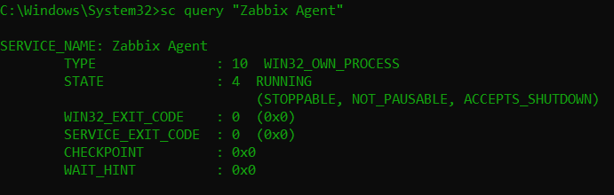
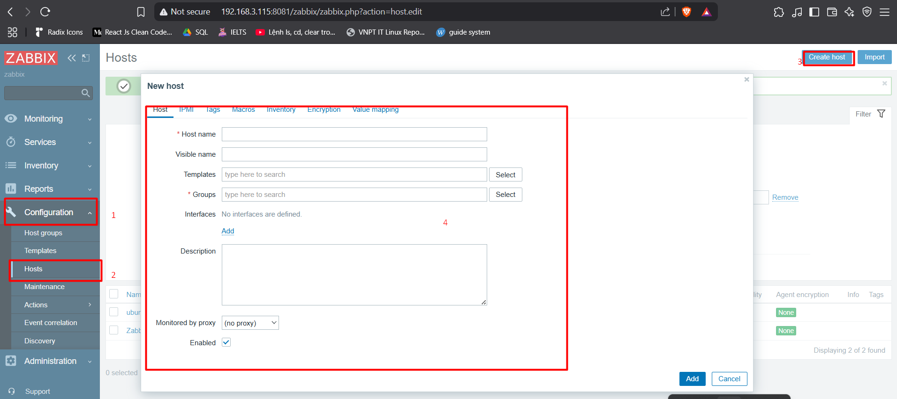
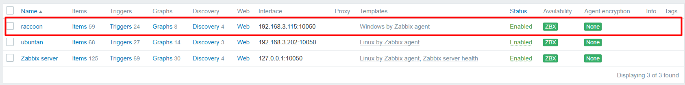

# Triển khai Zabbix agent trên ubuntu 22.04

## Giả định

- Zabbix server IP: `192.168.133.136`
- Máy windows 11 là host cần giám sát (agent)

## Các bước triển khai

### 1. Tải Zabbix Agent cho Windows

Truy cập: `https://www.zabbix.com/download_agents`

Chọn:

- Platform: `Windows`
- Version: `6.0 LTS (hoặc giống với Zabbix Server đang dùng)`
- Architecture: `x86_64`



### 2. Cài đặt Zabbix agent

Chạy file `.msi` đã tải về, làm theo từng bước:

- sau khi chọn location và chấp nhận license, cấu hình agent với IP của zabbix server, hostname (tên định danh thiết bị), listen port (mặc định là 10050):

    

### 3. Sau khi cài đặt

File cấu hình được cài đặt tại location đã chọn ở bước 2. Ở đây nằm tại:

```disk
D:\Zabbix Agent\zabbix_agentd.conf
```

Mở file bằng Notepad hoặc bất kỳ trình soạn thảo văn bản nào, tìm và chỉnh sửa các dòng sau:

```conf
Server=192.168.133.136
ServerActive=192.168.133.136
Hostname=raccoon
```

### 4. Khởi động Zabbix Agent trên Windows

Mở Command Prompt (Admin):

```bash
sc start "Zabbix Agent"
```

Kiểm tra trạng thái:

```bash
sc query "Zabbix Agent"
```

Chạy thành công:



### 5. Thêm máy windows vào Zabbix Server để giám sát

- **1. Truy cập giao diện web Zabbix:**

  - `http://192.168.133.136:8081`

- **2. Đăng nhập:**

  - `Admin / zabbix`



- **3. Vào Configuration → Hosts → Create host.**

- **4. Nhập thông tin host:**

  - Host name: `windows` (tên máy windows)
  - Groups: Chọn `Windows servers` hoặc tạo mới
  - Agent interfaces: Nhập IP máy Windows

- **5. Chọn tab Templates:**

  - Nhấn Select → chọn `Template OS Windows by Zabbix agent` → Add

### 6. Kiểm tra kết nối

Vào **Monitoring** → **Hosts**, xem cột “Availability” (màu xanh là thành công).


