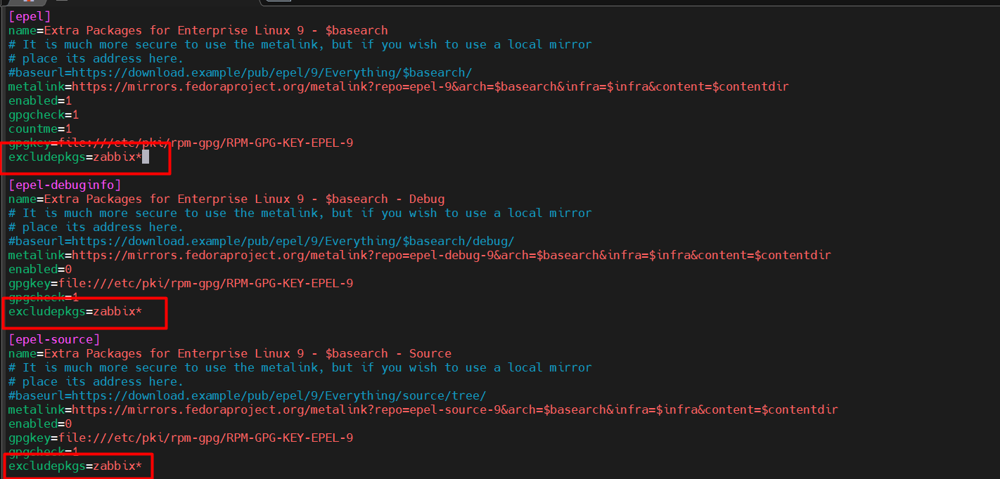
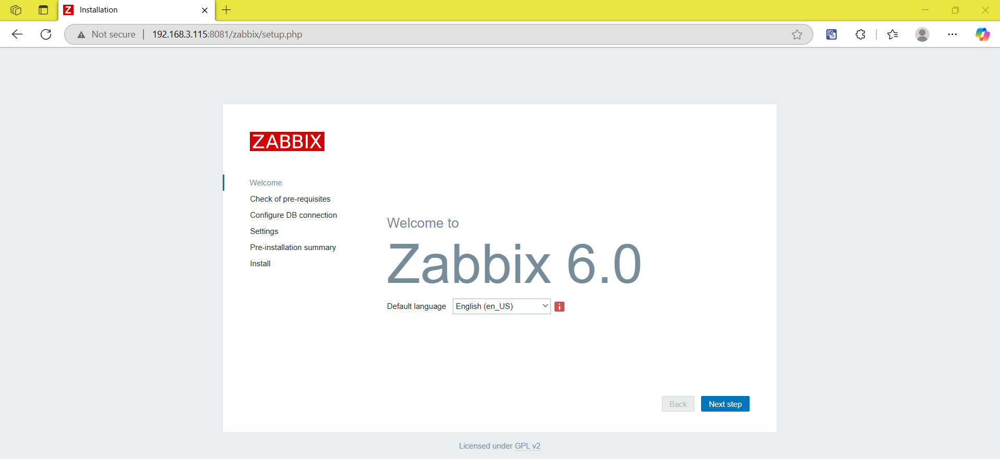
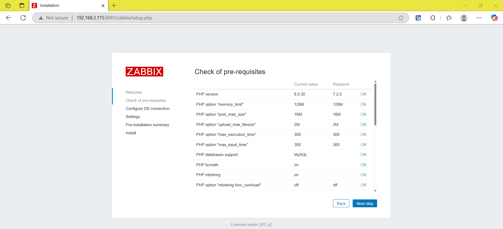
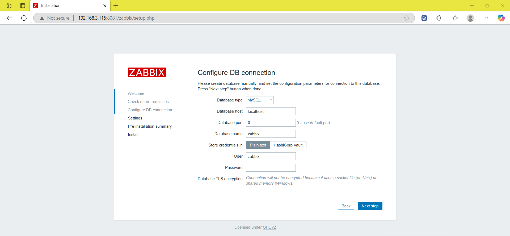
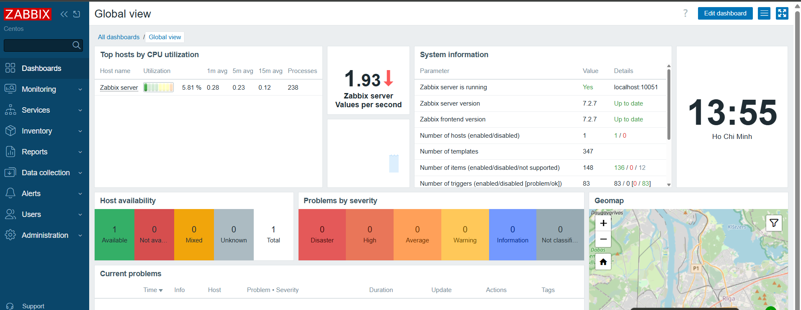

# Triển khai Zabbix Server trên CentOS Stream 9

## Chặn gói zabbix trong epel

### 1. Tại sai phải chặn?

- EPEL (Extra Packages for Enterprise Linux) cũng có chứa một số gói Zabbix cũ (thường là phiên bản thấp hơn repo chính thức).
- Nếu cài đặt mà không kiểm soát, `dnf` có thể lấy gói Zabbix từ EPEL thay vì repo chính thức → dẫn đến:
  - Xung đột phiên bản.
  - Khó nâng cấp về sau.
  - Sai version-agent-web.

=> *Giải pháp:* chặn (exclude) toàn bộ gói Zabbix trong EPEL để đảm bảo chỉ sử dụng gói từ repo chính thức của Zabbix.

### 2. Cách chặn gói Zabbix trong EPEL

Mở file epel.repo để chỉnh sửa

```bash
sudo vim /etc/yum.repos.d/epel.repo
```

Thêm dòng sau vào phần `[epel]`:

```ini
[epel]
```

Bên dưới nó, thêm `excludepkgs=zabbix*`:



- Điều này báo cho `dnf` rằng: bỏ qua mọi gói tên bắt đầu bằng `zabbix` khi đọc repo EPEL.

## Triển khai cài zabbix và cấu hình zabbix server

### 1. Thêm repo Zabbix chính thức

Thêm repo:

```bash
sudo rpm -Uvh https://repo.zabbix.com/zabbix/7.2/release/centos/9/noarch/zabbix-release-latest-7.2.el9.noarch.rpm

sudo dnf clean all
```

- `sudo dnf clean all` sau khi thêm một kho lưu trữ mới giúp DNF cập nhật ngay lập tức danh sách các gói có sẵn, đảm bảo DNF sẽ thấy và sử dụng các gói từ kho Zabbix 7.2 vừa thêm vào, tránh các lỗi cài đặt hoặc xung đột phiên bản có thể xảy ra do thông tin kho lưu trữ bị cũ.

### 2. Cài đặt MariaDB

Zabbix yêu cầu một cơ sở dữ liệu để lưu trữ thông tin. Chúng ta sẽ sử dụng MariaDB.

```bash
sudo dnf install mariadb-server -y
sudo systemctl enable --now mariadb
```

Thiết lập mật khẩu root MariaDB

```bash
sudo mysql_secure_installation
```

- Nhập mật khẩu root cho MariaDB.
- Chọn "Y" để xóa người dùng ẩn danh.
- Chọn "Y" để không cho root đăng nhập từ xa.
- Chọn "Y" để xóa cơ sở dữ liệu thử nghiệm.
- Chọn "Y" để tải lại bảng quyền (reload privilege).

### 3. Tạo database cho Zabbix

```bash
sudo mysql -u root -p
```

Trong Mysql shell, chạy:

```sql
CREATE DATABASE zabbix CHARACTER SET utf8mb4 COLLATE utf8mb4_bin;
CREATE USER 'zabbix'@'localhost' IDENTIFIED BY 'doantan28';
GRANT ALL PRIVILEGES ON zabbix.* TO 'zabbix'@'localhost';
SET GLOBAL log_bin_trust_function_creators = 1;
EXIT;
```

### 4. Cài đặt Zabbix Server, frontend và agent (dùng Nginx)

```bash
sudo dnf install zabbix-server-mysql zabbix-web-mysql zabbix-nginx-conf zabbix-sql-scripts zabbix-selinux-policy zabbix-agent -y
```

### 5. Import database schema

```bash
zcat /usr/share/zabbix/sql-scripts/mysql/server.sql.gz | mysql --default-character-set=utf8mb4 -uzabbix -p zabbix
```

- Khi nhập mật khẩu, nhập `doantan28` (mật khẩu đã tạo ở bước 3).

Tắt tùy chọn log_bin_trust_function_creators sau khi **Import database schema**:

```bash
sudo mysql -u root -p
```

```sql
SET GLOBAL log_bin_trust_function_creators = 0;
EXIT;
```

### 6. Cấu hình Zabbix Server

Mở file cấu hình Zabbix Server:

```bash
sudo vim /etc/zabbix/zabbix_server.conf
```

Tìm các dòng và thay đổi thành:

```bash
DBHost=localhost
DBName=zabbix
DBUser=zabbix
DBPassword=doantan28
```

### 7. Cấu hình Nginx cho Zabbix Web

Mở file cấu hình nginx (chạy cổng 8081):

```bash
sudo vim /etc/nginx/conf.d/zabbix.conf
```

Bỏ comment 2 dòng:

```nginx
listen 80;
server_name your_server_ip_or_domain;
```

Sửa thành:

```nginx
listen 8081;
server_name 192.168.3.125;
```

### 8. Cấu hình PHP frontend

Mở file cấu hình PHP:

```bash
sudo vim /etc/php-fpm.d/zabbix.conf
```

Chỉnh lại timezone:

```bash
php_value[date.timezone] = Asia/Ho_Chi_Minh
```

### 9. Khởi động dịch vụ

```bash
sudo systemctl enable --now zabbix-server zabbix-agent php-fpm nginx
```

### 10. Cấu hình firewall (Nếu bật)

```bash
sudo firewall-cmd --permanent --add-service=http
sudo firewall-cmd --permanent --add-port=10050/tcp
sudo firewall-cmd --permanent --add-port=10051/tcp
sudo firewall-cmd --reload
```

### 11. Truy cập zabbix web interface

Mở trình duyệt truy cập:

```bash
http://<IP_ADDRESS>/zabbix
```

**Đăng nhập:**

- Username: `Admin`
- Password: `zabbix`

sau đó cấu hình:

- DB name: `zabbix`
- DB user: `zabbix`
- DB password: `doantan28`
- Timezone: `Asia/Ho_Chi_Minh`

Kết quả:



Chọn `Next Step`.



Chọn `Next Step`.



Thêm mật khẩu: `doantan28`

*Lưu ý:* Tài khoản đăng nhập mặc định của Zabbix Web UI là:

- **Username:** `Admin`
- **Password:** `zabbix`

Sau khi đăng nhập thành công:


