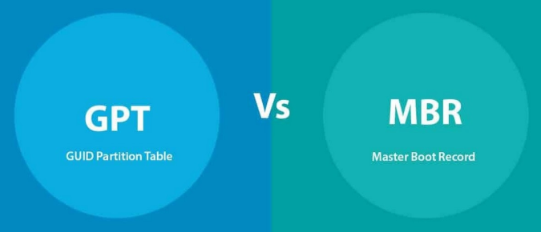
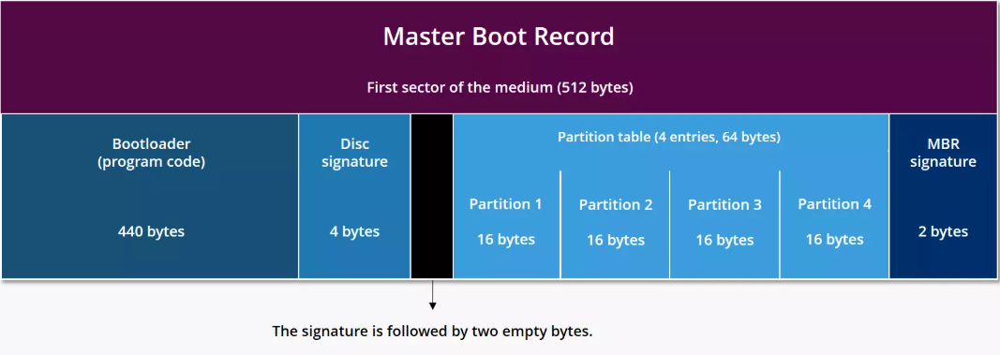
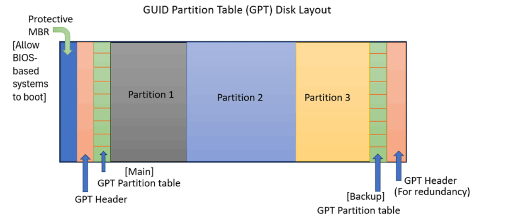

# Tìm hiểu MBR và GPT

**MBR (Master Boot Record)** và **GPT (GUID Partition Table)** là hai phương pháp chính mà ổ đĩa cứng hoặc SSD (Solid State Drive) sử dụng để tổ chức thông tin về các phân vùng (partitions) trên chúng. Chúng xác định cách dữ liệu được lưu trữ, số lượng phân vùng có thể tạo và cách máy tính khởi động từ ổ đĩa đó.

## MBR (Master Boot Record)

### MBR là gì?

**MBR (Master Boot Record)** là chuẩn phân vùng ổ đĩa ra đời từ những năm 1980, dùng với hệ thống BIOS (Basic Input/Output System) truyền thống.

- **Vị trí:** Thông tin MBR được lưu trữ ở khu vực đầu tiên của ổ đĩa (Sector 0).
- **Cách hoạt động:** Khi máy tính khởi động, BIOS sẽ đọc MBR ở Sector 0, thực thi mã khởi động và tải hệ điều hành vào bộ nhớ.
- **Hạn chế:**
  - Chỉ hỗ trợ ổ đĩa tối đa 2TB (do dùng địa chỉ LBA 32-bit). Nếu ổ đĩa lớn hơn, phần dung lượng vượt quá sẽ không được nhận dạng hoặc sử dụng.
  - Chỉ tạo được tối đa 4 phân vùng chính (nếu muốn nhiều hơn phải dùng phân vùng mở rộng).
  - Độ bền kém: Bảng phân vùng MBR chỉ có một bản sao duy nhất. Nếu Sector 0 bị hỏng, thông tin về các phân vùng có thể bị mất, khiến dữ liệu khó truy cập.

### Cấu trúc MBR

| Thành phần | Kích thước | Mô tả |
|------------|------------|-------|
| **Bootloader (program code)** | `440 bytes` | Phần mã khởi động đầu tiên mà BIOS thực thi. Tải hệ điều hành hoặc bootloader chính từ phân vùng. |
| **Disk signature** | `4 bytes` | Giá trị duy nhất để nhận diện ổ đĩa (Disk ID). Một số hệ điều hành như Windows sử dụng để nhận dạng đĩa. |
| **Padding / Reserved** | `2 bytes (đen trong hình)` | Không dùng hoặc dành riêng. Một số tài liệu tính 446 bytes cho bootloader gồm luôn phần này. |
| **Partition table** | `4 × 16 bytes = 64 bytes` | Bảng mô tả 4 phân vùng chính hoặc 3 chính + 1 mở rộng. |
| **MBR signature** | `2 bytes (giá trị 0x55AA)` | Dấu hiệu MBR hợp lệ để BIOS công nhận và tiếp tục khởi động. |

***Ghi chú:*** Một số tài liệu nói bootloader chiếm 446 byte thay vì 440 byte. Sự khác biệt là do:

- 440 bytes đầu tiên là mã máy thực thi chính.
- 6 bytes còn lại gồm:
  - 4 bytes Disk Signature.
  - 2 bytes Reserved.

## GPT (GUID Partition Table)

### GPT là gì?

**GPT (GUID Partition Table)** là một tiêu chuẩn mới hơn, được giới thiệu như một phần của UEFI (Unified Extensible Firmware Interface) - hệ thống firmware hiện đại thay thế cho BIOS.

- **Vị trí:** GPT lưu thông tin phân vùng ở nhiều vị trí trên ổ đĩa (có protective MBR ở Sector 0, bảng chính và bản sao ở đầu/cuối ổ đĩa).
- **Cách hoạt động:** Khi khởi động, firmware UEFI sẽ đọc GPT, tìm phân vùng hệ thống EFI và tải bootloader để khởi động hệ điều hành.
- **Ưu điểm:**
  - Hỗ trợ ổ đĩa lớn hơn: GPT hỗ trợ ổ đĩa có dung lượng lên đến 9.4ZB (Zettabytes), đủ lớn cho hầu hết các ứng dụng hiện tại.
  - Số lượng phân vùng: GPT cho phép bạn tạo ra nhiều phân vùng hơn, thường là lên đến 128 phân vùng mà không cần phải sử dụng phân vùng mở rộng.
  - Độ bền cao: GPT lưu trữ nhiều bản sao của bảng phân vùng trên ổ đĩa, giúp bảo vệ dữ liệu khỏi sự cố hỏng hóc.

*Lưu ý:* Một số hệ điều hành cũ không hỗ trợ GPT.

### Cấu trúc GPT

| Thành phần | Vị trí | Mô tả |
|------------|------------|-------|
| **Protective MBR** | Sector đầu tiên (LBA 0) | Dành cho các hệ thống BIOS cũ không hỗ trợ GPT, giúp nhận diện đĩa là “đã phân vùng” và ngăn không cho phần mềm ghi đè GPT. Không chứa bootloader. |
| **GPT Header (Main)** | Sector thứ hai (LBA 1) | Chứa thông tin chính về GPT như số lượng entry, vị trí bảng phân vùng, CRC để kiểm tra lỗi. |
| **GPT Partition Table (Main)** | Sau GPT Header | Danh sách các phân vùng trên đĩa (mỗi entry thường 128 bytes). Thường có thể chứa tới 128 phân vùng. |
| **Các phân vùng (Partition 1, 2, 3...)** | Tiếp theo | Dữ liệu thực tế của người dùng, hệ điều hành, EFI, v.v. |
| **GPT Partition Table (Backup)** | Trước sector cuối cùng | Bản sao của bảng phân vùng chính để dự phòng. |
| **GPT Header (Backup)** | Sector cuối cùng | Bản sao của GPT Header chính, phục vụ khôi phục nếu bị hỏng. |

***Lưu ý:***

- GPT hỗ trợ ổ đĩa lớn hơn 2 TB, vượt giới hạn 32-bit LBA của MBR.
- GPT không giới hạn số lượng phân vùng như MBR (tối đa 4 primary). Thường mặc định hỗ trợ 128 phân vùng (có thể mở rộng).
- GPT sử dụng UUID (GUID) để định danh từng phân vùng, tăng tính nhất quán và nhận diện.

## Khác biệt giữa MBR và GPT

- MBR hỗ trợ tất cả các phiên bản hệ điều hành Windows, trong khi GPT chỉ hỗ trợ phiên bản 64-bit từ Windows 7 trở đi.
- MBR chỉ hỗ trợ chia 4 phân vùng, trong khi GPT hỗ trợ chia 128 phân vùng.
- MBR hỗ trợ cả BIOS và UEFI, trong khi GPT chỉ hỗ trợ UEFI.
- MBR hỗ trợ ổ cứng tối đa 2TB, trong khi GPT hỗ trợ ổ cứng tối đa 1ZB (1024^3 TB).
- MBR sử dụng 1 thông tin lưu trữ phân vùng, trong khi GPT sử dụng 2 thông tin lưu trữ phân vùng.
