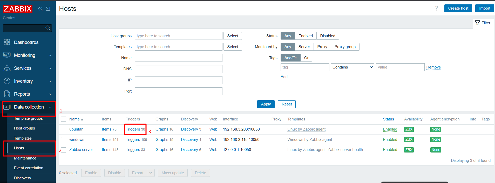
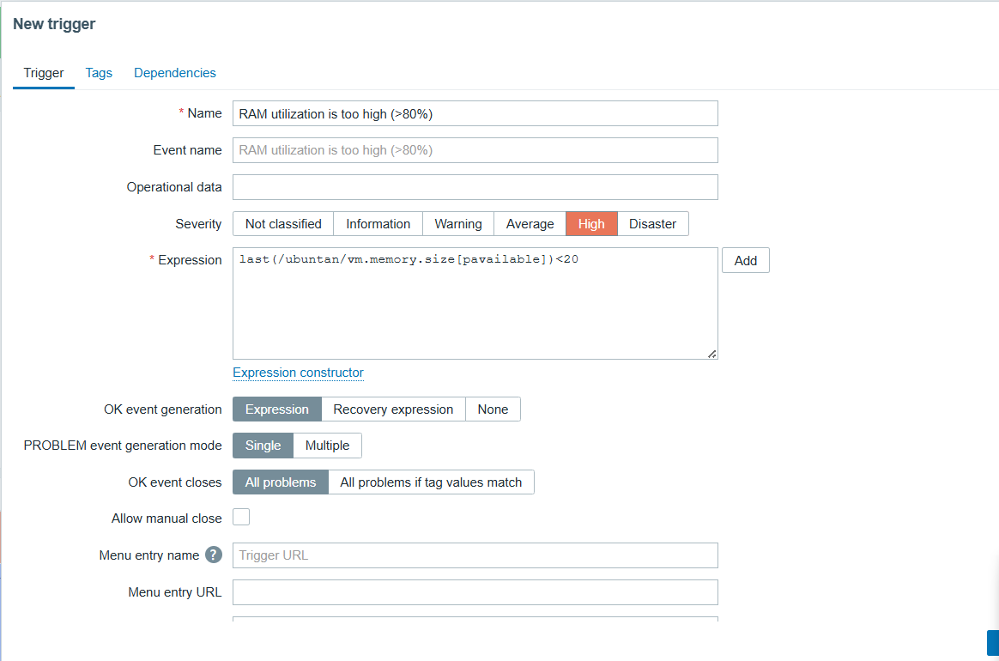

# Cấu hình cảnh báo khi RAM, CPU vượt ngưỡng nào đó (ví dụ 80%)

## Tổng quan

- Zabbix sử dụng Item để thu thập dữ liệu như CPU load, RAM usage.
- Triggers được sử dụng để xác định khi nào vượt ngưỡng.
- Khi triggers được kích hoạt, zabbix sẽ tạo cảnh báo (Problem).
- Cảnh báo sẽ được gửi qua telegram.

## Cấu hình cảnh báo CPU vượt ngưỡng 80%

### Bước 1. Xác định dữ liệu giám sát CPU

Key thường dùng:

```bash
system.cpu.load[percpu,avg1]
```

- Đây là loại load trung bình 1 phút chia cho số core CPU.
- Giá trị hợp lý: < 1 với CPU 1 core, < 4 với CPU 4 core.
- Ở đây giả định muốn dùng CPU load vượt quá 80% mức full (tương đối).

### Bước 2. Tạo Trigger cảnh báo CPU



- `Configuration` → `Hosts` → `Triggers` → `Create trigger`

Nhập thông tin:

| Trường | Giá trị |
|--------|---------|
| Name | `CPU load above 80 %` |
| Severity | `Warning` hoặc `High` |

Trong phần `Expression` → Bấm `Select` → chọn:

- **Host:** chọn đúng host.
- **Item:** chọn `system.cpu.util[,user]`
- **Function:** `>` (greater than)
- **Threshold:** `80` (tức 80%)

Ví dụ Expression:

```bash
last(/ubuntan/system.cpu.util[,user])>80
```

## Cấu hình cảnh báo RAM vượt ngưỡng 80%

Làm tương tự như bước 3 nhưng với RAM:

- Name: `RAM utilization is too high (>80%)`
- Severity: `High`
- Expression:
  - Host: chọn đúng host.
  - Item: chọn `vm.memory.size`
  - Function: chọn `Last (most recent)` → tức `.last()`
  - Operator: `<`
  - Value: `20`

  ```bash
  last(/ubuntan/vm.memory.size[pavailable])<20
  ```

- Click `Insert` → `Add`
   

Vì item `vm.memory.size` tính toán RAM khả dụng, nên đặt ngưỡng nhỏ hơn 20% để cảnh báo khi RAM sử dụng > 80%.

### Kết quả cuối cùng

| Tình huống | Hành động |
|------------|-----------|
| CPU > 80% | Tạo problem (cảnh báo) |
| RAM > 80% | Tạo problem (cảnh báo) |
| Khi quay về bình thường | Problem tự chuyển về Resolved |
