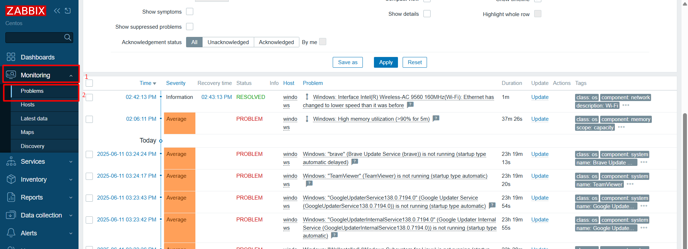

# Đọc hiểu các dữ liệu giám sát

## Các loại dữ liệu giám sát phổ biến

| Name | Key | Type of info | Unit | Meaning |
|------|-----|--------------|------|---------|
| CPU load (1m) | `system.cpu.load[percpu,avg1]` | Numeric (float) | - | Mức tải CPU trung bình 1 phút trên mỗi core |
| CPU load (5m) | `system.cpu.load[percpu,avg5]` | Numeric (float) | - | Mức tải CPU trung bình 5 phút trên mỗi core |
| CPU utilization | `system.cpu.util[,user]` | Numeric (float) | % | % CPU do user sử dụng |
| Memory available | `vm.memory.size[available]` | Numeric (unsigned) | Byte | RAM khả dụng (tuyệt đối) |
| Memory avaulable in % | `vm.memory.size[available]` | Numeric (float) | % | RAM khả dụng theo phần trăm |
| Disk space used | `vfs.fs.size[/,used]` | Numeric (unsigned) | Byte | Dung lượng đĩa đã dùng |
| Disk space used in % | `vfs.fs.size[/,pused]` | Numeric (float) | % | Dung lượng đĩa đã dùng theo phần trăm |
| Network traffic | `net.if.in[eth0]` / `net.if.out[eth0]` | Numeric (unsigned) | Bps | Lưu lượng mạng vào/ra internet |
| Ping | `icmpping` | Numeric (unsigned) | - | Kiểm tra host còn hoạt động không |

## Cách đọc hiểu dữ liệu (Latest data)

### 1. Hiểu các giá trị hiện tại

Trong giao diện Zabbix, vào `Monitoring` -> `Latest data`:

- **Host (máy chủ):** Tên của thiết bị hoặc máy chủ đang được giám sát.
- **Name (Item - mục giám sát):** Tên của thông số đang được theo dõi (ví dụ: CPU Utilization, Memory available).
- **Last Check (kiểm tra cuối cùng):** Thời điểm zabbix thu thập giá trị này lần cuối.
- **Last Value (Giá trị cuối cùng):** Giá trị mới nhất được thu thập.
- **Change (Thay đổi):** Sự thay đổi giá trị so với lần thu thập trước đó.
- **History / Graphs:** Các liên kết nhanh để xem lịch sử hoặc biểu đồ của item đó.

Cách đọc hiểu:

- **Giá trị cụ thể:**  Kiểm tra các con số. Ví dụ, nếu "Free disk space" là "10G", bạn biết còn 10GB trống. Nếu "CPU utilization" là "95%", điều đó cho thấy CPU đang hoạt động rất nặng.
- **Thời gian thu thập:** Luôn chú ý Last Check để biết giá trị có cập nhật thường xuyên không. Nếu một Item không được cập nhật trong thời gian dài, có thể Zabbix Agent hoặc kết nối đang gặp sự cố.
- **Trạng thái màu sắc:** chỉ ra trạng thái của item (ví dụ: xanh lá cây cho bình thường, vàng/cam cho cảnh báo, đỏ cho sự cố).

### 2. Phân tích biểu đồ (Graphs)

Biểu đồ là công cụ mạnh mẽ để hiểu dữ liệu giám sát:

- **Trục X (Ngang):** Thường biểu thị thời gian, có thể chọn thời gian muốn xem (ví dụ: 1h, 24h, 7days, 30days).
- **Trục Y (Dọc):** Biểu thị giá trị thông số đang dược giám sát. (ví dụ: %, MB/s, nhiệt độ).
- **Đường biểu diễn (Line/Areas):** Mỗi đường hoặc vùng màu sắc đại diện cho 1 item hoặc một thống kê (ví dụ: giá trị trung bình, tối đa, tối thiểu).

Cách đọc hiểu:

- **Xu hướng (Trends):** biểu đồ giúp thấy rõ được sự tăng giảm theo thời gian. Ví dụ: dung lượng ổ đĩa trống đang liên tục giảm, hoặc việc sử dụng CPU có xu hướng tăng vào giờ cao điểm.
- **Đột biến/Bất thường (Spikes/Anomalies):** Tìm kiếm các điểm dữ liệu bất thường, tăng vọt hoặc giảm mạnh không mong muốn. Một đợt tăng đột biến lưu lượng mạng có thể là dấu hiệu của tấn công hoặc một sự kiện lớn.
- **Tính chu kỳ (Periodicity):** Một số dữ liệu có tính chu kỳ (ví dụ: lưu lượng truy cập web cao vào ban ngày và thấp vào ban đêm). Biểu đồ giúp xác nhận các mẫu này và dễ dàng phát hiện khi có gì đó sai lệch với chu kỳ thông thường.
- **So sánh:** Biểu đồ có thể hiển thị nhiều item cùng lúc, cho phép so sánh hiệu suất giữa các thiết bị hoặc mối quan hệ giữa các thông số (ví dụ: CPU tăng cao có đi kèm với việc sử dụng RAM tăng không?).
- **Ngưỡng (Thresholds):** Các ngưỡng cảnh báo thường được vẽ trên biểu đồ (đường nét đứt màu đỏ hoặc cam) để dễ dàng thấy khi nào giá trị vượt quá giới hạn cho phép.

### 3. Xem xét lịch sử (History)

Lịch sử cung cấp một cái nhìn chi tiết về các giá trị thu thập được theo thứ tự thời gian:

- **Timestamp:** Thời gian chính xác khi giá trị được thu thập.
- **Value:** Giá trị thu thập tại thời điểm đó.

Cách đọc hiểu:

- **Kiểm tra chi tiết:** Khi thấy một điểm bất thường trên bản đồ, có thể dùng lịch sử để xem giá trị chính xác tại thời điểm đó.
- **Truy vết:** Dùng lịch sử để truy vết các thay đổi nhỏ hoặc xác định chính xác thời điểm sự cố bắt đầu hoặc kết thúc.

### 4. Phản ứng với sự kiện (Events) và cảnh báo (Alerts)

**Trigger (Ngưỡng kích hoạt):** là quan trọng của hệ thống cảnh báo Zabbix. Trigger được định nghĩa để chuyển sang trạng thái "Problem" (sự cố) khi một item vượt qua ngưỡng nhất định hoặc một điều kiện nào đó được thỏa mãn, lúc đó một "event" được tạo ra.

