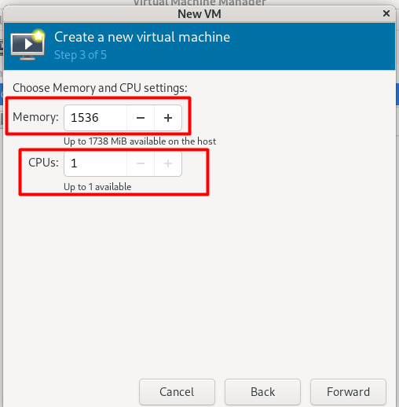
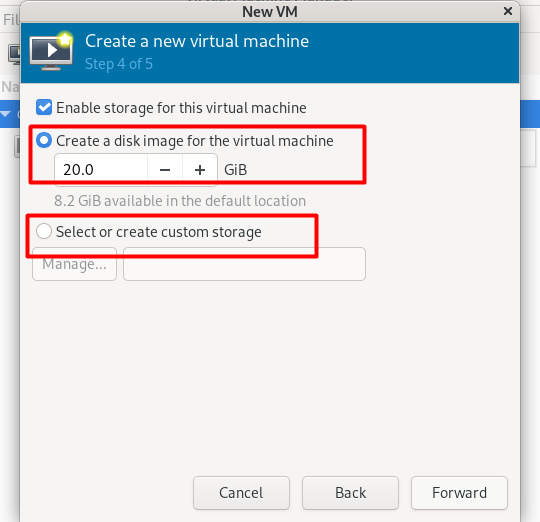
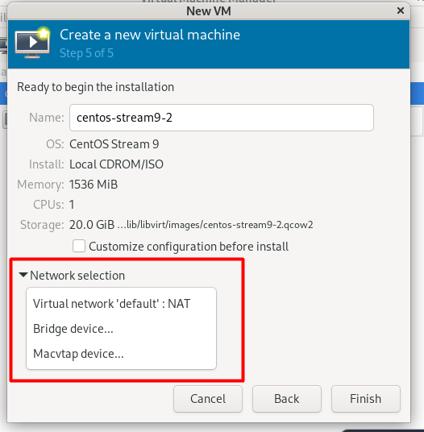

# Các option khi tạo VM (CPU, Disk, NIC)

## Option của CPU

Ta có thể tùy chỉnh dung lượng RAM và số CPU ảo cho VM.

## Option của Disk

- Tạo 1 Disk image để lưu máy ảo
- Hoặc chọn tạo một storage tùy chỉnh

## Option của NIC

- Tùy vào mục đích sử dụng VM để chọn kiểu card mạng thích hợp.
