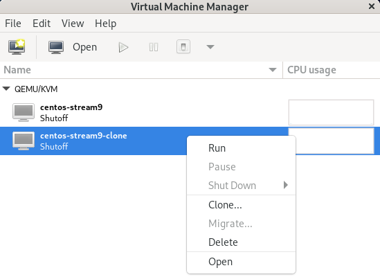
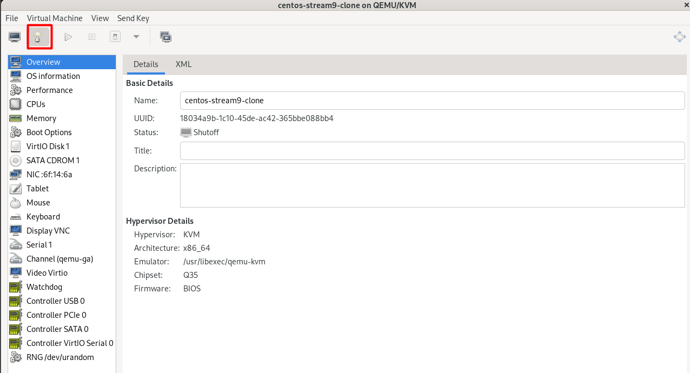
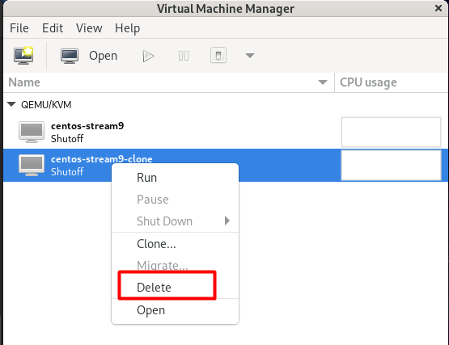
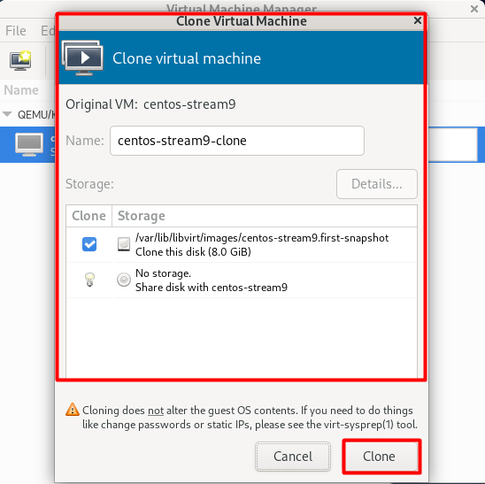
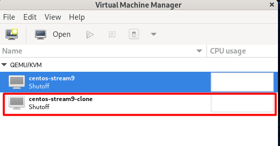

# Các tính năng của KVM đối với các VM

## I. Thêm VM

## II. Sửa VM

Click chuột phải vào VM cần sửa, sau đó chọn `Open` để mở VM.

- Sau khi mở VM, click vào `Show Virtual Hardware Details` để chỉnh sửa các thông tin của VM.

- Sau chỉnh sửa, click vào `Apply` để lưu lại các thay đổi.

## III. Xoá VM

- click chuột phải vào VM cần xoá, sau đó chọn `delete`.

## IV. Clone VM

### 1. Chuột phải phải VM muốn clone và click vào "Clone"

### 2. Chỉnh sửa các thông tin cơ bản của VM clone và nhấn `clone`

### 3. Sau khi thực hiện các bước trên, sẽ thấy vm mới được clone từ vm gốc

## V. Snapshot
