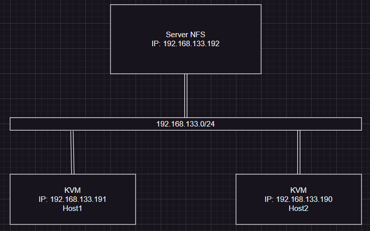
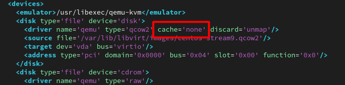

# Live migrate trên KVM

## I. Tổng quan

## II. Chuẩn bị

Sử dụng lệnh dưới đây để tắt firewall và selinux (dùng trong môi trường lab nên tắt):

```bash
sudo systemctl stop firewalld
sudo setenforce 0
```

Nếu firewall được bật lại trong tương lai, mở các cổng NFS:

```bash
sudo firewall-cmd --permanent --add-service=nfs
sudo firewall-cmd --reload
```

**Mô hình:**



**Cơ chế cơ bản của Live Migrate:**

Về cơ bản cơ chế di chuyển vm khi vm vẫn đang hoạt động. Quá trình trao đổi diễn ra nhanh các phiên làm việc kết nối hầu như không cảm nhận được sự gián đoạn nào. Quá trình Live Migrate được diễn ra như sau:

- Bước đầu tiên của quá trình Live Migrate: 1 ảnh chụp ban đầu của VM cần chuyển trên **host1** được chuyển sang VM trên **host2**.
- Trong trường hợp người dùng đang truy cập VM tại **host1** thì những sự thay đổi và hoạt động trên **host2** vẫn diễn ra bình thường, tuy nhiên những thay đổi này sẽ không được ghi nhận.
- Những thay đổi của VM trên **host1** được đồng bộ liên tục đến **host2**.
- Khi đã đồng bộ xong thì VM trên **host1** sẽ offline và các phiên truy cập trên **host1** được chuyển sang **host2**.

## III. Cài đặt

### 1. Cấu hình phân giải tên miền

Để có thể live migrate giữa 2 host KVM thì chúng cần biết tên miền của nhau, có thể cấu hình dịch vụ DNS hoặc sử dụng file `/etc/hosts` để ánh xạ tên miền với địa chỉ IP.

- Sửa tên máy trong file `/etc/hostname` hoặc dùng nhanh với lệnh:

    ```bash
    # nfs-server
    sudo hostnamectl set-hostname nfs-server
    # host1
    sudo hostnamectl set-hostname kvm-host1
    # host2
    sudo hostnamectl set-hostname kvm-host2
    ```

- Sửa file `/etc/hosts` trên cả 3 máy để ánh xạ tên miền với địa chỉ IP:

    ```bash
    # Thêm các dòng sau vào cuối file /etc/hosts
    192.168.133.192  nfs-server
    192.168.133.191  host1.local host1
    192.168.133.190  host2.local host2

    # restart sau chỉnh sửa
    sudo systemctl restart systemd-hostnamed
    ```

### 2. Cài đặt NFS

**Trên NFS server:**

```bash
sudo dnf install -y nfs-utils
sudo mkdir -p /home/doantan/storage
# Đặt owner là doantan
sudo chown doantan:doantan /home/doantan/storage
# Sửa /etc/exports
"/home/doantan/storage 192.168.133.191(rw,sync,no_root_squash) 192.168.133.190(rw,sync,no_root_squash)" | sudo tee /etc/exports
# Cập nhật file vừa chỉnh sửa
sudo exportfs -rav
# Khởi động và bật dịch vụ NFS
sudo systemctl enable --now rpcbind nfs-server
# Kiểm tra
showmount -e localhost
# hoặc từ host1:
showmount -e nfs-server
```

**Trên 2 máy KVM host:**

```bash
sudo dnf install -y nfs-utils
# Mount tạm thời
sudo mount nfs-server:/home/doantan/storage /var/lib/libvirt/images
# # Để mount tự động khi boot, thêm vào /etc/fstab
echo "nfs-server:/home/doantan/storage /var/lib/libvirt/images nfs defaults,_netdev 0 0" | sudo tee -a /etc/fstab

# Kiểm tra sau mount
mount | grep /var/lib/libvirt/images
ls -la /var/lib/libvirt/images
# thử tạo file để kiểm tra write
sudo touch /var/lib/libvirt/images/testfile_from_host1
ls -l /var/lib/libvirt/images/testfile_from_host1
```

### 3. Cài đặt KVM

- Khi cài đặt VM ta cần lưu file disk của VM vào thư mục đã mount với thư mục được share của NFS server. Ở đây ta sẽ lưu vào thư mục mặc định `/var/lib/libvirt/images`.

- Tạo máy ảo **centos-stream9** với `virt-manager`.

- Sau khi cài máy ảo xong ta cần thêm thông tin sau vào trong file xml của VM bằng cách dùng lệnh

    ```bash
    sudo virsh edit <vm-name>
    ```

- Thêm vào `cache='none'`

    

- Reboot lại VM.

### 4. Kết nối qemu giữa 2 KVM host

- Để live migrate giữa 2 host thì chúng phải được kết nối với nhau, thực hiện các lệnh sau trên cả 2 host:

    ```bash
    sudo sed -i 's/#listen_tls = 0/listen_tls = 0/' /etc/libvirt/libvirtd.conf
    sudo sed -i 's/#listen_tcp = 1/listen_tcp = 1/' /etc/libvirt/libvirtd.conf
    sudo sed -i 's/#tcp_port = "16509"/tcp_port = "16509"/' /etc/libvirt/libvirtd.conf
    sudo sed -i 's/#listen_addr = "10.10.34.1"/listen_addr = "0.0.0.0"/' /etc/libvirt/libvirtd.conf
    sudo sed -i 's/#auth_tcp = "sasl"/auth_tcp = "none"/' /etc/libvirt/libvirtd.conf
    # Bật libvirtd TCP socket
    sudo systemctl enable --now libvirtd-tcp.socket
    sudo systemctl enable --now libvirtd.service
    # Kiểm tra cổng (Nếu thấy 0.0.0.0:16509 là OK)
    ss -tlnp | grep 16509
    # Tắt TLS (nếu không dùng)
    sudo systemctl disable --now libvirtd-tls.socket
    ```

- Restart lại libvirtd trên cả 2 máy:

    ```bash
    sudo systemctl restart libvirtd
    ```

### 5. Live migrate VM

**Kiểm tra VM trên host1:**

```bash
sudo virsh list --all
# Hoặc
virsh --connect qemu:///system list --all
```


Kiểm tra VM trên host2 với lệnh tương tự, kết quả:


**Chạy migrate:**

```bash
sudo virsh migrate --live centos-stream9 qemu+tcp://host2/system
```

- `qemu+tcp://host2/system` nghĩa là dùng TCP migration đến libvirt “system” của host2.
- Nếu cần giữ VM trên host1 sau khi migrate, thêm `--p2p --tunnelled`.

Nếu muốn migrate khi máy đang tắt, thì đó là **cold migration**, không cần `--live`.

```bash
sudo virsh migrate centos-stream9 qemu+tcp://host2/system
```

**Kết quả:**


- Khi migrate, trên host1 sẽ chỉ còn file XML của VM, không còn file disk nữa. vậy nên nó vẫn hiện nhưng không thể chạy.


