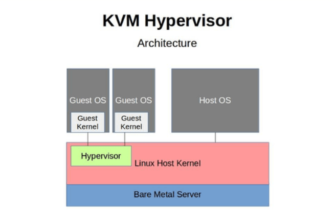

# Tìm hiểu KVM cơ bản

## I. KVM là gì?

### 1. Khái niệm KVM

**KVM (Kernel-based Virtual Machine)** là một module của nhân Linux, biến nhân Linux thành hypervisor loại 1 (bare-metal) để tạo và quản lý máy ảo. Nó cung cấp khả năng ảo hóa hỗ trợ phần cứng (Hardware-Assisted Virtualization).

**Đặc điểm:**

- **Hỗ trợ phần cứng:** Sử dụng công nghệ ảo hóa phần cứng (Intel VT-x, AMD-V) để máy ảo truy cập trực tiếp tài nguyên (CPU, RAM).
- **Mô-đun nhân:** KVM là mô-đun trong nhân Linux, hoạt động với QEMU để mô phỏng phần cứng ảo (mạng, lưu trữ).
- **Driver VirtIO:** Cung cấp driver hiệu suất cao (gần giống para-virtualization) cho I/O của máy ảo.
- **Mở và miễn phí:** Là phần mềm mã nguồn mở, tích hợp trong hầu hết bản phân phối Linux.

### 2. KVM để làm gì?

- **Tạo và quản lý máy ảo:** Chạy nhiều hệ điều hành (Linux, Windows, v.v.) trên một máy chủ vật lý, tối ưu tài nguyên phần cứng.
- **Tối ưu hiệu suất:** Sử dụng ảo hóa hỗ trợ phần cứng (Intel VT-x, AMD-V) và VirtIO để đạt hiệu suất gần với máy vật lý.
- **Hỗ trợ đám mây:** Cung cấp nền tảng cho các dịch vụ đám mây (VD: OpenStack, Proxmox) để triển khai máy ảo linh hoạt.
- **Kiểm thử và phát triển:** Tạo môi trường ảo để thử nghiệm phần mềm, hệ điều hành, hoặc cấu hình mà không ảnh hưởng hệ thống chính.
- **Quản lý tập trung:** Dùng công cụ như libvirt, virt-manager để cấu hình, giám sát, và sao lưu máy ảo dễ dàng.
- **Tiết kiệm chi phí:** Giảm số lượng máy chủ vật lý, tiết kiệm điện, không gian, và chi phí bảo trì.
- **Bảo mật:** Cô lập máy ảo, giảm rủi ro lây lan mã độc, tận dụng tính năng bảo mật của Linux.

## II. Loại ảo hóa KVM

**KVM** thuộc Hypervisor loại 1 (Type 1), còn gọi là **hypervisor bare-metal**. Vì **KVM** dựa vào **Linux** làm host OS, nên trông giống Hypervisor Type 2 (dùng hệ điều hành), nhưng thực chất KVM là một module trong kernel, tức là chạy ở mức nhân => bản chất là Type 1.

### 2. So sánh KVM với các loại hypervisor còn lại

| Tiêu chí | KVM | VMware ESXi | Microsoft Hyper-V | Xen | VirtualBox/VMware WS |
|----------|-----|-------------|-------------------|-----|-----------|
| Loại hypervisor | Type 1 (nhúng trong kernel Linux) | Type 1 (bare-metal) | Type 1 (nhưng chạy trên Windows) | Type 1 (bare-metal hoặc host-based) | Type 2 (trên OS) |
| Môi trường chạy | Linux | Bare-metal | Windows | Bare-metal hoặc Linux | Windows, macOS, Linux |
| Hiệu năng ảo hóa | Rất cao (gần như native) | Rất cao (enterprise-level) | Cao (tốt cho Windows workload) | Cao (tốt cho cloud) | Trung bình đến thấp |
| Cấp độ tích hợp kernel | Cao (module của Linux kernel) | Không tích hợp OS | Gắn với Windows OS | Chạy riêng biệt hoặc qua Dom0 | Phụ thuộc vào OS host |
| Hỗ trợ tính năng nâng cao | Live Migration, Snapshots, etc. | Rất đầy đủ, mạnh nhất | Có nhưng chủ yếu với Windows | Đầy đủ nhưng phức tạp | Có nhưng giới hạn |
| Dễ sử dụng | Trung bình (CLI + libvirt, virt-manager) | Rất thân thiện (GUI quản lý vSphere) | Thân thiện nếu quen Windows | Khá khó (CLI, cấu hình phức tạp) | Rất dễ dùng cho người mới |
| Tính mở và chi phí | Miễn phí, mã nguồn mở | Mất phí bản quyền | Có bản miễn phí, bản đầy đủ trả phí | Miễn phí, mã nguồn mở | Miễn phí (hoặc giới hạn bản Pro) |
| Ứng dụng phổ biến | Server Linux, Cloud (OpenStack, Proxmox) | Doanh nghiệp lớn, Data center | Môi trường Windows doanh nghiệp | Cloud (AWS EC2 trước đây dùng Xen) | Thử nghiệm, học tập |

## III. Các thành phần trong KVM

```plaintext
     +--------------------+
     |   virt-manager     |     <- Giao diện người dùng (GUI)
     |     virsh          |     <- CLI
     +--------------------+
               ↓
         +------------+
         |   libvirt  |     <- Công cụ quản lý
         +------------+
               ↓
     +--------------------+
     |     QEMU + KVM     |     <- Thực thi VM (QEMU mô phỏng, KVM tăng tốc bằng phần cứng)
     +--------------------+
               ↓
         +----------+
         |  Kernel  |     <- Linux Host Kernel có mô-đun KVM
         +----------+
               ↓
         +----------+
         | Hardware |
         +----------+
```

### 1. KVM Kernel Module

- Mô-đun trong nhân Linux, cung cấp khả năng ảo hóa hỗ trợ phần cứng (Intel VT-x, AMD-V).
- Chuyển nhân Linux thành hypervisor loại 1, quản lý tài nguyên (CPU, RAM) cho máy ảo.

### 2. QEMU (Quick Emulator)

- Phần mềm mô phỏng phần cứng ảo (ổ cứng, mạng, GPU) cho máy ảo.
- Kết hợp với KVM để xử lý I/O và cung cấp môi trường ảo hoàn chỉnh.

### 3. VirtIO

- Bộ driver hiệu suất cao (giống para-virtualization) cho máy ảo, tối ưu hóa I/O (mạng, lưu trữ).
- Giảm chi phí mô phỏng, tăng tốc độ truy cập tài nguyên.
- >VirtIO không phải là thành phần độc lập như KVM module hay QEMU, mà là giải pháp driver và backend nằm trong guest và QEMU để tối ưu hiệu suất I/O.

```plaintext
Guest OS
   │
VirtIO drivers (cài trong Guest OS)
   │
VirtIO backend (trong QEMU)
   │
QEMU giao tiếp với phần cứng thật qua Linux host
```

### 4. Các công cụ quản lý

- **libvirt:** Thư viện mã nguồn mở (Library for Virtualization), cung cấp API và công cụ để quản lý các nền tảng ảo hóa (KVM, Xen, VMware).
- **virt-manager (Virtual Machine Manager):** Ứng dụng giao diện đồ họa để quản lý máy ảo KVM (và các hypervisor khác qua libvirt).
- **virsh (Virtual Shell):** Công cụ dòng lệnh của libvirt để quản lý máy ảo.

## IV. Cơ chế hoạt động của KVM



**Bare Metal Server (phần màu xanh dưới cùng):**

- Là phần cứng vật lý thực sự: CPU, RAM, ổ cứng, v.v.
- KVM hoạt động trực tiếp trên phần cứng này.

**Linux Host Kernel (màu đỏ):**

- Là hệ điều hành Linux cài đặt trên máy chủ vật lý, nơi KVM được bật như một mô-đun kernel.
- KVM thực tế là một mô-đun trong kernel Linux, biến kernel Linux thành một hypervisor (kiểu 1).

**Hypervisor (màu xanh lá):**

- Phần này đại diện cho KVM kernel module – nó cho phép tạo và quản lý máy ảo.
- Chạy trong không gian kernel của hệ điều hành Linux.

**Host OS:**

- Là hệ điều hành chính (Linux) cài trực tiếp trên máy chủ.
- Bạn có thể chạy các dịch vụ, ứng dụng như bình thường.

**Guest OS & Guest Kernel:**

- Là các máy ảo (Virtual Machines) do KVM quản lý.
- Mỗi máy ảo có:
  - **Guest Kernel:** kernel riêng của hệ điều hành máy ảo (Windows, Linux,...).
  - **Guest OS:** hệ điều hành máy ảo.

**Các bước hoạt động cơ bản:**

1. **Khởi động hệ thống:** Khi hệ thống khởi động, Kernel Based Virtual Machine được khởi động cùng với nhân Linux.
2. **Tạo máy ảo:** Người dùng sử dụng các công cụ quản lý VM như libvirt hoặc virsh để tạo các máy ảo VM.
3. **Cấu hình máy ảo:** Người dùng cần cấu hình các thông số cho VM như hệ điều hành, CPU, RAM, ổ đĩa, mạng,...
4. **Khởi động máy ảo:** Khi VM được khởi động, KVM sẽ tạo một môi trường ảo riêng biệt cho VM.
5. **Chạy hệ điều hành khách:** Hệ điều hành khách được cài đặt và chạy trong môi trường ảo.
6. **Quản lý máy ảo:** Người dùng có thể sử dụng các công cụ quản lý VM để theo dõi, điều khiển và quản lý các VM.

**Cơ chế hoạt động chi tiết:**

- **KVM sử dụng mô hình hypervisor dựa trên mô-đun:** Mô-đun KVM được tích hợp vào nhân Linux, cho phép KVM tận dụng tối đa các tính năng và hiệu suất của hệ thống.
- **KVM sử dụng QEMU để giả lập phần cứng:** QEMU là một trình giả lập phần cứng mã nguồn mở, cung cấp khả năng giả lập các thiết bị phần cứng như CPU, RAM, ổ đĩa, mạng,... cho các VM.
- **KVM sử dụng libvirt để quản lý VM:** Libvirt là một thư viện quản lý VM mã nguồn mở, cung cấp giao diện lập trình ứng dụng (API) để thao tác với các VM.
- **KVM sử dụng virsh để quản lý VM dòng lệnh:** Virsh là một công cụ quản lý VM dòng lệnh, cho phép người dùng tạo, khởi động, dừng, quản lý và cấu hình các VM.

## V. Mối quan hệ giữa KVM và OS (Operating System)

### 1. KVM là một phần của Linux Kernel

- KVM không phải là một phần mềm riêng biệt chạy trên hệ điều hành như VirtualBox.
- Nó là một mô-đun được tích hợp vào nhân (kernel) của Linux, bắt đầu từ phiên bản 2.6.20.
- Khi được bật, Linux kernel có thể hoạt động như một hypervisor Type 1 (giống như VMware ESXi hay Hyper-V).

> Linux + KVM = Hypervisor Type 1

### 2. Linux OS là môi trường host (Host OS)

- Người dùng cài đặt Linux OS trên máy chủ vật lý. Sau đó bật/tải mô-đun KVM.
- KVM tận dụng các tính năng của Linux như:
  - Quản lý bộ nhớ.
  - Lập lịch CPU.
  - Hệ thống tập tin.
  - Driver thiết bị.
- Vì vậy, Linux OS vừa là một hệ điều hành đầy đủ, vừa là nền tảng để KVM tạo và quản lý máy ảo.

### 3. Từ Linux host, có thể tạo các máy ảo (Guest OS)

- Sau khi KVM được kích hoạt, có thể tạo các VM (máy ảo) sử dụng các công cụ như `libvirt`, `virt-manager`, `virsh`, hoặc dùng QEMU trực tiếp.
- Mỗi máy ảo có thể cài đặt hệ điều hành riêng biệt: Linux, Windows, BSD, v.v.

| Thành phần | Vai trò |
|------------|--------|
| **Linux OS (Host)** | Hệ điều hành chủ, nơi mô-đun KVM hoạt động, cung cấp tài nguyên hệ thống |
| **KVM** | Một mô-đun trong kernel Linux, biến hệ điều hành Linux thành hypervisor |
| **Guest OS** | Các máy ảo chạy trên KVM, có thể là bất kỳ hệ điều hành nào |
