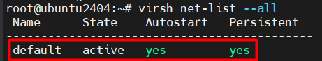
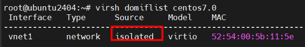

# Chuyển đổi máy ảo KVM sang chế độ host-only (isolated)

## I. Tình huống

- Máy **Ubuntu 24.04** được tạo trên **OpenStack** (đây là host).
- Trên máy Ubuntu này đã cài **KVM** và tạo một máy ảo **CentOS 7**.
- Máy CentOS 7 hiện đang dùng mạng mặc định của KVM (`default` = NAT).
- Chuyển máy CentOS 7 sang chế độ **host-only (isolated)**.

## II. Cách làm

### 1. Kiểm tra mạng hiện có

```bash
virsh net-list --all
```



- Kết quả sẽ thấy `default` (NAT).

### 2. Tạo mạng host-only (isolated)

Tạo file XML, ở đây là `isolated.xml` với nội dung:

```xml
<network>
  <name>isolated</name>
  <bridge name='virbr100' stp='on' delay='0'/>
  <ip address='192.168.100.1' netmask='255.255.255.0'>
    <dhcp>
      <range start='192.168.100.50' end='192.168.100.200'/>
    </dhcp>
  </ip>
</network>
```

- `name` = tên network đặt.
- `bridge name` = interface ảo mà libvirt tạo (ở đây là `virbr10`).
- `ip` = IP của bridge trên máy Ubuntu (host). Máy ảo sẽ nhận IP trong subnet này.

> không có thẻ <forward ...> → mạng sẽ là isolated.
virbr100 là bridge ảo sẽ xuất hiện trên host với IP 192.168.100.1.

### 3. Định nghĩa và bật mạng

```bash
virsh net-define isolated.xml
virsh net-autostart isolated
virsh net-start isolated
```

### 4. Gán máy ảo CentOS 7 sang mạng host-only

```bash
virsh edit centos7.0
```

Trong phần `<interface>`, sửa từ:

```xml
<interface type='network'>
  <source network='default'/>
```

Thành:

```xml
<interface type='network'>
  <source network='isolated'/>
```

### 5. Detach NIC cũ (default)

Xác định MAC cũ (`52:54:00:7a:91:bb`) rồi chạy:

```bash
virsh detach-interface --domain centos7.0 --type network --mac 52:54:00:7a:91:bb --persistent
```

### 6. Attach NIC mới (isolated)

``` bash
virsh attach-interface --domain centos7.0 --type network --source isolated --model virtio --persistent
```

### 7. Kiểm tra lại

```bash
virsh domiflist centos7.0
```

Kết quả cần thấy:



### 8. Khởi động lại VM

```bash
virsh reboot centos7.0
```
