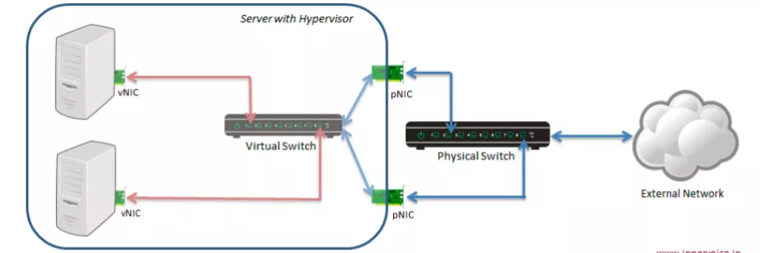
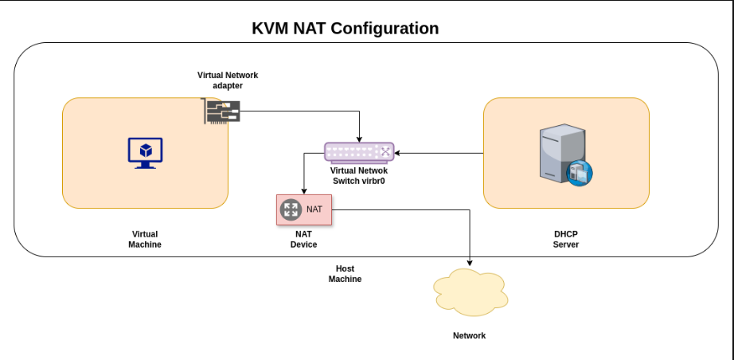
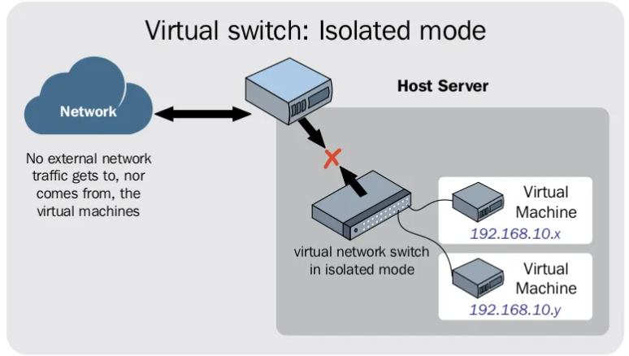

# Phân tích đường đi gói tin với 3 chế độ card mạng

## I. Bridged



### 1. Các thành phần trong sơ đồ bridged

- **Server with Hypervisor:** Đây là máy chủ vật lý đang chạy một Hypervisor (như KVM).
- **Hai máy chủ ảo (Virtual Machines):** Đây là các máy ảo (VMs) được tạo và chạy trên Hypervisor.
- **vNIC (Virtual Network Interface Card):** Mỗi máy ảo có một card mạng ảo (vNIC).
- **Virtual Switch (Switch ảo):** là một thành phần phần mềm được tạo và quản lý bởi Hypervisor trên Server. Trong KVM, đây chính là Linux Bridge (ví dụ: `br0`).
- **pNIC (Physical Network Interface Card):** card mạng vật lý trên Server, kết nối với mạng vật lý bên ngoài.
- **Physical Switch (Switch vật lý):** Switch vật lý nằm ngoài Server, kết nối Server với mạng bên ngoài.
- **External Network:** Đại diện cho mạng bên ngoài (mạng LAN của bạn, Internet, v.v.).

### 2. Cách thức hoạt động Bridged

**2.1 Kết nối bên trong server ảo:**

- Mỗi **vNIC** của máy ảo được kết nối trực tiếp vào **Virtual Switch**.
- Các **pNIC** của Server cũng được kết nối (hoặc gắn vào) **Virtual Switch**.
- Điều này tạo ra một "cầu nối" logic, nơi **Virtual Switch** đóng vai trò trung gian kết nối giữa các máy ảo và giữa máy ảo với mạng vật lý bên ngoài thông qua **pNIC**.

**2.2 Giao tiếp giữa các VM (nội bộ trên cùng Host):**

- Khi một gói tin từ một máy ảo muốn gửi đến máy ảo khác trên cùng một Server:
- Gói tin từ vNIC của VM nguồn đi vào Virtual Switch.
- Virtual Switch (giống như một switch vật lý) sẽ kiểm tra địa chỉ MAC đích của gói tin.
- Nếu địa chỉ MAC đích là của một vNIC khác cũng được kết nối với Virtual Switch, Virtual Switch sẽ chuyển tiếp gói tin đó trực tiếp đến vNIC của VM đích.
- Đường đi (màu đỏ trong sơ đồ): VM1 -> vNIC -> Virtual Switch -> vNIC -> VM2.

**2.3 Giao tiếp giữa VM và External Network (ra/vào mạng vật lý):**

- Gói tin từ vNIC của VM đi vào Virtual Switch.
- Virtual Switch kiểm tra địa chỉ MAC đích. Nếu địa chỉ MAC đích nằm ngoài Server (ví dụ: MAC của router hoặc một máy tính vật lý khác trên mạng LAN), Virtual Switch sẽ chuyển tiếp gói tin đó qua một trong các pNIC được kết nối với nó.
- pNIC sẽ gửi gói tin ra Physical Switch.
- Đường đi (màu đỏ -> màu xanh trong sơ đồ): VM -> vNIC -> Virtual Switch -> pNIC -> Physical Switch -> External Network.
- Phản hồi (màu xanh -> màu đỏ trong sơ đồ): External Network -> Physical Switch -> pNIC -> Virtual Switch -> vNIC -> VM.

> Quá trình này hoàn toàn diễn ra bên trong Host, không cần gói tin phải đi ra pNIC hay Physical Switch.

## II. NAT



### 1. Các thành phần trong sơ đồ NAT

- **Host Machine (Máy chủ KVM):** Đây là máy vật lý chạy hệ điều hành Linux nơi bạn cài đặt KVM và `libvirt`.
- **Virtual Machine (Máy ảo):** Đây là máy ảo khách được tạo trên KVM.
- **Virtual Network adapter (Card mạng ảo của VM):** Card mạng mà bạn gán cho máy ảo.
- **Virtual Network Switch 'virbr0' (Switch ảo):** Một switch ảo được tạo ra trên Host Machine. Nó tương tự như một switch vật lý, kết nối các máy ảo với nhau và với các thành phần mạng ảo khác trên Host. `virbr0` là tên mặc định cho mạng ảo NAT mặc định trong `libvirt`.
- **NAT Device (Thiết bị NAT):** Đây là một thành phần ảo hoạt động như một Router có chức năng NAT. Nó được tích hợp vào mạng ảo `virbr0`.
- **DHCP Server (Máy chủ DHCP):** Một máy chủ DHCP ảo cũng được tích hợp vào mạng ảo `virbr0`. Nhiệm vụ của nó là cấp phát địa chỉ IP tự động cho các máy ảo kết nối vào `virbr0`.
- **Network (Mạng bên ngoài):** Đại diện cho mạng vật lý bên ngoài Host Machine (Internet hoặc mạng LAN của bạn).

### 2. Cách thức hoạt động NAT

**1. Kết nối nội bộ trong host:**

- Card mạng ảo của VM được kết nối vào **Virtual Network Switch 'virbr0**'.
- **NAT Device** và **DHCP Server** cũng được kết nối vào **Virtual Network Switch 'virbr0'**.

**2. Cấp phát IP cho VM:**

- Khi VM khởi động, nó sẽ gửi yêu cầu DHCP.
- **DHCP Server** (tích hợp trong `libvirt` và gắn với `virbr0`) sẽ cấp phát một địa chỉ IP (ví dụ: 192.168.122.X) cho VM. Địa chỉ IP này thuộc một mạng con riêng biệt và biệt lập (private subnet) được quản lý bởi virbr0 (ví dụ: 192.168.122.0/24).

**3. Định tuyến và NAT ra mạng ngoài:**

1. Khi VM gửi gói tin ra Network, gói tin sẽ đi từ card mạng ảo của VM đến **Virtual Network Switch 'virbr0'**.
2. Từ `virbr0`, gói tin được chuyển đến **NAT Device**.
3. **NAT Device** thay đổi địa chỉ nguồn của gói tin từ IP riêng của VM thành IP của Host Machine trên mạng vật lý.
4. Sau khi NAT, gói tin được gửi ra Network thông qua card mạng vật lý của Host Machine.
5. Khi có phản hồi từ Network, gói tin sẽ đến Host Machine, **NAT Device** sẽ đảo ngược quá trình **NAT (de-NAT)**, thay đổi IP đích từ IP của Host Machine trở lại IP riêng của VM, sau đó chuyển gói tin về cho VM thông qua `virbr0`.

## III. Host-only (Isolated)

### 1. Các thành phần chính trong sơ đồ Host-Only (Isolated)

- **Host Server:** Máy chủ vật lý chạy Hypervisor (KVM).
- **2 Virtual Machine (Máy ảo):** Các máy ảo được chạy trên Host Server.
- **virtual network switch in isolated mode (Switch mạng ảo ở chế độ cô lập):** Đây là một switch ảo được tạo trên Host Server. Trong KVM/Libvirt, nó cũng là một Linux Bridge, nhưng nó không được kết nối với bất kỳ card mạng vật lý nào của Host.
- **Network (Mạng bên ngoài):** Đại diện cho mạng vật lý bên ngoài Host Server.

### 2. Cách thức hoạt động của Host-Only (Isolated)



**2.1 Kết nối nội bộ trong host:**

- Các card mạng ảo của các **Virtual Machines** được kết nối vào **virtual network switch in isolated mode**.
- **Virtual network switch** này không có bất kỳ kết nối nào với card mạng vật lý của Host Server. Điều này được thể hiện rõ bằng mũi tên chéo đỏ bị gạch bỏ giữa **Host Server** và **virtual network switch**.

**2.2 Giao tiếp giữa các VM (nội bộ trên cùng Host):**

Khi một gói tin từ một máy ảo muốn gửi đến máy ảo khác trên cùng một Host:

- Gói tin từ card mạng ảo của VM nguồn đi vào **virtual network switch**.
- **Virtual network switch** sẽ kiểm tra địa chỉ MAC đích của gói tin.
- Vì cả hai VM đều được kết nối với cùng switch ảo này, switch sẽ chuyển tiếp gói tin trực tiếp đến card mạng ảo của VM đích.

>Các máy ảo trong cùng mạng Host-Only có thể giao tiếp với nhau mà không cần gói tin rời khỏi Host Server.

**2.3 Không có giao tiếp với External Network:**

- Do **virtual network switch** không có kết nối vật lý nào ra bên ngoài, bất kỳ gói tin nào mà máy ảo cố gắng gửi ra ngoài (ví dụ: đến Internet) sẽ bị drop (loại bỏ) tại switch ảo.
- Ngược lại, không có gói tin nào từ External Network có thể đến được các máy ảo trong mạng Host-Only này.

## IV. Switch ảo và card vật lý

Đây là mối quan hệ cốt lõi giữa máy ảo và mạng vật lý bên ngoài. Switch ảo là trung gian kết nối giữa card mạng máy ảo và card mạng thật của host. Tùy chế độ cấu hình, switch ảo sẽ gắn thế nào với card thật

| Thành phần | Vai trò |
| --- | --- |
| **Switch ảo (`virbr0`, `br0`)** | Giống như switch mạng nội bộ – kết nối các máy ảo với nhau và ra ngoài |
| **Card mạng thật (eth0, eno1, wlp3s0...)** | Giao tiếp thật với thế giới bên ngoài – mạng LAN/Internet |

### 1. NAT (`virbr0`)

```css
[VM]──► [virbr0 (switch ảo)] ──► [NAT trên host] ──► [eth0] ──► Internet
```

- Switch ảo `virbr0` không kết nối trực tiếp card mạng thật.
- Gói tin từ máy ảo → `virbr0` → host NAT lại qua card thật → Internet.

>Trong trường hợp này, switch ảo chỉ dùng để nối các máy ảo, sau đó host làm NAT ra ngoài.

### 2. Bridged (`br0`)

```css
[VM]──┐
      ├──► [br0 (switch ảo)] ◄──► [eth0 (card mạng thật)] ◄──► Router/Internet
[VM]──┘
```

- Switch ảo `br0` gắn trực tiếp card mạng thật vào bridge.
- Máy ảo có thể lấy IP từ mạng ngoài (router, DHCP thật).
- Mỗi máy ảo như là một máy vật lý độc lập trong mạng LAN.

>Trong trường hợp này, switch ảo nối trực tiếp với card thật, giống như cắm cáp mạng thật vào một switch thật.
