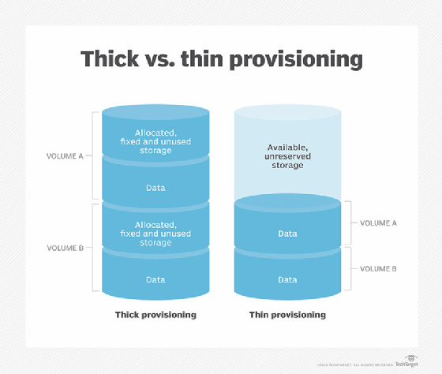
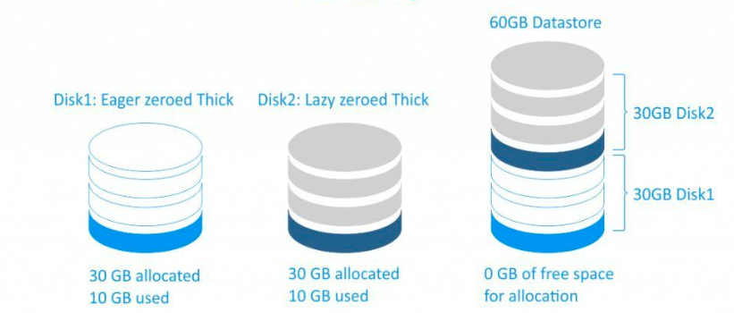
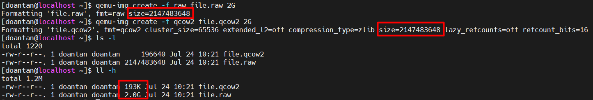
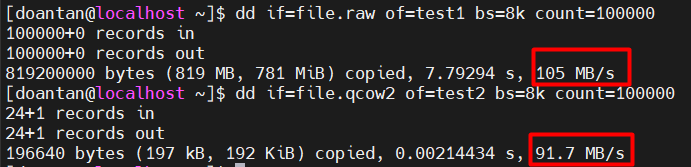
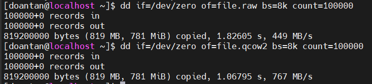
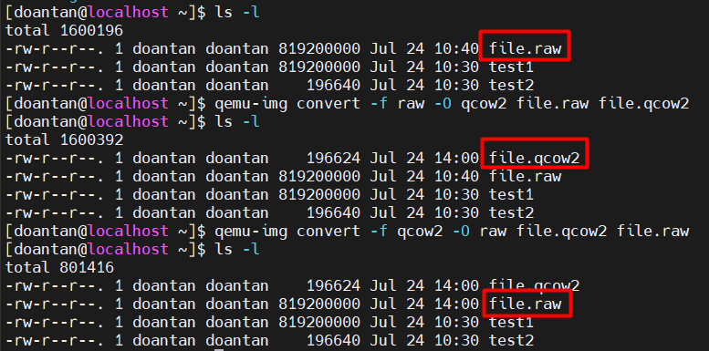

# Tìm hiểu các định dạng file images

## I. Cơ chế lưu trữ Thin-Thick



### 1. Thin provisioning (Cấp phát mỏng)

- **Khái niệm:** Chỉ cấp phát dung lượng thực tế mà máy ảo sử dụng, không cấp trước toàn bộ dung lượng được chỉ định.
- **Đặc điểm:**
  - File image bắt đầu với kích thước nhỏ và tăng dần theo dữ liệu được ghi.
  - Dung lượng tối đa được định nghĩa (logical size) nhưng chỉ chiếm dung lượng vật lý tương ứng với dữ liệu thực tế.
- *Ví dụ*: Nếu bạn tạo một máy ảo với ổ đĩa 100GB nhưng chỉ sử dụng 10GB, file image sẽ chỉ chiếm 10GB trên đĩa vật lý.
- **Ưu điểm:**
  - Tiết kiệm dung lượng ổ cứng vật lý. Đặc biệt khi chạy nhiều máy ảo
  - Linh hoạt, dễ mở rộng dung lượng mà không cần định trước toàn bộ.
- **Nhược điểm:**
  - Hiệu suất có thể giảm khi file image mở rộng (do phân mảnh hoặc quản lý cấp phát động).
  - Dễ gây over-provisioning (cấp phát vượt quá dung lượng thực tế của ổ đĩa vật lý nếu không giám sát kỹ).
- **Ứng dụng:** Phù hợp cho môi trường kiểm thử, phát triển, hoặc hệ thống có nhu cầu lưu trữ thay đổi thường xuyên.

### 2. Thick provisioning (Cấp phát dày)

- **Khái niệm:** Cấp phát toàn bộ dung lượng ổ đĩa ảo ngay từ đầu. File image chiếm toàn bộ kích thước được chỉ định dù không có dữ liệu nào được ghi.
- **Đặc điểm:**
  - Hiệu năng ổn định, không tốn thời gian cấp phát động.
  - Tránh tình trạng đầy đĩa vật lý bất ngờ.
  - Phù hợp với hệ thống quan trọng hoặc máy chủ sản xuất.
- *Ví dụ*: Tạo đĩa ảo 20GB thì file image luôn chiếm 20GB ngay khi tạo.
- **Ưu điểm:**
  - Hiệu suất cao và ổn định hơn do không cần cấp phát động.
  - Đảm bảo dung lượng luôn sẵn sàng, tránh rủi ro hết dung lượng.
- **Nhược điểm:**
  - Lãng phí dung lượng nếu máy ảo không sử dụng hết không gian được cấp.
  - Yêu cầu dung lượng lưu trữ vật lý lớn ngay từ đầu.
- **Ứng dụng:** Phù hợp cho môi trường sản xuất, ứng dụng yêu cầu hiệu suất cao hoặc cần đảm bảo dung lượng cố định (như cơ sở dữ liệu, máy chủ web).



**2.1 Thick Lazy (Lazy Zeroed Thick Provisioning):**

- **Khái niệm:** Cấp phát toàn bộ dung lượng được chỉ định ngay từ đầu, nhưng không ghi số 0 (zero out) vào tất cả các khối dữ liệu lúc khởi tạo. Chỉ khi khối dữ liệu được sử dụng, nó mới được ghi số 0 trước khi ghi dữ liệu thực.
- **Đặc điểm:**
  - File image chiếm toàn bộ dung lượng định trước (VD: 100GB được cấp, file chiếm 100GB trên ổ cứng).
  - Không thực hiện ghi số 0 ban đầu, giúp quá trình tạo file image nhanh hơn.
  - Khi máy ảo ghi dữ liệu vào một khối, hệ thống sẽ ghi số 0 vào khối đó trước, sau đó ghi dữ liệu mới.
  - Tạo file image nhanh hơn so với Thick Eager (do không cần zero out trước).

**2.2 Thick Eager (Eager Zeroed Thick Provisioning):**

- **Khái niệm:** Cấp phát toàn bộ dung lượng được chỉ định ngay từ đầu và ghi số 0 (zero out) vào tất cả các khối dữ liệu ngay khi tạo file image.
- **Đặc điểm:**
  - File image chiếm toàn bộ dung lượng định trước (VD: 100GB được cấp, file chiếm 100GB và tất cả khối được ghi số 0).
  - Quá trình khởi tạo lâu hơn do phải ghi số 0 vào toàn bộ dung lượng trước.
  - Quá trình tạo file image chậm hơn do phải ghi số 0 vào tất cả các khối.

**2.3 Mục đích của việc zero out:**

- Zero out xóa sạch dữ liệu cũ hoặc rác (residual data) trên đĩa, ngăn chặn khả năng máy ảo đọc nhầm dữ liệu không mong muốn từ các khối chưa được ghi.
- Khi khối đĩa đã được zero out, hệ thống không cần thực hiện bước ghi số 0 trước khi ghi dữ liệu thực, giúp giảm độ trễ trong các thao tác ghi lần đầu.
- Một số phần mềm (như cơ sở dữ liệu hoặc hệ thống tệp cụ thể) yêu cầu đĩa phải được khởi tạo hoàn toàn bằng số 0 để hoạt động đúng.

## II. Các định dạng ổ đĩa trong KVM

### 1. ISO (International Organization for Standardization)

- **Khái niệm:** Định dạng tệp ảnh đĩa quang (CD/DVD), lưu trữ dữ liệu hệ thống tệp theo chuẩn ISO 9660.
- **Đặc điểm:**
  - Thường chứa hệ điều hành hoặc phần mềm cài đặt.
  - Chỉ đọc (read-only), không thể ghi dữ liệu mới vào.
  - Không phải định dạng lưu trữ chính cho máy ảo, thường dùng để boot cài đặt.
- **Kich thước:** Cố định, chứa toàn bộ dữ liệu được ghi.
- **Tính năng:**
  - Boot máy ảo để cài đặt hệ điều hành hoặc phần mềm.
  - Không hỗ trợ ghi dữ liệu trong quá trình sử dụng.
  - Dễ chia sẻ và tương thích với hầu hết hypervisor.
- **Ứng dụng:**
  - Cài đặt hệ điều hành (VD: Ubuntu ISO cho máy ảo KVM).
  - Khởi động phần mềm hoặc công cụ chẩn đoán (VD: ISO của MemTest86).
  - Dùng để triển khai máy ảo ban đầu trong KVM.

### 2. Raw

- **Khái niệm:** Định dạng ảnh đĩa thô, lưu trữ dữ liệu trực tiếp mà không nén hoặc tối ưu.
- **Đặc điểm:** Là bản sao 1:1 của đĩa vật lý, không có siêu dữ liệu (metadata).
- **Kich thước:** Với Thick, chiếm toàn bộ dung lượng định trước; với Thin, tăng dần theo dữ liệu.
- **Tính năng:**
  - Hiệu suất cao do không có siêu dữ liệu hoặc xử lý phức tạp.
  - Hỗ trợ cả Thick (Eager/Lazy Zeroed) và Thin Provisioning, thường là Thick.
  - Không hỗ trợ snapshot, nén, hoặc mã hóa.
- **Ứng dụng:**
  - Máy ảo cần hiệu suất tối đa (VD: cơ sở dữ liệu, máy chủ web).
  - Dùng trong môi trường sản xuất yêu cầu độ tin cậy cao.
  - Chuyển đổi dễ dàng sang định dạng khác hoặc sử dụng trực tiếp trên thiết bị vật lý.

### 3. qcow2 (QEMU Copy-On-Write 2)

- **Khái niệm:** Định dạng ảnh đĩa do QEMU phát triển, hỗ trợ các tính năng nâng cao như nén, snapshot, và Thin Provisioning.
- **Đặc điểm:**
  - Chỉ hỗ trợ Thin Provisioning (dung lượng tăng theo dữ liệu).
  - Linh hoạt, tối ưu cho KVM/QEMU.
- **Kich thước:** Nhỏ gọn, chỉ chiếm dung lượng thực tế sử dụng.
- **Tính năng:**
  - Hỗ trợ snapshot (lưu trạng thái máy ảo), nén, mã hóa AES.
  - Thin Provisioning, tiết kiệm dung lượng lưu trữ.
  - Hỗ trợ copy-on-write, cho phép tạo bản sao hiệu quả.
- **Ứng dụng:**
  - Môi trường phát triển/kiểm thử cần snapshot để khôi phục trạng thái.
  - Máy ảo trong đám mây hoặc trung tâm dữ liệu (VD: OpenStack với KVM).
  - Lưu trữ tiết kiệm, phù hợp khi chạy nhiều máy ảo trên cùng hệ thống.

## III. So sánh raw và qcow2

| Tiêu chí | Raw | qcow2 |
|----------|-----|-------|
| **Dung lượng** | Thick: chiếm toàn bộ dung lượng. Thin: Ít linh hoạt hơn qcow2 | Thin: Chỉ chiếm dung lượng thực tế, hỗ trợ nén |
| **Hiệu năng** | Cao nhất, đọc/ghi trực tiếp | Thấp hơn, nhưng tối ưu với VirtIO |
| **snapshot** | Không hỗ trợ | Hỗ trợ, linh hoạt cho kiểm thử |

### 1. Dung lượng

Để kiểm tra dung lượng của 2 định dạng này, ta sẽ dùng lệnh `qemu-img` để tạo ra một file có định dạng raw và một file có định dạng qcow2 cả 2 file nàu đều có dung lượng là 2G.

**File Raw:**

```bash
qemu-img create -f raw file.img 2G
```

**File qcow2:**

```bash
qemu-img create -f qcow2 file.qcow2 2G
```



### 2. Hiệu năng

Để test hiệu năng giữa 2 định dạng nàym sử dụng lệnh `dd` để đọc và ghi dữ liệu từ các file trên.

**Đọc dữ liệu:** `raw` < `qcow2`

```bash
dd if=file.raw of=test1 bs=8k count=100000
dd if=file.qcow2 of=test2 bs=8k count=100000
```

- `dd`: dùng để sao chép dữ liệu ở cấp độ thấp giữa file hoặc thiết bị
- `if=file.raw` → input file là file.`raw`
- `of=test1` → output file là `test1`
- `bs=8k` → block size là 8 kilobyte (1 block = 8192 byte)
- `count=100000` → sao chép 100000 block

-> Tổng dung lượng sao chép `8KB * 100000 = 800MB` -> đang đọc 800MB từ file.raw và ghi vào test1, với block size 8KB.



**Ghi dữ liệu:** `raw` > `qcow2`

```bash
dd if=/dev/zero of=file.raw bs=8k count=100000
dd if=/dev/zero of=file.qcow2 bs=8k count=100000
```



### 3. snapshot

Chỉ có **qcow2** hỗ trợ tạo snapshot

## IV. Cách chuyển đổi giữa raw và qcow2

### 1. Chuyển từ `raw` ➜ `qcow2`

```bash
qemu-img convert -f raw -O qcow2 file.raw file.qcow2
```

- `-f raw`: Định dạng đầu vào là raw.
- `-O qcow2`: Định dạng đầu ra là qcow2.
- `disk.img`: file ảnh đĩa định dạng raw
- `disk.qcow2`: file đầu ra qcow2

### 2. Chuyển từ `qcow2` ➜ `raw`

```bash
qemu-img convert -f qcow2 -O raw file.qcow2 file.raw
```



### 3. Tùy chọn

| Tùy chọn | Mô tả |
|----------|-------|
| `-c` | Nén file đầu ra (chỉ với qcow2) |
| `-p` | Hiển thị tiến trình % |
| `-o preallocation=full` | Dùng cho raw để tạo file dày (thick) — tối ưu hiệu năng |
| `-o cluster_size=...` | Chỉnh kích thước cụm trong qcow2 (ảnh hưởng performance) |

*Ví dụ có nén khi convert raw ➜ qcow2:*

```bash
qemu-img convert -f raw -O qcow2 -c -p disk.img disk.qcow2
```

### 4. Kiểm tra định dạng file hiện tại

```bash
qemu-img info <file-name>
```
