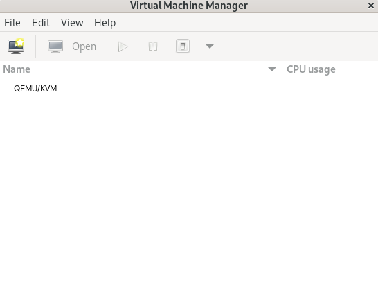
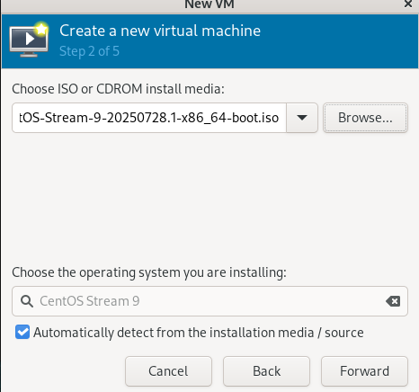

# Các công cụ thao tác với KVM

## I. Tạo và quản lý máy ảo bằng CLI Virsh

`virsh` là công cụ dòng lệnh để quản lý các máy ảo (VM) dùng libvirt, rất tiện cho quản trị server không có GUI.

Cài đặt:

```bash
# Trên Centos
sudo dnf install -y qemu-kvm libvirt virt-install virt-manager
```

Bật và khởi động dịch vụ `libvirtd`:

```bash
sudo systemctl enable --now libvirtd
sudo systemctl status libvirtd
```

### 1. Tạo máy ảo KVM bằng `virt-install`

Tạo máy ảo tên là **vm-centos**, dùng ISO cài CentOS Stream 9 đã có sẵn.

**1.1 Tải file ISO (nếu chưa có):**

```bash
wget https://mirror.stream.centos.org/9-stream/BaseOS/x86_64/iso/CentOS-Stream-9-20250722.0-x86_64-boot.iso -P /var/lib/libvirt/boot/
```

**1.2 Tạo ổ đĩa cho máy ảo:**

- Tạo một file ổ đĩa ảo định dạng qcow2 để làm ổ cứng cho máy ảo, nơi hệ điều hành (CentOS Stream 9) và dữ liệu sẽ được cài đặt/lưu trữ.
- File này được sử dụng bởi KVM/QEMU để mô phỏng ổ cứng vật lý cho VM.

```bash
sudo qemu-img create -f qcow2 /var/lib/libvirt/images/vm-centos.qcow2 10G
```

**1.3 Tao máy ảo bằng `virt-install`:** Trong đó hầu hết các option đều không bắt buộc. Tối thiểu cần `--name`, `--memory`, lưu trữ (`--disk` hoặc `--filesystem`)

```bash
sudo virt-install \
  --name vm-centos \
  --memory 1024 \
  --vcpus 1 \
  --disk path=/var/lib/libvirt/images/vm-centos.qcow2,format=qcow2 \
  --cdrom /var/lib/libvirt/boot/CentOS-Stream-9-20250722.0-x86_64-boot.iso \
  --os-variant rhel9.0 \
  --network network=default \
  --graphics vnc \
  --noautoconsole
```

- `--name`: Tên máy ảo
- `--vcpus`: Tổng số CPU tạo cho máy ảo
- `--memory`: Tổng dung lượng RAM cấp cho máy ảo (MB)
- `--cdrom`: Đường dẫn đến file ISO cài đặt hệ điều hành.
- `--disk`: Đường dẫn đến file đĩa cứng ảo hoặc chỉ định dung lượng ổ đĩa mới. `size` chỉ ra dung lượng disk của máy ảo(tính bằng GB). Có thể tạo thêm disk bằng cách thêm 1 dòng nữa.
- `--os-variant`: Chỉ định loại hệ điều hành, giúp tối ưu hóa cấu hình.
- `--graphics vnc`: Chọn kiểu màn hình tương tác.
- `--network`: chỉ ra cách kết nối mạng của máy ảo. Nếu tạo nhiều card mạng, ta chỉ cần khai báo thêm

**1.4 Kiểm tra máy ảo đã tạo:**

```bash
virsh list --all
```


### 2. Các trường hợp tạo máy ảo dùng virt-install

**2.1 Tạo máy ảo bằng file `.iso`:** Dùng khi bạn có file ISO của OS như Ubuntu, CentOS, AlmaLinux, v.v.

```bash
sudo virt-install \
  --name vm-centos \
  --memory 1024 \
  --vcpus 1 \
  --disk path=/var/lib/libvirt/images/vm-centos.qcow2,format=qcow2 \
  --cdrom /var/lib/libvirt/boot/CentOS-Stream-9-20250722.0-x86_64-boot.iso \
  --os-variant rhel9.0 \
  --network network=default \
  --graphics vnc \
  --noautoconsole
```

- Dùng `--cdrom` để chỉ định file ISO cài đặt hệ điều hành.
- Cài HĐH như dùng đĩa CD thật.

**2.2 Tạo máy ảo bằng file image:** Dùng khi bạn có sẵn file `.qcow2` hoặc `.raw` có hệ điều hành đã cài.

```bash
#Tải file .tar.xz từ CentOS:
wget https://cloud.centos.org/centos/9-stream/x86_64/images/CentOS-Stream-Container-Base-9-20240703.1.x86_64.tar.xz -P ~/Downloads/

# Giải nén file .tar.xz (Sau khi giải nén, sẽ thấy file layer.tar, chứa filesystem gốc (rootfs))
mkdir ~/centos-container-base
tar -xf ~/Downloads/CentOS-Stream-Container-Base-9-20240703.1.x86_64.tar.xz -C ~/centos-container-base
```

Tạo đĩa ảo `.qcow2` và chép filesystem vào

```bash
# Tạo file qcow2 rỗng
sudo qemu-img create -f qcow2 /var/lib/libvirt/images/vm-centos-container.qcow2 8G

# Format ext4 và mount tạm (cần sudo full)
sudo virt-format --format=qcow2 -a /var/lib/libvirt/images/vm-centos-container.qcow2 --filesystem ext4

# Mount image
sudo guestmount -a /var/lib/libvirt/images/vm-centos-container.qcow2 -i /mnt

# Giải nén layer.tar vào ổ đĩa
sudo tar -xf ~/centos-container-base/layer.tar -C /mnt

# Sau khi hoàn tất
sudo guestunmount /mnt

# Lúc này, đã có file .qcow2 chứa hệ thống file CentOS.

# Khởi tạo máy ảo từ image
sudo virt-install \
  --name alma9-vm \
  --memory 2048 \
  --vcpus 2 \
  --disk path=/var/lib/libvirt/images/alma9.qcow2,format=qcow2 \
  --import \
  --os-variant almalinux9 \
  --network network=default \
  --graphics none \
  --noautoconsole
```

- Dùng `--import` để bỏ qua bước cài OS (vì nó đã có sẵn trong image).
- `disk` là đường dẫn đến file image.

**Tạo máy ảo qua Internet(netboot):** Cài OS bằng cách tải trình cài đặt trực tiếp từ internet (thường là từ mirror của distro).

```bash
# Tạo ổ đĩa ảo
sudo qemu-img create -f qcow2 /var/lib/libvirt/images/centos9-netboot.qcow2 20G
```

- `qemu-img create`: Tạo file ổ đĩa ảo.
- `-f qcow2`: Định dạng qcow2 (tiết kiệm dung lượng, hỗ trợ snapshot).
- `/var/lib/libvirt/images/centos9-netboot.qcow2`: Đường dẫn và tên file ổ đĩa.
- `20G`: Dung lượng tối đa 20GB, nhưng chỉ chiếm dung lượng thực tế khi dữ liệu được ghi.

```bash
# Sử dụng option --location : sau đó là đường dẫn url chứa file cài đặt netboot (netboot được cung cấp bởi hệ điểu hành)
# Tạo máy ảo với virt-install (Netboot)
sudo virt-install \
  --name centos9-netboot \
  --ram 2048 \
  --vcpus 2 \
  --disk path=/var/lib/libvirt/images/centos9-netboot.qcow2,format=qcow2 \
  --os-variant rhel9.0 \
  --network network=default \
  --graphics vnc,listen=0.0.0.0 \
  --noautoconsole \
  --location https://mirror.stream.centos.org/9-stream/BaseOS/x86_64/os/ \
  --extra-args "inst.ks=https://git.centos.org/raw/repos/r/centos/kickstart/stable/9-stream/kickstart/ks.cfg"
```

### 3. Hiển thị danh sách máy ảo

```bash
virsh list --all
```


### 4. Bật máy ảo

```bash
sudo virsh start <vm-name>
```

### 5. Tắt máy ảo

```bash
sudo virsh shutdown <vm-name>
```

### 6. Reboot máy ảo

```bash
sudo virsh reboot <vm-name>
```

### 7. Xóa máy ảo

```bash
sudo virsh destroy <vm-name>  # Tắt máy ảo nếu nó đang chạy
sudo virsh undefine <vm-name>  # Xóa máy ảo khỏi danh sách
```

### 8. snapshot

```bash
sudo virsh snapshot-create-as \
  --domain <vm-name> \
  --name <tên-snapshot> \
  --description "<mô tả>" \
  --atomic \
  --disk-only \
  --no-metadata
```

- `--disk-only` nghĩa là chỉ lưu trạng thái đĩa (không lưu RAM).
- Nếu bạn muốn lưu cả RAM, loại bỏ `--disk-only` `--no-metadata`.
- `--atomic` đảm bảo rằng snapshot được tạo thành công hoặc không có gì thay đổi.


**Xem danh sách các bản snapshot:**

```bash
sudo virsh snapshot-list <vm-name>
```

**Xem thông tin chi tiết của bản snapshot:**

```bash
sudo virsh snapshot-info --domain <vm-name> --snapshotname <tên-snapshot>
```

**Revert để chạy lại bản snapshot đã tạo:**

```bash
sudo virsh snapshot-revert <vm-name> <tên-snapshot>
```

**Xóa 1 bản snapshot:**

```bash
sudo virsh snapshot-delete <vm-name> <tên-snapshot>
```

### 9. Sửa thông tin CPU hoặc Memory

```bash
sudo virsh edit <vm-name>
```

### 10. Một số lệnh khác

**Xem thông tin chi tiết về file disk của mấy ảo:**

```bash
qemu-img info <file-disk-path>
```

**Xem thông tin cơ bản của 1 máy ảo:**

```bash
sudo virsh dominfo <vm-name>
```


## II. Virt-manager

### 1. Kiểm tra máy có hỗ trợ ảo hóa không

```bash
egrep -c '(vmx|svm)' /proc/cpuinfo
```

- Nếu kết quả là 0, máy không hỗ trợ ảo hóa.
- Nếu kết quả > 0, máy hỗ trợ ảo hóa.

### 2. Cài đặt gói cần thiết

```bash
sudo dnf install -y qemu-kvm libvirt virt-install virt-manager
```

### 3. Truy cập `virt-manager` để cấu hình

```bash
sudo virt-manager
```



Trong trường hợp ssh không hỗ trợ x11-forwarding (lỗi bởi server):

```bash
# Tải các gói hỗ trợ (centos stream 9)
sudo dnf install xorg-x11-xauth xorg-x11-utils
# Chỉnh các dòng thành nội dung sau trong file /etc/ssh/sshd_config
X11Forwarding yes
X11DisplayOffset 10
X11UseLocalhost no
```

Tạo 1 máy ảo: `file` -> `New Virtual Machine`


Chọn `Local install media (ISO image or CDROM)`:


Chọn đường dẫn file ISO đã tải về:



Sau khi cài đặt các thông số cho máy ảo, Kiểm tra và thiết lập lại các thông số của máy ảo và click chọn `Begin Installation`.


### 4. Một số thao tác khác

**4.1 Tạo snapshot:**

Chọn vào mục Manager VM Snapshot:


Click chọn thêm và điền tên cho Snapshot:


Snapshot được tạo:


**4.2 Xem thông tin phần cứng:**

Click vào biểu tượng `show virtual hardware details` để chuyển sang giao diện xem thông tin phần cứng của máy ảo:


