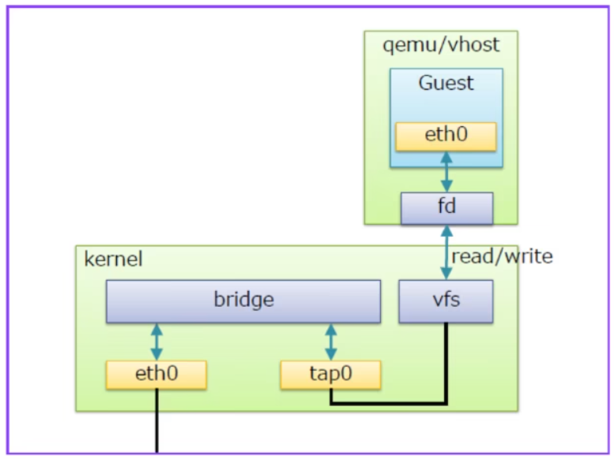
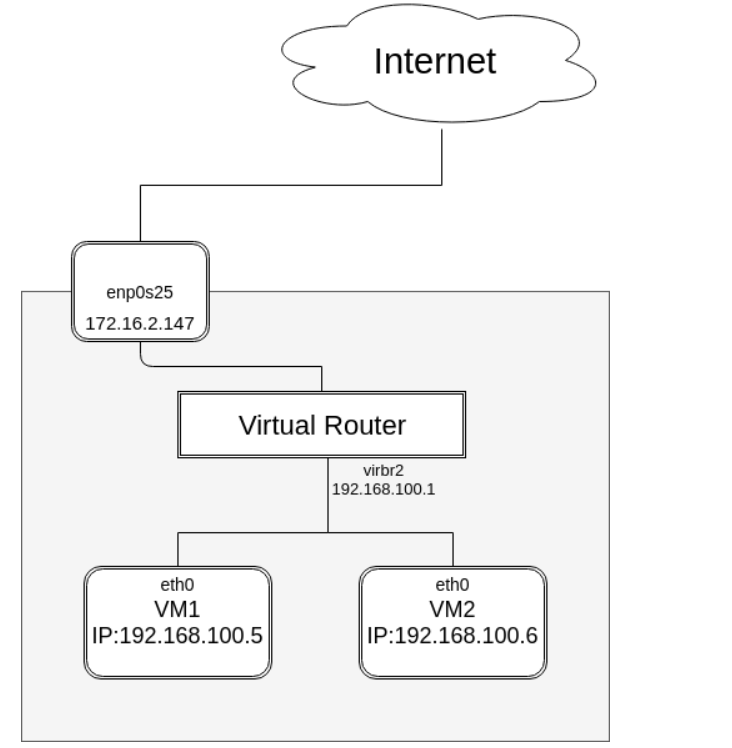

# Các chế độ card mạng

## I. Bridged

### 1. Cấu trúc mạng Bridge



- **vfs ( virtual file system)**: tạo 1 phân vùng để nhận gói tin forward data từ máy ảo thông qua forward database.
- **fd (forward database)**: là cổng giao tiếp chuyển tiếp dữ liệu giữa máy ảo với bridge.
- **Bridge**: có chức năng giống với switch layer 2.
- **Port**: có chức năng tương đương với port của switch thật.

### 2. Cách thức hoạt động Bridged

Khi có 1 gói tin từ máy ảo muốn đi ra mạng internet thì:

- **Bước 1:** Gói tin từ máy ảo đi ra cổng eth0 của máy ảo đó.
- **Bước 2:** Gói tin từ cổng eth0 đi đến forward database.
- **Bước 3:** Từ forward database gửi gói tin đến vùng vfs
- **Bước 4:** Kernel lấy gói tin từ vùng vfs chuyển đến bridge qua các tap interface.
- **Bước 5:** Từ Bridge gửi gói tin qua eth0 của máy thật và đi ra ngoài internet.

## II. NAT

### 1. Các thành phần trong sơ đồ NAT



- **Internet:** Nguồn bên ngoài cung cấp kết nối, dùng IP công cộng (172.16.2.147).
- **enp0s25:** Giao diện mạng vật lý trên host, kết nối Internet, có IP 172.16.2.147.
- **Virtual Router (virbr2):** Router ảo trong KVM, quản lý mạng NAT, có IP 192.168.100.1, thực hiện NAT giữa mạng nội bộ và Internet.
- **eth0 (VM1):** Giao diện mạng của VM1, IP 192.168.100.5, trong mạng NAT.
- **eth0 (VM2):** Giao diện mạng của VM2, IP 192.168.100.6, trong mạng NAT.

### 2. Cách thức hoạt động NAT

- **Bước 1:** Gói tin từ Internet đến host qua enp0s25 (172.16.2.147).
- **Bước 2:** Virtual Router (virbr2, 192.168.100.1) nhận gói, thực hiện NAT, ánh xạ IP công cộng sang IP nội bộ (192.168.100.5 hoặc 192.168.100.6).
- **Bước 3:** Gói tin được chuyển đến VM1 hoặc VM2 qua giao diện eth0 tương ứng.
- **Bước 4:** Gói tin từ VM1/VM2 đi ngược lại qua virbr2, NAT lại thành IP 172.16.2.147, gửi ra Internet.

## III. Host-only (Isolated)

### 1. Các thành phần chính trong sơ đồ Host-Only (Isolated)

```pgsql
                +-------------------+
                |       Internet    |
                +-------------------+
                         X   (Không tới được)

                        (Host NIC thật: eth0, 172.16.x.x)

+--------------------------------------------------------------+
|                         HOST (Linux)                         |
|                                                              |
|   +-------------------+        +-------------------------+   |
|   | virbr2 (192.168.100.1) <-> | Bridge Switch (Layer 2) |   |
|   +-------------------+        +-------------------------+   |
|            ^                               ^                 |
|            |                               |                 |
|          vnet0                           vnet1               |
|            |                               |                 |
|   +-------------+                  +-------------+           |
|   |   VM1       |                  |    VM2      |           |
|   | eth0        |                  | eth0        |           |
|   | 192.168.100.5|                 |192.168.100.6|           |
|   +-------------+                  +-------------+           |
+--------------------------------------------------------------+
```

- **VM (eth0)** → được nối vào một tap/vnet trên host (ví dụ `vnet0`).
- **Linux bridge** (ví dụ `virbr2`) ↔ gắn các `vnetX`. Bridge không gắn NIC vật lý nào.
- **Địa chỉ IP trên bridge** (ví dụ `virbr2`: `192.168.100.1/24`). Libvirt có thể chạy dnsmasq để phát DHCP/DNS cho dải này.
- **iptables**: libvirt tạo rule chặn FORWARD ra/vào `virbr2`; host không NAT.

### 2. Cách thức hoạt động của Host-Only (Isolated)

**2.1 VM ↔ VM (cùng mạng isolated):**

```rust
VM1 (192.168.100.5) --eth0--> vnet0 --> virbr2 (bridge) --> vnet1 --> VM2 (192.168.100.6)
```

1. VM1 gửi ARP để tìm MAC của VM2 → broadcast qua vnet0 vào virbr2.
2. Bridge học bảng MAC và chuyển frame sang vnet1 của VM2.
3. L2/L3 đều nội bộ bridge, không đi qua FORWARD/NAT. VM1 ↔ VM2 giao tiếp trực tiếp trong LAN ảo.

**2.2 VM ↔ Host:**

```rust
VM1 --eth0--> vnet0 --> virbr2 (IP 192.168.100.1) --> xử lý tại host (INPUT chain)
```

Ví dụ: VM ping `192.168.100.1` (IP của `virbr2`):

1. VM ARP 192.168.100.1 → host trả lời MAC của bridge.
2. Gói ICMP đi VM → vnet0 → virbr2.
3. Vì đích là IP local của host, gói đi theo luồng INPUT và được host xử lý (không qua FORWARD).

**2.3 VM ↔ Host (IP của bridge):**

Ví dụ: VM ping 192.168.100.1 (IP của virbr2):

1. VM ARP 192.168.100.1 → host trả lời MAC của bridge.
2. Gói ICMP đi `VM → vnet0 → virbr2`.
3. Vì đích là IP local của host, gói đi theo luồng INPUT và được host xử lý (không qua FORWARD). VM ping/SSH được vào host (nếu dịch vụ bind trên `virbr2`).

**2.4 VM → Internet (bị chặn):**

Ví dụ: VM ping `8.8.8.8`:

1. VM gửi gói tới gateway 192.168.100.1 (do DHCP cấp).
2. Gói vào host qua `virbr2`. Đích không phải IP local → gói cần forward ra NIC ngoài.
3. Bị chặn vì:

   - `net.ipv4.ip_forward=0` (mặc định), hoặc
   - iptables của libvirt đặt rule REJECT/DROP trên chain FORWARD cho virbr2,
   - và không có NAT. Kết quả: không ra được Internet trong mô hình isolated mặc định.

**2.5 Internet → VM (từ ngoài vào):**

Không có tuyến/port-forward/NAT vào mạng 192.168.100.0/24, iptables còn chặn FORWARD.

=> Không thể truy cập VM từ ngoài (đúng nghĩa “host-only/isolated”).

**2.6 Muốn "host-only mà vẫn ra ngoài":**

Bật router/NAT trên host:

```bash
# Cho phép forward
sudo sysctl -w net.ipv4.ip_forward=1
# NAT ra NIC ngoài (đổi eth0 theo NIC thật)
sudo iptables -t nat -A POSTROUTING -s 192.168.100.0/24 -o eth0 -j MASQUERADE
# Cho phép forward qua bridge
sudo iptables -A FORWARD -i virbr2 -o eth0 -j ACCEPT
sudo iptables -A FORWARD -i eth0 -o virbr2 -m state --state ESTABLISHED,RELATED -j ACCEPT
```

Khi đó: VM → gateway 192.168.100.1 → FORWARD + MASQUERADE → Internet.

**2.7 Lệnh kiểm tra nhanh:**

```bash
ip a            # xem virbr2, vnetX
bridge link     # các port của bridge
iptables -S     # rule FORWARD libvirt tạo
tcpdump -i virbr2 arp or icmp   # quan sát ARP/ICMP trong mạng isolated
```
