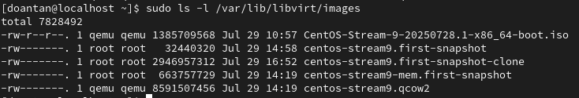
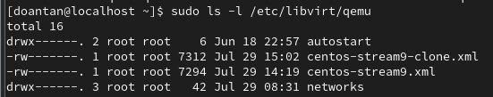
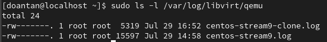
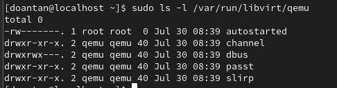
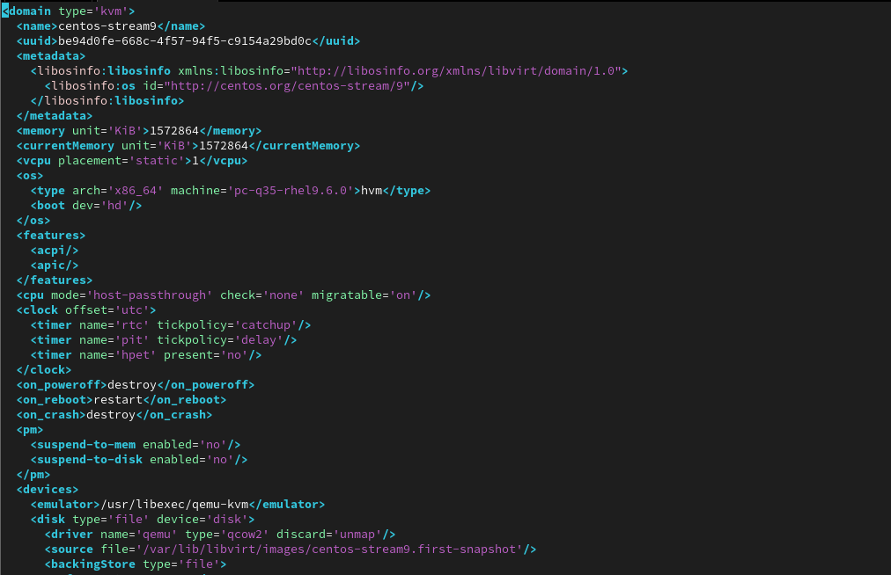
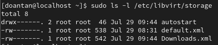
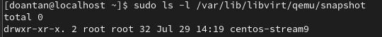
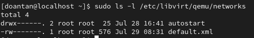

# Tìm hiểu nơi lưu trữ máy ảo trong KVM

## I. Nơi lưu trữ máy ảo KVM mặc định

Trong hầu hết các hệ thống Linux (như CentOS, Ubuntu) khi sử dụng libvirt, các file máy ảo thường được lưu trữ ở các vị trí mặc định sau:

### 1. File ảnh đĩa (Disk Images)

Mặc định: `/var/lib/libvirt/images/`



- Lưu trữ các file đại diện cho ổ đĩa cứng của máy ảo (virtual disk images). Các định dạng phổ biến là `.qcow2` (phổ biến nhất, hỗ trợ snapshot, clone) hoặc `.raw` (ổ đĩa thô).

### 2. Thư mục chứa file `.xml` thông số kỹ thuật của VM

Mặc định: `/etc/libvirt/qemu/`



- Lưu trữ các file cấu hình máy ảo dưới định dạng XML. Mỗi máy ảo sẽ có một file XML riêng (ví dụ: ten_may_ao.xml). File này mô tả tất cả các thông số của máy ảo như CPU, RAM, ổ đĩa ảo, card mạng ảo, BIOS/UEFI, v.v.

### 3. File Log và PID của máy ảo đang chạy

`/var/log/libvirt/qemu/`: log files cho mỗi VM



`/var/run/libvirt/qemu/`: PID files cho các VM đang chạy



## II. Cấu trúc thư mục và các file quan trọng

### 1. Thư mục `/etc/libvirt/qemu/`


- Đây là file quan trọng nhất định nghĩa cấu hình của mấy ảo.
- Nó là một file văn bản có thể chỉnh sửa thông qua `virsh edit <tên_máy_ảo>` hoặc trực tiếp bằng trình soạn thảo văn bản (nên dùng `virsh edit` để đảm bảo cú pháp).
- Nội dung file `.xml` cấu hình máy ảo `centos-stream9`:
  

### 2. Thư mục `/var/lib/libvirt/images/`


- Đây là file ảnh đĩa của máy ảo. Nó chứa toàn bộ hệ điều hành khách (Guest OS), các ứng dụng và dữ liệu của máy ảo.

### 3. Thư mục `/var/log/libvirt/qemu/`


- Ví dụ: file `centos-stream9.log` chứa log của máy ảo `centos-stream9`.
- Chứa các thông báo log từ quá trình khởi động, chạy và tắt máy ảo. Hữu ích cho việc gỡ lỗi khi máy ảo gặp sự cố.

### 4. Thư mục `/var/run/libvirt/qemu/`


- Ví dụ: file `centos-stream9.pid` chứa PID của tiến trình máy ảo `centos-stream9` đang chạy.
- Chứa ID tiến trình (PID) của tiến trình QEMU đang chạy máy ảo đó. Được sử dụng bởi `libvirt` để quản lý và theo dõi trạng thái của máy ảo. (Thư mục này thường là `/run/libvirt/qemu/` trên các hệ thống hiện đại sử dụng `/run` thay vì `/var/run`).

### 5. Thư mục `/etc/libvirt/storage/`



- Chứa file cấu hình của các Storage Pool (nơi lưu trữ image máy ảo).
- Cấu trúc phổ biến:

  ```bash
  /etc/libvirt/storage/
  ├── default.xml        ← File XML mô tả storage pool tên "default"
  ├── autostart/
  │   └── default.xml    ← Symlink đến file nào sẽ được tự động kích hoạt khi boot
  ```

### 6. Thư mục `/var/lib/libvirt/qemu/snapshot/`



- Đây là thư mục lưu thông tin về các snapshot (ảnh chụp trạng thái máy ảo tại thời điểm cụ thể) được tạo bởi virsh snapshot-create hoặc thông qua GUI như Virt-Manager.

### 7. Thư mục `/etc/libvirt/qemu/networks/`



- Lưu trữ file cấu hình mạng ảo (virtual networks) được libvirt quản lý (thường dùng cho NAT, isolated network...).
- Cấu trúc phổ biến:

  ```bash
  /etc/libvirt/qemu/networks/
  ├── default.xml        ← File XML mô tả mạng ảo tên "default"
  ├── autostart/
  │   └── default.xml    ← Liên kết tượng trưng (symlink) đến mạng nào sẽ autostart khi boot

  ```

## III. Tùy chỉnh nơi lưu trữ

- Khi tạo VM bằng `virt-manager`: Có thể chỉ định đường dẫn tùy chỉnh cho file ảnh đĩa.
- Khi tạo VM bằng `virt-install`: Sử dụng tùy chọn `--disk path=/duong/dan/tuy/chinh/file.qcow2`.
