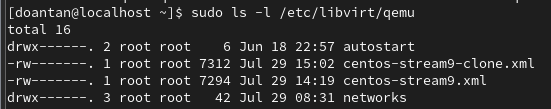

# Tìm hiểu về file XML trong KVM

## I. Cơ bản về XML

Trong KVM, **file XML** là thành phần cốt lõi để định nghĩa và quản lý các máy ảo (VMs) và mạng ảo. `libvirt` (daemon quản lý KVM) sử dụng các file XML này như một bản blueprint để biết cách tạo và chạy một VM hoặc một network.

### 1. File XML của máy ảo (domain XML)

- Vị trí mặc định: `/etc/libvirt/qemu/`

  

- Mô tả chi tiết toàn bộ cấu hình phần cứng của một máy ảo. Nó bao gồm mọi thứ từ tên, UUID, số lượng CPU, RAM cho đến các thiết bị lưu trữ, card mạng, card đồ họa,...

### 2. File XML của mạng ảo (network XML)

- Vị trí mặc định: `/etc/libvirt/qemu/networks/`

  

- Mô tả chi tiết cấu hình của một mạng ảo. Nó định nghĩa dải địa chỉ IP, chế độ mạng (NAT, bridged, isolated), cấu hình DHCP, và DNS cho mạng đó.

### 3. Lợi ích của việc sử dụng file XML

- **Tính linh hoạt cao:** Cho phép cấu hình các thông số chi tiết mà giao diện đồ họa (`virt-manager`) có thể không hỗ trợ.
- **Tự động hóa (automation):** Dễ dàng tạo và triển khai nhiều mấy ảo với cấu hình giống nhau bằng cách sử dụng file XML mẫu và các script tự động hóa.
- **Di chuyển và sao lưu:** File XML nhỏ gọn, dễ dàng sao chép và di chuyển giữa các host KVM khác nhau.

## II. Tạo máy ảo và mạng mới bằng file XML

Quy trình thường sử dụng lệnh `virsh` trên terminal.

### 1. Tạo mạng ảo mới bằng file XML

**Bước 1:** Tạo file XML cho mạng ảo

- Mở một trình soạn thảo văn bản và tạo file `mynetwork.xml` với nội dung ví dụ sau (mạng NAT với dải IP `192.168.200.0/24`):

    ```xml
    <network>
    <name>mynetwork</name>
    <forward mode='nat'/>
    <bridge name='virbr1' stp='on' delay='0'/>
    <ip address='192.168.200.1' netmask='255.255.255.0'>
        <dhcp>
        <range start='192.168.200.128' end='192.168.200.254'/>
        </dhcp>
    </ip>
    </network>
    ```

  - `<name>`: Tên của mạng ảo.
  - `<forward mode='nat'/>`: Chế độ mạng là NAT.
  - `<bridge name='virbr1'/>`: Tên của Linux Bridge sẽ được tạo trên Host.
  - `<ip ...>`: Dải địa chỉ IP của mạng ảo.
  - `<dhcp>`: Cấu hình DHCP, với range là dải IP sẽ được cấp phát cho các máy ảo.

**Bước 2:** Định nghĩa và khởi động mạng ảo

- Sử dụng lệnh `virsh` để định nghĩa (define) mạng ảo từ file XML:

    ```bash
    virsh net-define mynetwork.xml
    ```

- Khởi động mạng ảo:

    ```bash
    virsh net-start mynetwork
    ```

- Đặt mạng ảo này tự động khởi động cùng với host:

    ```bash
    virsh net-autostart mynetwork
    ```

- Kiểm tra trạng thái:

    ```bash
    virsh net-list --all
    ```

### 2. Tạo máy ảo mới bằng file XML

**Bước 1:** Tạo file XML cho máy ảo

- Tạo một file XML mới (`my_new_vm.xml`).

    ```xml
    <domain type='qemu'>
    <name>my_new_vm</name>
    <memory unit='MiB'>2048</memory>
    <vcpu>2</vcpu>
    <os>
        <type arch='x86_64' machine='pc-q35-8.0'>hvm</type>
        <boot dev='hd'/>
    </os>
    <devices>
        <disk type='file' device='disk'>
        <driver name='qemu' type='qcow2'/>
        <source file='/var/lib/libvirt/images/my_new_vm.qcow2'/>
        <target dev='vda' bus='virtio'/>
        </disk>
        <interface type='network'>
        <source network='mynetwork'/>
        <model type='virtio'/>
        </interface>
        <graphics type='spice' autoport='yes'/>
    </devices>
    </domain>
    ```

  - `source file`: Đảm bảo file ảnh đĩa (`my_new_vm.qcow2`) đã tồn tại ở đường dẫn này (có thể tạo nó trước bằng lệnh `qemu-img create -f qcow2 /var/lib/libvirt/images/my_new_vm.qcow2 20G`).
  - `source network`: Liên kết máy ảo này với mạng ảo `mynetwork` đã tạo ở trên.

**Bước 2:** Định nghĩa và khởi động máy ảo

```bash
# Định nghĩa máy ảo từ file XML
virsh define my_new_vm.xml

# Kiểm tra danh sách máy ảo
virsh list --all

# Khởi động máy ảo
virsh start my_new_vm
```

> Thường thì sẽ không tạo file XML thủ công, mà sẽ sử dụng `virt-manager` để tạo máy ảo và sau đó chỉnh sửa file XML nếu cần thiết. Tuy nhiên, việc hiểu cấu trúc XML là rất quan trọng để tùy chỉnh các thông số chi tiết.

## III. Chỉnh sửa cấu hình VM bằng file XML

Có thể chỉnh sửa file XML của một máy ảo đã tồn tại bằng lệnh virsh edit. Đây là cách an toàn nhất vì nó sẽ kiểm tra cú pháp XML trước khi lưu.

### Bước 1: Chỉnh sửa file XML

- Sử dụng lệnh `virsh edit` để mở file XML của máy ảo:

    ```bash
    virsh edit <vm_name>
    ```

  - lệnh này mở file XML của máy ảo trong trình soạn thảo văn bản mặc định (thường là `vi` hoặc `nano` hoặc `vim`).
  - Ví dụ muốn thêm ổ đĩa hoặc thêm card mạng, có thể thêm thẻ `<disk>` hoặc `<interface>` vào trong phần `<devices>`.

### Bước 2: Áp dụng thay đổi

- Sau khi chỉnh sửa, lưu và thoát trình soạn thảo. `virsh` sẽ tự động kiểm tra cú pháp XML.
- Hầu hết các thay đổi phần cứng chỉ có hiệu lực sau khi bạn tắt và khởi động lại máy ảo.
  - Tắt máy ảo: `virsh shutdown <vm_name>`
  - Khởi động máy ảo: `virsh start <vm_name>`

### Lưu ý

- Luôn tắt máy ảo trước khi thực hiện các thay đổi lớn.
- Nếu mắc lỗi cú pháp, `virsh edit` sẽ thông báo lỗi và không cho phép lưu.
- Một số thay đổi nhỏ (ví dụ: mô tả) có thể có hiệu lực ngay lập tức. Nhưng với CPU, RAM, Disk, card mạng thì cần khởi động lại máy ảo.
