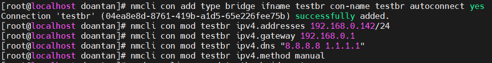
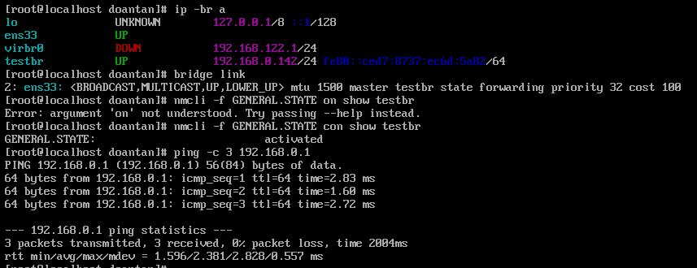

# Tìm hiểu các công nghệ liên quan đến KVM

## I. Linux Bridge - Công nghệ mạng ảo của KVM

### 1. Linux Bridge là gì?

Linux Bridge là một **switch layer 2 ảo** được cung cấp bởi nhân Linux. Nó cho phép:

- Nhiều thiết bị mạng (như máy ảo) giao tiếp với nhau như trong một switch vật lý.
- Có thể kết nối ra ngoài qua một card mạng thật (khi cấu hình chế độ bridged).
- Là thành phần quan trọng trong việc tạo mạng ảo với KVM/libvirt.

### 2. Cách hoạt động của Linux Bridge

- **Tạo một Bridge ảo:** Tạo một thiết bị bridge trên Host Linux, ví dụ `br0`.
- **Gắn các thiết bị vào Bridge:** gắn (attach) các thiết bị mạng khác vào bridge này. Các thiết bị đó có thể là:
  - Card mạng vật lý (pNIC) của Host (ví dụ: `eno1`).
  - Card mạng ảo (vNIC) của các máy ảo KVM.
- **Chuyển tiếp frame:** Khi một frame dữ liệu đến bridge từ một cổng nào đó (ví dụ: từ một máy ảo), bridge sẽ xem địa chỉ MAC đích của frame đó.
  - Nếu MAC đích là của một thiết bị khác cũng được gắn vào bridge (ví dụ: một máy ảo khác), bridge sẽ chuyển tiếp frame đó trực tiếp đến cổng tương ứng.
  - Nếu MAC đích là của một thiết bị nằm ngoài Host (ví dụ: một máy tính vật lý khác trên mạng LAN), bridge sẽ chuyển tiếp frame đó ra cổng vật lý (pNIC) đã được gắn vào nó.
- **Hoạt động minh bạch:** Đối với các thiết bị bên ngoài, các máy ảo trong cấu hình bridged xuất hiện như thể chúng là những máy vật lý độc lập đang cắm vào cùng một switch vật lý với Host. Chúng chia sẻ cùng một dải IP (subnet) của mạng vật lý.

### 3. Các lệnh liên quan

```bash
brctl show           # Hiển thị danh sách các bridge
ip link              # Hiển thị các card mạng
ip a                 # Hiển thị IP của bridge và các interface
```

### 4. Cấu hình bởi libvirt

- Libvirt có thể tự động tạo bridge như `virbr0` khi cấu hình NAT.
- Nếu tự tạo bridge `br0`, cần chỉnh `/etc/network/interfaces` hoặc dùng `nmcli` (nếu có NetworkManager).

### 5. Tạo và quản lý Linux Bridge

**5.0 Kiểm tra điều kiện:**

```bash
nmcli general status            # NetworkManager phải running
nmcli device status             # xem ens33 đã được NM quản lý (managed) chưa
# nếu “unmanaged”:
sudo nmcli device set ens33 managed yes
```

**5.1 Tạo bridge & gán IP (tĩnh):**

```bash
# Tạo connection cho bridge (tự bật khi boot)
sudo nmcli con add type bridge ifname testbr con-name testbr autoconnect yes

# Đặt địa chỉ IPv4 tĩnh, gateway, DNS
sudo nmcli con mod testbr ipv4.addresses 192.168.0.142/24
sudo nmcli con mod testbr ipv4.gateway 192.168.0.1
sudo nmcli con mod testbr ipv4.dns "8.8.8.8 1.1.1.1"
sudo nmcli con mod testbr ipv4.method manual

# Bật STP để tránh loop, giảm trễ
sudo nmcli con mod testbr bridge.stp yes
sudo nmcli con mod testbr bridge.forward-delay 0

# Cần DHCP thay vì tĩnh? Dùng:
sudo nmcli con mod testbr ipv4.method auto
```



**5.2 Biến ens33 thành “port” của bridge:**

```bash
# Có 2 cách (chọn một):

# Cách A (sạch): xoá connection cũ của ens33 rồi tạo slave
# xem connection name hiện tại của ens33:
nmcli -f NAME,DEVICE,TYPE con show | grep ens33

# xoá connection cũ (chỉ xoá cấu hình NM, không xoá thiết bị)
sudo nmcli con delete ens33

# tạo slave & gắn ens33 vào testbr
sudo nmcli con add type bridge-slave ifname ens33 master testbr con-name ens33 autoconnect yes


# Cách B (an toàn): giữ connection cũ nhưng vô hiệu hoá tự động bật
sudo nmcli con mod "<ten-connection-cu>" connection.autoconnect no
sudo nmcli con add type bridge-slave ifname ens33 master testbr con-name ens33 autoconnect yes
```

**5.3 Kích hoạt:**

```bash
# bật bridge trước, rồi bật slave
sudo nmcli con up testbr
sudo nmcli con up ens33
```

> Nếu gặp “device is unmanaged”, xem lại bước 0, đảm bảo ens33 do NM quản lý và không có dịch vụ mạng khác can thiệp.

**5.4 Kiểm tra:**

```bash
ip -br a                         # testbr phải có IP, ens33 không còn IP
bridge link                      # ens33 là port của testbr
nmcli -f GENERAL.STATE con show testbr
ping -c 3 192.168.0.1           # thử ping gateway
```



Quản lý thường dùng:

```bash
# Xem chi tiết cấu hình
nmcli con show testbr
nmcli con show ens33
# Đổi IP/GW/DNS sau này
sudo nmcli con mod testbr ipv4.addresses 192.168.0.142/24
sudo nmcli con mod testbr ipv4.gateway 192.168.0.1
sudo nmcli con mod testbr ipv4.dns "8.8.4.4 1.1.1.1"
sudo nmcli con up testbr
# Bật/tắt bridge hoặc slave
sudo nmcli con down ens33
sudo nmcli con down testbr
sudo nmcli con up testbr
sudo nmcli con up ens33
# Xoá bridge & trả ens33 về như cũ
sudo nmcli con delete ens33
sudo nmcli con delete testbr
# tạo lại kết nối “Wired” bình thường cho ens33 (DHCP)
sudo nmcli con add type ethernet ifname ens33 con-name ens33 ipv4.method auto autoconnect yes
```

## II. Công nghệ storage trong KVM

Trong KVM, storage là nơi lưu trữ đĩa ảo (VM disk) và các file liên quan đến máy ảo (ISO, snapshot,...).

### 1. Các loại lưu trữ

**File-based storage:**

- Định dạng: `.img` (raw), `.qcow2` (QEMU Copy-On-Write), `.vmdk`.
- Path: Thường nằm trong `/var/lib/libvirt/images/`.
- Ưu điểm: Dễ quản lý, hỗ trợ snapshot (đặc biệt với `.qcow2`), linh hoạt.
- Nhược điểm: Hiệu năng thấp hơn so với block device do I/O qua filesystem.

**Block device storage:**

- Ví dụ: LVM (Logical Volume Manager), iSCSI, hoặc thiết bị trực tiếp (như `/dev/sdb`).
- Ưu điểm: Hiệu năng cao, phù hợp cho máy ảo lớn hoặc tải nặng.
- Nhược điểm: Cần cấu hình phức tạp hơn.

**Network storage:**

- Ví dụ: NFS, GlusterFS, Ceph.
- Ưu điểm: Phân tán, dễ mở rộng, phù hợp cho cụm máy ảo.
- Nhược điểm: Phụ thuộc mạng, độ trễ cao hơn.

### 2. Thư mục liên quan

| Thư mục | Chức năng |
|---------|-----------|
| `/var/lib/libvirt/images/` | Nơi lưu trữ file đĩa mặc định |
| `/etc/libvirt/storage/` | Chứa XML định nghĩa storage pool |
| `/var/lib/libvirt/qemu/snapshot/` | Lưu snapshot của vm |
| `/etc/libvirt/qemu/` | Chứa XML cấu hình máy ảo (VM definition) |

### 3. Sotrage Pool và Volume

KVM sử dụng khái niệm:

- **Storage Pool:** một tập hợp dung lượng lưu trữ, ví dụ `/var/lib/libvirt/images`.
- **Sotrage Volume:** một file đĩa ảo cụ thể (như `ubuntu.qcow2`).

Có thể quản lý bằng lệnh:

```bash
virsh pool-list
virsh vol-list default
virsh pool-define /path/to/pool.xml
```

### 4. Snapshot

- Nếu dùng `.qcow2`, có thể tạo snapshot bằng `vỉrsh snapshot-create`.
- Snapshot giúp lưu trạng thái máy ảo (đĩa + RAM nếu muốn)
