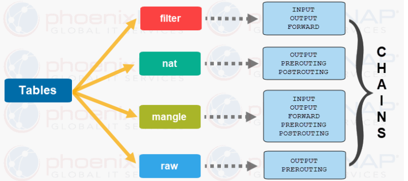
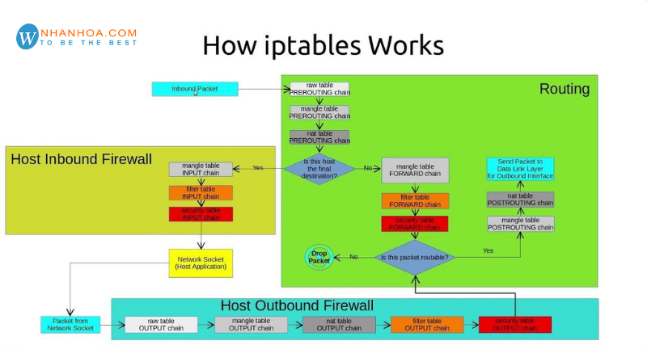
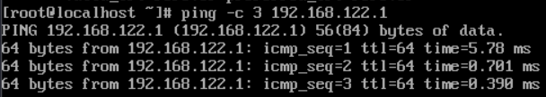
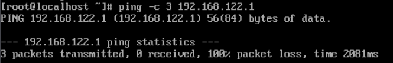
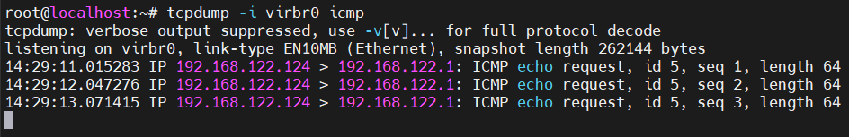

# Tìm hiểu iptables

## I. Khái niệm iptables


- **iptables** là một công cụ quản lý tường lửa (firewall) trong Linux, làm việc với **netfilter** (trong kernel).
- Nó kiểm soát gói tin đi vào, đi ra hoặc đi qua máy Linux.

## II. Thành phần của iptables



### 1. Table

Bộ sưu tập quy tắc trong iptables, mỗi bảng xử lý một loại tác vụ (ví dụ: `filter` cho lọc, `nat` cho NAT).

- **filter (mặc định):** Bảng mặc định, dùng để lọc các gói tin, quyết định gói tin nào được phép đi qua (`ACCEPT`), bị từ chối (`REJECT`) hoặc bị loại bỏ hoàn toàn (`DROP`). Đây là bảng được sử dụng phổ biến nhất cho mục đích bảo mật.
- **nat:** Dùng cho NAT, cho phép chuyển đổi địa chỉ IP và cổng của các gói tin. Nó thường được dùng để chia sẻ kết nối Internet từ một máy chủ sang nhiều máy khác trong mạng nội bộ..
- **mangle:** Table này liên quan đến việc sửa header của gói tin, ví dụ chỉnh sửa giá trị các trường TTL, MTU, Type of Service.
- **raw:** 1 gói tin có thể thuộc một kết nối mới hoặc cũng có thể là của 1 một kết nối đã tồn tại. Table raw cho phép bạn làm việc với gói tin trước khi kernel kiểm tra trạng thái gói tin

### 2. Chain

Chuỗi quy tắc trong mỗi bảng, định nghĩa điểm xử lý gói tin (ví dụ: `INPUT`, `OUTPUT`, `FORWARD` trong `filter`).

- **INPUT:** Xử lý các gói tin đến từ mạng bên ngoài vào máy chủ.
- **OUTPUT:** Xử lý các gói tin từ máy chủ ra mạng bên ngoài.
- **FORWARD:** Xử lý các gói tin đi qua máy chủ (không phải từ hoặc đến máy chủ).
- **PREROUTING:** Xử lý các gói tin ngay khi chúng đến, trước khi chúng được định tuyến.
- **POSTROUTING:** Xử lý các gói tin ngay trước khi chúng rời khỏi máy chủ.

### 3. Rule

Mỗi **Chain** chứa nhiều **Rule**, được kiểm tra theo thứ tự từ trên xuống. Khi khớp rule, sẽ thực hiện Target (ACCEPT, DROP, REJECT, MASQUERADE…).

- **ACCEPT:** Chấp nhận gói tin, cho phép gói tin đi vào hệ thống
- **DROP:** Loại bỏ gói tin, không có gói tin trả lời, giống như là hệ thống không tồn tại
- **REJECT:** Loại bỏ gói tin nhưng có trả lời table gói tin khác, ví dụ trả lời table 1 gói tin “connection reset” đối với gói TCP hoặc bản tin “destination host unreachable” đối với gói UDP và ICMP
- **LOG:** Chấp nhận gói tin nhưng có ghi lại log. Gói tin sẽ đi qua tất cả các rule chứ không dừng lại khi đã đúng với 1 rule đặt ra. Đối với những gói tin không khớp với rule nào cả mặc định sẽ được chấp nhận

## III. Cách thức hoạt động iptables

### 1. Vị trí của iptables trong hệ thống

- **iptables** là công cụ người dùng (user-space).
- Nó giao tiếp với **netfilter** trong kernel để kiểm soát gói tin.
- Khi gói tin đi vào/ra hệ thống, **netfilter** sẽ gọi các hooks (điểm chặn), tại đó **iptables rule** sẽ được áp dụng.

### 2. Các điểm chặn (Netfilter hooks)

Khi một gói tin đi qua Linux host, nó có thể đi qua các hook sau:

```bash
(1) PREROUTING   – xử lý trước khi định tuyến (routing)
(2) INPUT        – gói tin đến chính máy host
(3) FORWARD      – gói tin đi qua máy (host như router)
(4) OUTPUT       – gói tin do máy host sinh ra
(5) POSTROUTING  – xử lý sau khi định tuyến, trước khi ra ngoài
```

Mỗi hooks này được gắn với các chain trong iptables.

### 3. Quy trình xử lý gói tin



**Gói tin đến (Inbound Packet):**

1. **PREROUTING:**

   - Gói tin từ mạng vào, đi qua các bảng:
     - **raw table:** Xử lý trước khi kết nối theo dõi, thường dùng để tắt conntrack.
     - **mangle table:** Thay đổi các thuộc tính gói tin (TTL, TOS).
     - **nat table:** Thực hiện DNAT (chuyển đổi địa chỉ đích) nếu cần.

2. **Routing Decision:**

   - Kiểm tra gói tin có dành cho host này không:
     - **Yes:** Đi vào `Host Inbound Firewall`.
     - **No:** Đi vào chuỗi `FORWARD`.

3. **Host Inbound Firewall:**
   - **mangle table (INPUT chain):** Thay đổi gói tin (nếu có).
   - **filter table (INPUT chain):** Lọc gói tin (ACCEPT, DROP, REJECT).
   - **security table (INPUT chain):** Áp dụng chính sách bảo mật SELinux (nếu bật).
   - Nếu qua, gói tin đến **Network Socket** (ứng dụng host).

**Gói tin chuyển tiếp (Forwarded Packet):**

1. **FORWARD:**

   - Từ `PREROUTING`, nếu không phải đích host:
     - **mangle table (FORWARD chain):** Điều chỉnh gói tin.
     - **filter table (FORWARD chain):** Lọc gói tin.
     - **security table (FORWARD chain):** Kiểm tra bảo mật.
   - Nếu được phép, đi đến **Routing**.

2. **Routing Decision:**

   - Kiểm tra gói tin có định tuyến đến không:
     - **Yes:** Đi đến `POSTROUTING`.
     - **No:** Bị loại bỏ (DROP).

**Gói tin đi ra (Outbound Packet):**

1. Host Outbound Firewall:

   - Gói tin từ **Packet from Network Socket** (ứng dụng host):
     - **raw table (OUTPUT chain):** Xử lý trước conntrack.
     - **mangle table (OUTPUT chain):** Điều chỉnh gói tin.
     - **nat table (OUTPUT chain):** Thực hiện SNAT nếu cần.
     - **filter table (OUTPUT chain):** Lọc gói tin.
     - **security table (OUTPUT chain):** Kiểm tra bảo mật.
   - Nếu qua, đi đến **Routing**.

**POSTROUTING:**

- Sau Routing, gói tin đi qua:
  - **nat table (POSTROUTING chain):** Thực hiện SNAT/MASQUERADE.
  - **mangle table (POSTROUTING chain):** Điều chỉnh cuối cùng.
- Gói tin được gửi đến **Data Link Layer** (giao diện vật lý) để truyền ra ngoài.

## IV. Lệnh cơ bản

### 1. Xem rule hiện tại

```bash
iptables -L -n -v
```

- `-L`: Liệt kê (list) các chuỗi quy tắc (chains) trong các bảng (tables), mặc định là bảng `filter` nếu không chỉ định.
- `-n`: Hiển thị địa chỉ IP và cổng dưới dạng số (numeric), không phân giải tên miền (DNS) hoặc tên dịch vụ, giúp nhanh hơn và rõ ràng hơn.
- `-v`: Hiển thị thông tin chi tiết (verbose), bao gồm số gói tin và byte đã được xử lý bởi mỗi quy tắc, cung cấp dữ liệu thống kê.

### 2. Thêm rule cho chain INPUT (cho phép ping)

```bash
iptables -A INPUT -p icmp -j ACCEPT
```

- `-A INPUT`: Thêm (append) quy tắc vào chuỗi INPUT, xử lý gói tin đến máy.
- `-p icmp`: Chỉ định giao thức là ICMP (Internet Control Message Protocol), dùng cho ping và các thông báo lỗi mạng.
- `-j ACCEPT`: Hành động (jump) là chấp nhận (accept) gói tin, cho phép nó đi qua mà không bị chặn.

### 3. Chặn ip cụ thể

```bash
iptables -A INPUT -s 192.168.100.5 -j DROP
```

### 4. NAT (VM ra Internet thông qua host)

```bash
iptables -t nat -A POSTROUTING -s 192.168.100.0/24 -o eth0 -j MASQUERADE
```

- `-t nat`: Xác định bảng nat, dùng để xử lý các quy tắc chuyển đổi địa chỉ mạng.
- `-A POSTROUTING`: Thêm (append) quy tắc vào chuỗi POSTROUTING, áp dụng sau khi gói tin được định tuyến, trước khi gửi ra giao diện.
- `-s 192.168.100.0/24`: Chỉ định nguồn gói tin từ mạng con 192.168.100.0/24 (mạng nội bộ).
- `-o eth0`: Gói tin sẽ xuất ra giao diện eth0 (giao diện mạng vật lý kết nối Internet).
- `-j MASQUERADE`: Hành động là masquerade, tự động thay đổi (NAT) địa chỉ nguồn IP từ 192.168.100.0/24 thành địa chỉ IP của eth0, thích hợp cho mạng động (DHCP).

### 5. Xóa tất cả rule

```bash
sudo iptables -F
sudo iptables -t nat -F
```

## V. lab

### 1. Xem rule mặc định

```bash
iptables -L -v -n
```

### 2. Thử chặn ping từ 1 VM đến host

Kiểm tra kết nối ban đầu:

```bash
# Thực hiện ping trên vm đến host
ping -c 3 192.168.122.1
```

Nếu host chưa chặn, sẽ nhận reply:



Tạo rule chặn ICMP cho VM:

```bash
# Trên host, dùng iptables
iptables -A INPUT -s 192.168.122.124 -p icmp -j DROP
```

Kiểm tra lại, sẽ không có phản hồi:



### 3. Bật lại rule để VM có thể ra internet (NAT)

Để bật lại ping (cho phép VM ping host), xóa rule đã append (-A) trước đó:

```bash
iptables -D INPUT -s 192.168.122.124 -p icmp -j DROP
```

- `-D`: delete (xóa rule)

### 4. Dùng `tcpdump` để quan sát gói tin bị chặn

Thực hiện chặn gói tin từ vm đến host. Sau đó trên host xác định interface mà libvirt NAT sử dụng (ở đây là `virbr0`).

```bash
# chạy tcpdump
tcpdump -i virbr0 icmp
```

- `-i virbr0` → bắt gói trên interface ảo mà VM kết nối.
- `icmp` → chỉ lọc gói ICMP (ping).

Thực hiện ping trên vm. sau đó quan sát kết quả `tcpdump` trên máy host:



## VI. Ghi nhớ quan trọng

- Rule được kiểm tra từ trên xuống.
- Nếu không có rule khớp → áp dụng policy mặc định của chain (ACCEPT hoặc DROP).
- Để cấu hình vĩnh viễn trên CentOS/RHEL → dùng firewalld hoặc lưu rule bằng:

    ```bash
    service iptables save
    ```
