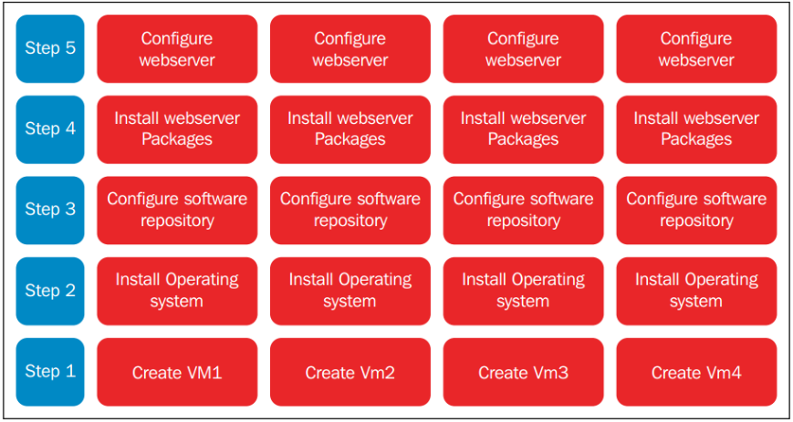
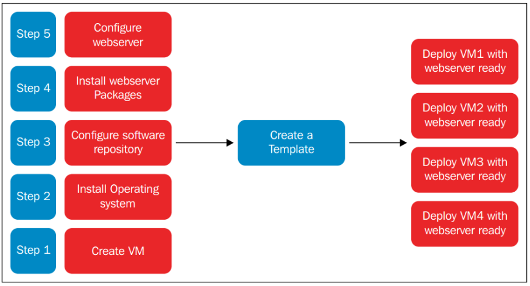

# Tạo template cho VM và tạo VM từ template

## I. Template là gì?

### 1. Khái niệm

**VM template (virtual machine template)** là một bản sao được chuẩn bị sẵn của một máy ảo (VM). Nó bao gồm hệ điều hành đã được cài đặt, các ứng dụng, cấu hình mạng và các thiết lập khác, được dùng làm cơ sở để tạo nhanh các máy ảo mới.

Thay vì phải cài đặt và cấu hình thủ công từng máy ảo từ đầu, người dùng có thể sử dụng một template để sao chép hàng loạt các máy ảo giống hệt nhau. Điều này giúp tiết kiệm thời gian, đảm bảo tính nhất quán và giảm thiểu sai sót trong quá trình triển khai.

### 2. Đặc điểm của VM template

- **Read-only:** Template thường được đánh dấu chỉ đọc, để không ai vô tình khởi động hay thay đổi nó.
- **Chuẩn hóa:** VM được tạo từ template đều có cấu hình OS, phần mềm, driver… giống nhau.
- **Nhanh chóng:** Thay vì cài đặt OS từ đầu, bạn chỉ việc deploy từ template → tiết kiệm thời gian.
- **Tự động hóa:** Kết hợp với công cụ như **cloud-init** (Linux) hoặc **Sysprep** (Windows), các máy ảo sinh ra từ template sẽ tự động đổi hostname, user, IP… để tránh bị trùng lặp.

**Ví dụ:**



- Đây là các bước để tạo VM thông thường. Bước 2-5 đều lặp lại => tốn thời gian.



- Với việc sử dụng template, các bước được rút ngắn đáng kể. Đồng nghĩa với việc rút ngắn thời gian triển khai các VM.

### 3. Mục đích

- Giúp tạo nhanh nhiều VM có cấu hình đồng nhất.
- Tiết kiệm thời gian thay vì phải cài đặt OS từ ISO mỗi lần.
- Đảm bảo tính nhất quán trong môi trường lab hoặc production.

### 4. Khác nhau giữa Clone và template

#### 4.1 Clone VM

- **Định nghĩa:** Là một bản VM đã được chuẩn hoá (cấu hình OS, phần mềm cơ bản, update sẵn…), rồi được chuyển sang trạng thái **read-only** để dùng làm mẫu.
- **Mục đích:** Dùng để triển khai nhiều VM giống nhau nhanh chóng mà không phải cài đặt lại từ đầu.
- **Đặc điểm:**
  - Không dùng trực tiếp để chạy (thường không boot template).
  - Khi cần VM mới → ta deploy từ template.
  - Đảm bảo tính thống nhất (các VM sinh ra từ template giống nhau).
  - Trong các hệ thống như vSphere, Proxmox, KVM + OpenStack → template giúp tạo cloud-init hoặc sysprep để tự động thay hostname, IP, user…
- **Đặc điểm:**
  - Có thể clone cả VM đang chạy (hot clone) hoặc VM đã tắt (cold clone).
  - Bản clone giữ nguyên mọi thứ: hostname, IP, config, dữ liệu.
  - Nếu không chỉnh sửa sau clone → dễ gây trùng lặp (IP trùng, hostname trùng).
  - Clone nhanh chóng nhưng không “chuẩn hóa” như template.

#### 4.2 Template VM

- **Định nghĩa:** Là bản sao chép nguyên xi (copy) từ một VM đang chạy hoặc đã tắt.
- **Mục đích:** Dùng khi muốn nhân đôi một VM cụ thể (bao gồm cả trạng thái OS, dữ liệu, ứng dụng hiện tại).
- **Đặc điểm:**
  - Không dùng trực tiếp để chạy (thường không boot template).
  - Khi cần VM mới → ta deploy từ template.
  - Đảm bảo tính thống nhất (các VM sinh ra từ template giống nhau).
  - Trong các hệ thống như vSphere, Proxmox, KVM + OpenStack → template giúp tạo cloud-init hoặc sysprep để tự động thay hostname, IP, user…

## II. Virt-sysprep

### 1. Virt-sysprep là gì?

`virt-sysprep` là một công cụ thuộc bộ **libguestfs** trong Linux, được dùng để chuẩn bị (**sysprep = system preparation**) một máy ảo hoặc một disk image trước khi dùng làm template hoặc clone.

### 2. Chức năng chính

`virt-sysprep` sẽ xóa hoặc reset các thông tin nhạy cảm/định danh trong máy ảo để tránh bị trùng khi nhân bản nhiều VM.

Ví dụ:

- Xóa **hostname**.
- Xóa **SSH host keys**.
- Xóa **MAC address**.
- Xóa **log files** (messages, secure, journal...).
- Reset **user account password** nếu cần.
- Reset **machine-id**.

Được dùng khi:

- Trước khi biến một VM thành template VM.
- Trước khi clone một VM → để VM mới không bị trùng danh tính mạng (MAC, hostname).
- Khi muốn “làm sạch” một VM để phát hành ra môi trường mới.

### 3. Cách sử dụng

`Ví dụ` có disk image `centos-stream9.qcow2` muốn chuẩn bị làm template:

```bash
virt-sysprep -a /var/lib/libvirt/images/centos-stream9.qcow2
```

- `-a` → chỉ định file disk image.
- Công cụ sẽ chỉnh sửa trực tiếp vào disk image (không cần VM đang chạy).

Sau khi chạy lệnh có thể dùng `virt-clone` hoặc `virt-install` để tạo VM mới từ image này.

## III. Tạo template từ máy ảo và tạo máy ảo từ template

- Host KVM là Ubuntu 24.04
- VM CentOS tên là `centos-stream9` và file disk là `/var/lib/libvirt/images/centos-stream9.qcow2`.

### 1. Tạo Template từ Máy Ảo (trên host KVM Ubuntu 24.04)

**1.1 Cài đặt VM CentOS Stream 9:** Sử dụng `virt-manager` hoặc lệnh `virt-install` để tạo và cài đặt VM với tên **centos-stream9**, cài các gói cần thiết (ví dụ: SSH, net-tools) để làm template.

**1.2 Tắt VM:**

```bash
virsh shutdown centos-stream9
```

- Tắt máy ảo để tránh xung đột khi chỉnh sửa.

**1.3 Cài đặt libguestfs-tools:**

```bash
apt install -y libguestfs-tools
```

- `libguestfs-tools`: công cụ để chỉnh sửa image máy ảo.

**1.4 Chạy virt-sysprep** để loại bỏ những thông tin cụ thể của hệ thống đồng thời niêm phong và biến máy ảo trở thành template

```bash
virt-sysprep -d centos-stream9
```

- Loại bỏ UUID, MAC, hostname, logs để biến VM thành template chung.
- Có 2 options để dùng virt-sysprep đó là `-a` và `-d`. Tùy chọn `-d` được sử dụng với tên hoặc UUID của máy ảo, tùy chọn `-a` được sử dụng với đường dẫn tới ổ đĩa máy ảo.

**1.5 Backup file XML:**

```bash
# Tạo folder lưu trữ template
mkdir -p /etc/libvirt/templates
# Lưu file XML của VM làm template
virsh dumpxml centos-stream9 > /etc/libvirt/templates/centos-stream9-template.xml
```

- Lưu cấu hình XML để tái sử dụng.

**1.6 Undefine VM:**

```bash
virsh undefine centos-stream9
```

- Xóa định nghĩa VM khỏi libvirt, giữ image làm template (`/var/lib/libvirt/images/centos-stream9.qcow2`).

### 2. Sử Dụng Template để Tạo Máy Ảo Mới

**2.1 Tạo file image mới từ template:**

```bash
qemu-img create -f qcow2 -b /var/lib/libvirt/images/centos-stream9.qcow2 -F qcow2 /var/lib/libvirt/images/vm1.qcow2
```

- Tạo disk mới dựa trên template làm backing file (thin provisioning, tiết kiệm dung lượng).

**2.2 Kiểm tra backing file:**

```bash
qemu-img info /var/lib/libvirt/images/vm1.qcow2
```


**2.4 Clone VM từ XML:**

```bash
virt-clone --original-xml /etc/libvirt/templates/centos-stream9-template.xml --file /var/lib/libvirt/images/vm1.qcow2 --name vm1 --preserve-data
```

- Tạo VM mới từ XML, giữ dữ liệu từ backing file. Thay `--preserve-data` bằng `--auto-clone` để tạo disk độc lập.

**2.5 Kiểm tra VM:**

```bash
virsh list --all
```


