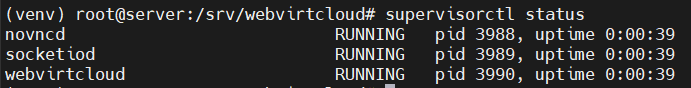

# Cài đặt webvirtcloud trên Ubuntu 24.04

## I. Giới thiệu

### 1. WebVirtCloud là gì?

- Là **web-based KVM management tool**, mã nguồn mở, viết bằng **Django (Python)**.
- Nó là một **lớp quản lý KVM** qua **libvirt** nhưng hiển thị dưới dạng giao diện web.
- Có thể coi như một giải pháp thay thế **Virt-Manager GUI**, nhưng chạy qua trình duyệt.

### 2. Chức năng chính

- **Quản lý host:** kết nối đến 1 hoặc nhiều KVM host qua SSH.
- **Quản lý VM:**
  - Tạo, start, stop, restart, delete VM.
  - Snapshot, clone, migrate.
  - Console VNC/SPICE ngay trên web.
- **Quản lý Storage:**
  - Upload ISO, qcow2.
  - Tạo disk mới, attach/detach disk.
- **Quản lý Network:**
  - Tạo và cấu hình bridge, NAT, isolated network.
- **Multi-user:**
  - Có quản lý **user & role** (admin, user).
  - Hữu ích khi nhiều người cùng sử dụng KVM.

## II. Cài đặt WebVirtCloud (trên Ubuntu 24.04)

### Bước 1: Cài đặt các gói phụ thuộc

Cài đặt tất cả các gói phụ thuộc cần thiết để build và chạy WebVirtCloud:

```bash
# cập nhật hệ thống
apt update && apt upgrade -y
# Cài đặt các gói phụ thuộc
apt install -y git libvirt-dev libxml2-dev libxslt1-dev libxslt1-dev zlib1g-dev libffi-dev libssl-dev supervisor gcc pkg-config libsasl2-dev libssl-dev libldap2-dev
```

### Bước 2: Cài đặt Python và các module

```bash
# Cài đặt Python
apt install -y python3 python3-pip python3-venv
# Kiểm tra phiên bản Python
python3 --version
```


### Bước 3: Cài đặt Web server Nginx

```bash
# Cài đặt Nginx
apt install -y nginx
# Khởi động và bật dịch vụ Nginx khi khởi động hệ thống
systemctl enable --now nginx
```

### Bước 4: Cài đặt WebVirtCloud

```bash
# Dùng git để tải mã nguồn WebVirtCloud vào folder /srv
cd /srv
git clone https://github.com/retspen/webvirtcloud.git

# Di chuyển vào thư mục webvirtcloud
cd webvirtcloud

# Tạo file settings.py từ file mẫu
cp webvirtcloud/settings.py.template webvirtcloud/settings.py

# Tạo SECRET_KEY bằng script có sẵn
SECRET=$(python3 conf/runit/secret_generator.py)

# Thêm secret vừa tạo vào file settings.py
sed -i "s|SECRET_KEY = \"\"|SECRET_KEY = \"$SECRET\"|" webvirtcloud/settings.py

# Mở file settings.py để chỉnh sửa
vim webvirtcloud/settings.py
# Thêm hostname hệ thống vào danh sách CSRF_TRUSTED_ORIGINS
CSRF_TRUSTED_ORIGINS = ['http://192.168.133.133','http://webvirtcloud.test',]

# Thêm dòng sau vào file /etc/hosts
192.168.133.133 webvirtcloud.test

# Sao chép file cấu hình nginx và supervisor
cp conf/nginx/webvirtcloud.conf /etc/nginx/conf.d
cp conf/supervisor/webvirtcloud.conf /etc/supervisor/conf.d

# Mở file cấu hình Nginx để chỉnh sửa
vim /etc/nginx/conf.d/webvirtcloud.conf
# Cập nhật giá trị server_name và cấu hình file log
server {
    listen 80;

    server_name webvirtcloud.test;
    access_log /var/log/nginx/webvirtcloud-access_log;
    error_log /var/log/nginx/webvirtcloud-error_log;

# Tạo môi trường ảo cho WebVirtCloud
python3 -m venv venv

# Kích hoạt môi trường ảo và cài đặt yêu cầu
source venv/bin/activate

# Cài đặt các gói Python trong môi trường ảo
pip3 install -r conf/requirements.txt

# Thực hiện migrate cơ sở dữ liệu và tạo static files
pip3 install setuptools
python3 manage.py migrate
python3 manage.py collectstatic --noinput

# Cấp quyền sở hữu cho user web server
chown -R www-data:www-data /srv/webvirtcloud

# Khởi động lại Nginx và Supervisor
systemctl enable nginx supervisor
systemctl restart nginx supervisor

# Kiểm tra các dịch vụ được quản lý bởi supervisor
supervisorctl status
# Xác nhận dịch vụ đang chạy
ss -tunelp | grep 8000
```




### 5. Truy cập Dashboard WebvirtCloud

Truy cập `http://webvirtcloud.test` hoặc `http://192.168.133.133` để truy cập giao diện WebVirtCloud.

>NOTE: Nếu hiển thị giao diện mặc định của nginx, hãy vô hiệu hóa hoặc xóa file `/etc/nginx/sites-enabled/default`


Tài khoản mặc định là:

- Username: `admin`
- Password: `admin`
