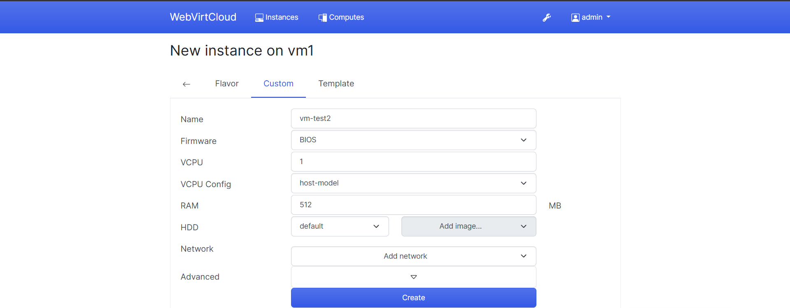

# Các thao tác với VM trên webvirtcloud

## I. Thêm VM

Tạo 1 storage để chạy VM, chọn **Computes**:

Tại giao diện **Computes**, chọn 1 máy để storage (click vào biểu tượng **view** của máy đó):

Trong giao diện của máy vừa chọn, chọn tab **Storages**:

Tại đây, chọn 1 mục để phân vùng lưu trữ VM, ví dụ **default**:

Click chọn biểu tượng **Add Volume** để thêm volume:

Điền thông tin cho VM, sau đó click **Create**:

Nếu thành công, sẽ nhận được thông báo như hình:

Tiếp đến, chọn **Instances**, sau đó click vào biểu tượng **Create Instance** để tạo VM:

Chọn 1 **Compute (host)** để tạo VM, ở đây có 1 **Compute** là **vm1**:

Chọn cấu hình máy ảo để tạo hoặc tạo bằng `XML`:

Tại màn tiếp theo, chọn **cấu hình có sẵn (Flavor)** hoặc **tự cấu hình (Custom)**:

Với chọn cấu hình sẵn, sau khi chọn biểu tượng dấu **+** sẽ xuất hiện thông tin cấu hình. Thêm thông tin và **Create** để tạo VM:

Với cấu hình tùy chỉnh, điền thông tin và **Create** để tạo VM:

## II. Sửa VM

Để thay đổi thông số VM, chọn tab **Instances**, sau đó click vào tên của VM cần sửa:

Chọn tab **Resize** và thay đổi thông số VM (CPU, Memory, Disk), nhấn **Resize** để lưu lại:

## III. Clone VM

Để clone VM, chọn **Instances** -> **Clone** -> Thêm tên mới cho VM clone -> **Clone**:

Sau khi clone thành công, hiển thị giao diện VM đã clone:

## IV. Snapshot VM

### 1. Tạo Snapshot

Cần tắt VM trước khi snapshot.

Chọn **Snapshot** -> Điền thông tin -> **Take Snapshot**:

Sau khi tạo snapshot thành công, có thể thấy snapshot trong tab **Manage Snapshots**:

### 2. Quay lại Snapshot

Click vào biểu tượng **Revert** trong bản snapshot muốn quay lại để quay lại snapshot:

### 3. Xóa Snapshot

Click vào biểu tượng **Delete** trong bản snapshot muốn xóa để xóa snapshot (Biểu tượng thùng rác đỏ bên canh biểu tượng **Revert**).

## V. Xóa VM

Chọn VM muốn xóa, sau đó chọn tab **Destroy** -> **Destroy** để xóa VM:

