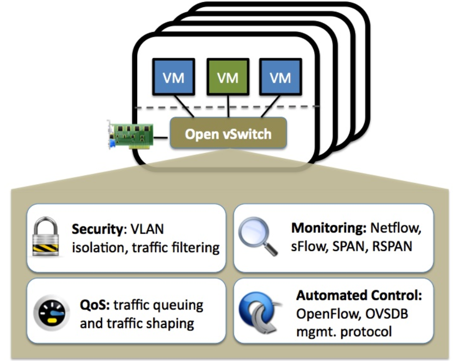
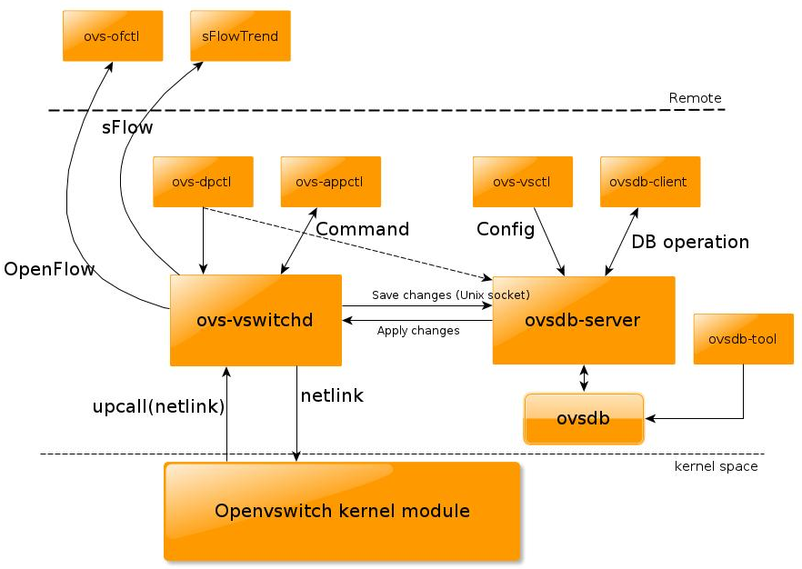
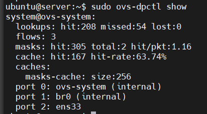
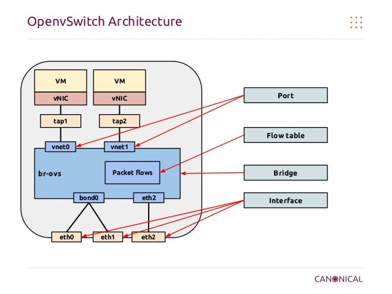
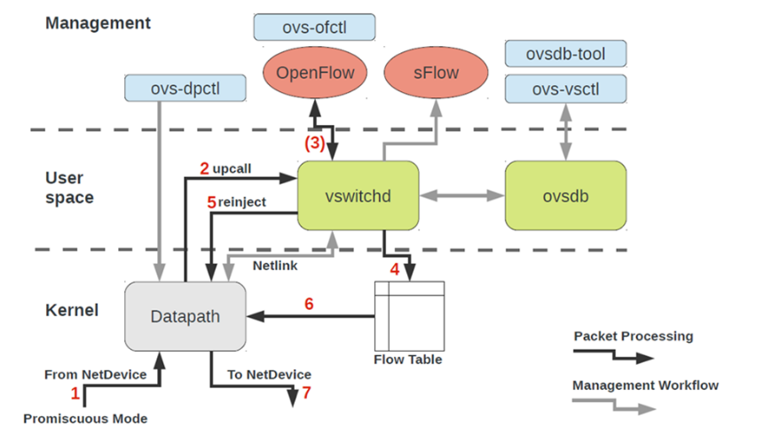

# Open vSwitch

## I. Open vSwitch là gì?



**Open vSwitch (OVS)** là một **virtual switch** mã nguồn mở, được thiết kế để dùng trong môi trường ảo hóa và **cloud computing**. Nó hoạt động giống như một switch trong mạng vật lý, nhưng thay vì kết nối các thiết bị vật lý, OVS kết nối các máy ảo (VM), container, host trong môi trường ảo hóa.

### 1. Tổng quan

- **Open vSwitch** là một phần mềm chuyển mạch đa lớp, được cấp phép theo giấy phép mã nguồn mở Apache 2. Mục tiêu là tạo ra một nền tảng chuyển mạch chất lượng cao, hỗ trợ các giao diện quản lý tiêu chuẩn và cho phép mở rộng, kiểm soát các chức năng chuyển tiếp thông qua lập trình.
- **Open vSwitch** đặc biệt phù hợp để hoạt động như một chuyển mạch ảo trong môi trường máy ảo (VM). Ngoài việc cung cấp các giao diện kiểm soát và quan sát tiêu chuẩn cho tầng mạng ảo, nó được thiết kế để hỗ trợ phân phối trên nhiều máy chủ vật lý. Open vSwitch hỗ trợ nhiều công nghệ ảo hóa dựa trên Linux, bao gồm **KVM** và **VirtualBox**.

### 2. Các tính năng

- **Chuẩn VLAN 802.1Q** với hỗ trợ **trunk port** và **access port**.
- **NIC bonding** (gộp nhiều card mạng) có hoặc không có **LACP** trên switch vật lý upstream
- **NetFlow**, **sFlow**, **mirroring** → tăng cường khả năng giám sát và hiển thị lưu lượng
- **QoS (Quality of Service)** kèm khả năng giới hạn (policing)
- Hỗ trợ nhiều loại tunnel: **Geneve**, **GRE**, **VXLAN**, **ERSPAN**, **GTP-U**, **SRv6**, **Bareudp**.
- **802.1ag Connectivity Fault Management** (quản lý sự cố kết nối)
- **OpenFlow 1.0** kèm nhiều phần mở rộng
- **Cơ sở dữ liệu cấu hình giao dịch** với API C và Python
- **Hiệu năng cao** nhờ Linux kernel module cho forwarding

## II. Open vSwitch components

### 1. Các thành phần chính



**1.1 `ovs-vswitchd`**

- Là một trong những thành phần cốt lõi.
- Đây là **daemon (tiến trình nền)** điều khiển tất cả các switch của **Open vSwitch** trên hệ thống.
- Khi khởi động lần đầu, nó lấy cấu hình ban đầu từ `ovsdb-server` thông qua **giao thức quản lý OVSDB**.
- Giao tiếp với **kernel module** bằng giao thức **netlink**, và giao tiếp với hệ thống thông qua giao diện trừu tượng **netdev**.
- Chịu trách nhiệm triển khai các tính năng của switch như:
  - **Mirroring** (sao chép gói tin để giám sát).
  - **Bonding** (ghép nhiều NIC để tăng băng thông/HA).
  - **VLANs** (gắn thẻ, phân chia VLAN).

**1.2 `ovsdb-server`**

- Là một **cơ sở dữ liệu nhẹ** lưu trữ các cấu hình ở mức switch.
- Nhờ có **ovsdb-server**, các thay đổi cấu hình sẽ được lưu giữ lâu dài, không bị mất sau khi khởi động lại hệ thống.
- Giao tiếp với `ovs-vswitchd` thông qua **giao thức quản lý OVSDB**.

**1.3 `Open vSwitch Kernel Module`**

- Thành phần xử lý **chuyển mạch (switching)** và **tunneling** ở mức kernel.
- Khi một gói tin đến:
  - Nếu có luồng (flow) tương ứng đã tồn tại → xử lý ngay tại kernel (nhanh).
  - Nếu chưa có flow → gói tin được chuyển lên **userspace** để `ovs-vswitchd` xử lý.
- Được thiết kế để nhanh và đơn giản, không biết gì về OpenFlow (mọi giao tiếp OpenFlow đều do `ovs-vswitchd` xử lý).
- Triển khai khái niệm **datapath**:
  - Datapath là một tập hợp các port vật lý hoặc ảo.
  - Có thể coi như một “bridge” nhưng nằm trong kernel thay vì userspace.
  - Mỗi datapath có thể có nhiều port, được gọi là vports.
  - Quản lý bằng lệnh `ovs-dpctl`.

**1.4 `OpenFlow Controller (Bộ điều khiển OpenFlow)`**

- Không phải là một phần trực tiếp của OVS, nhưng rất quan trọng trong môi trường thực tế.
- Các flow lưu trong ovs-vswitchd sẽ bị mất nếu dịch vụ khởi động lại hoặc bị crash.
- Để đảm bảo các flow quan trọng được duy trì lâu dài, ta thường dùng một OpenFlow Controller.
- Controller này thường được cài đặt trên remote server (vì thế nó được vẽ ở không gian khác trong sơ đồ), nhưng cũng có thể chạy trên cùng server với OVS.

### 2. Open vSwitch utilities

**2.1 `ovs-vsctl`**

- Dùng để truy vấn và cập nhật cấu hình của `ovs-vswitchd`.
- Một số thao tác phổ biến:
  - Tạo, xoá, quản lý bridge.
  - Thêm/xoá port vào bridge.
  - Cấu hình VLAN, bonding, mirror.
- Ví dụ:

```bash
sudo ovs-vsctl show
sudo ovs-vsctl add-br br0
sudo ovs-vsctl add-port br0 ens33
```

**2.2 `ovs-ofctl`**

- Dùng để truy vấn và điều khiển các switch và controller theo chuẩn **OpenFlow**.
- Cho phép quản lý **flow entries** (các quy tắc xử lý gói tin).

**2.3 `ovs-dpctl`**

- Dùng để cấu hình kernel module (datapath) của OVS.
- Cho phép:
  - Tạo, sửa, xoá datapath.
  - Thêm hoặc xoá vport trong datapath.
- Ví dụ:

```bash
sudo ovs-dpctl show
sudo ovs-dpctl add-dp dp0
sudo ovs-dpctl add-if dp0 ens33
```



**2.4 `ovs-appctl`**

- Là công cụ để gửi lệnh trực tiếp đến các daemon của Open vSwitch (như `ovs-vswitchd`, `ovsdb-server`).
- Dùng cho mục đích quản trị nâng cao, debug và kiểm tra trạng thái.
- Ví dụ:

```bash
sudo ovs-appctl vlog/list       # xem cấu hình logging
sudo ovs-appctl bridge/dump-flows br0
sudo ovs-appctl -t ovs-vswitchd exit   # dừng ovs-vswitchd
```

Mô hình sử dụng Open vSwitch:



## III. Open vSwitch Modes

Bridge trong Open vSwitch có thể hoạt động theo hai chế độ khi chuyển tiếp gói tin: **Normal mode** hoặc **Flow mode**.

### 1. Normal mode (Chế độ thường)

Trong chế độ này, cơ chế hoạt động của **Open vSwitch** tương tự như một switch Ethernet truyền thống dựa trên **bảng MAC**.

**Quy trình:**

1. Khi một frame (gói tin lớp 2) được nhận lần đầu, switch sẽ so sánh địa chỉ MAC nguồn với bảng MAC:
   - Nếu địa chỉ MAC nguồn chưa tồn tại trong bảng → switch thêm địa chỉ MAC này vào bảng, kèm theo số cổng mà frame được nhận.
2. Tiếp theo, switch so sánh địa chỉ MAC đích trong frame với bảng MAC:
   - Nếu tìm thấy địa chỉ đích trong bảng → frame được chuyển tiếp ra cổng tương ứng.
   - Nếu không tìm thấy địa chỉ đích trong bảng → switch thực hiện flooding (phát ra tất cả các cổng ngoại trừ cổng nhận frame).

Để xem bảng địa chỉ MAC, sử dụng lệnh:

```bash
ovs-appctl fdb/show <bridge_name>
```

### 2. Flow mode (Chế độ theo luồng – Flow-based)

Trong chế độ này, việc chuyển tiếp gói tin dựa trên bảng luồng (flow tables), được định nghĩa theo chuẩn OpenFlow.

**Đặc điểm chính:**

- Một switch có thể có một hoặc nhiều flow table.
- Flow table có thể được:
  - Tạo thủ công bằng lệnh **ovs-ofctl add-flow**.
  - Hoặc được **OpenFlow Controller** thiết lập và quản lý tự động.

**Quy trình:**

1. Khi một gói tin đi vào switch, nó sẽ được xử lý bởi bảng luồng có số thứ tự nhỏ nhất (thường là bảng 0).
   - Mỗi bảng chứa nhiều **flow entry**.
2. Mỗi flow entry bao gồm:
   - **Match fields:** gồm các thông tin từ header gói tin (IP destination, VLAN ID, cổng UDP nguồn, mã ICMP, cổng vào…) và có thể thêm metadata.
   - Nếu gói tin khớp nhiều flow entry → entry có **độ ưu tiên (priority)** cao nhất sẽ được chọn.
3. Sau khi tìm được flow entry phù hợp, phần Action trong entry sẽ quyết định xử lý tiếp theo:
   - **required actions:** forward đến cổng cụ thể, drop (loại bỏ), hoặc xử lý qua một nhóm (group).
   - **optional actions:** thay đổi TTL, chỉnh sửa trường header, thêm (push) thẻ VLAN,…
4. Nếu gói tin không khớp bất kỳ flow entry nào → tình huống này gọi là table-miss. Khi đó gói tin sẽ:
   - Gửi thông tin tới Controller (nếu có).
   - Nếu không có Controller, gói tin sẽ bị drop hoặc chuyển tiếp sang bảng luồng khác (nếu được cấu hình).

## IV. Kiến trúc xử lý gói tin (Packet Processing) và luồng quản lý (Management Workflow) trong Open vSwitch



- **Packet Processing (dòng đen):** xử lý gói dữ liệu thực sự (Data Plane).
- **Management Workflow (dòng xám):** cấu hình, giám sát, quản lý OVS (Control Plane + Management Plane).

### 1. Packet Processing

Đây là cách OVS xử lý gói tin khi nó đi qua switch:

1. **Từ NetDevice → Datapath**
   - Gói tin đi vào từ interface vật lý/ảo (eth0, tap, vnet, v.v.).
   - Kernel Datapath nhận gói tin.
2. **Upcall (nếu không có flow match trong kernel)**
    - Nếu Datapath Flow Table không có entry phù hợp → gói tin được đẩy (upcall) lên userspace (ovs-vswitchd).
3. **ovs-vswitchd xử lý bằng OpenFlow**
    - ovs-vswitchd kiểm tra OpenFlow rules (được cấu hình bởi quản trị hoặc controller SDN).
    - Nếu có rule → quyết định hành động (forward, drop, modify, output...).
4. **Cập nhật Flow Table trong Kernel**
    - ovs-vswitchd cài đặt rule mới vào Datapath Flow Table trong kernel để những gói tin sau được xử lý nhanh mà không cần lên userspace nữa.
5. **Reinject**
    - Gói tin đầu tiên được xử lý bởi ovs-vswitchd sẽ được gửi ngược lại vào Datapath để thực thi theo rule mới.
6. **Datapath xử lý các gói tiếp theo**
    - Các gói tiếp theo cùng flow match trực tiếp ở Kernel Flow Table → xử lý nhanh, không cần đi userspace.
7. **Output ra NetDevice**
    - Gói tin cuối cùng được gửi ra port đích (interface thật hoặc vNIC của VM).

### 2. Management Workflow

Đây là cách quản trị viên hoặc controller cấu hình và quản lý OVS:

- **ovs-vsctl / ovsdb-tool → ovsdb**
  - Lệnh quản lý cấu hình (tạo bridge, thêm port, VLAN, bond…) đi vào OVSDB.
  - ovsdb giữ thông tin cấu hình (persistent state).
- **ovsdb ↔ ovs-vswitchd**
  - ovs-vswitchd lấy cấu hình từ ovsdb để biết switch có những bridge, port, VLAN nào.
- **ovs-ofctl → ovs-vswitchd (OpenFlow)**
  - ovs-ofctl (hoặc SDN controller như OpenDaylight, ONOS) cài đặt OpenFlow rules vào ovs-vswitchd.
- **ovs-dpctl → Datapath**
  - ovs-dpctl dùng để kiểm tra/trực tiếp chỉnh sửa flow trong kernel datapath (ít dùng trong quản lý thường ngày, chủ yếu debug).
