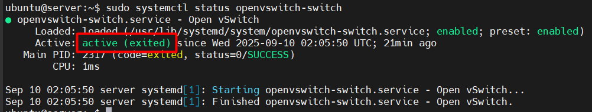
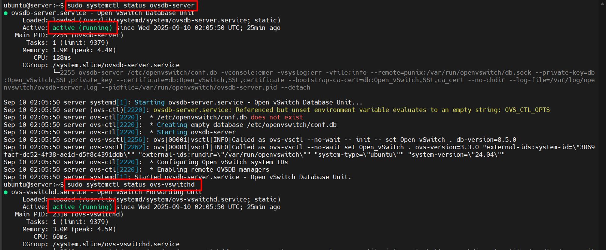
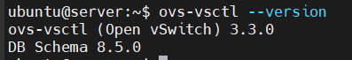
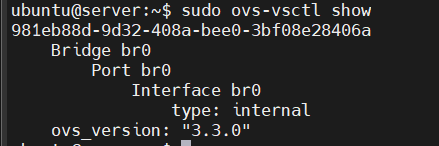
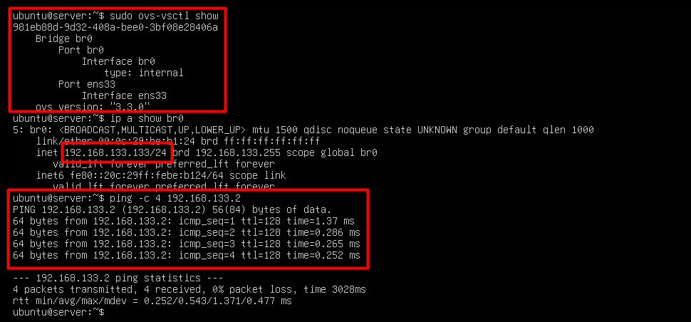

# Install Open vSwitch

## I. Cài đặt Open vSwitch trên Ubuntu 24.04

### 1. Cài đặt các gói cung cấp tiện tích OVS

```bash
# Tải gói chính thức trong kho APT
sudo apt install -y openvswitch-switch
```

- `openvswitch-common`: Chứa các tệp chung cần thiết cho **Open vSwitch**, bao gồm thư viện, tiện ích (`ovs-vsctl`, `ovs-ofctl`, v.v.) và tệp cấu hình cơ bản. Đây là gói cơ sở cho các thành phần Open vSwitch.
- Package `openvswitch-switch` sẽ cài:
  - `ovs-vswitchd` (daemon chính thực hiện switching).
  - `ovsdb-server` (database server để lưu cấu hình).
  - Các công cụ CLI (`ovs-vsctl`, `ovs-ofctl`, `ovs-appctl`).

### 2. Kiểm tra trạng thái dịch vụ OVS

Sau khi cài xong, kiểm tra trạng thái:

```bash
sudo systemctl status openvswitch-switch
```

Kết quả hiển thị dịch vụ đang chạy (active):



- `openvswitch-switch` chỉ là **unit khởi tạo (wrapper)**, nó chạy xong rồi thoát → báo `exited`.
- Các daemon thật sự cần chạy là:
  - `ovsdb-server`: database server.
  - `ovs-vswitchd`: daemon chuyển mạch.
- Kiểm tra 2 daemon này:

  ```bash
  sudo systemctl status ovsdb-server
  sudo systemctl status ovs-vswitchd
  ```

  

  - Nếu thấy `active (running)` → OVS đang hoạt động bình thường

### 3. Kiểm tra phiên bản OVS

```bash
ovs-vsctl --version
```



- Xác nhận OVS đã cài thành công, biết được phiên bản (Ubuntu 24.04 thường có OVS 3.x).

### 4. Tạo bridge ảo

Tạo switch ảo (bridge) tên `br0`:

```bash
sudo ovs-vsctl add-br br0
```

Kiểm tra:

```bash
sudo ovs-vsctl show
```



- `br0` là virtual switch do OVS quản lý.
- Tương tự như `br0` trong Linux Bridge, nhưng mạnh mẽ hơn.

### 5. Thêm card mạng vật lý vào Bridge

Card trên máy là `ens33` (kiểm tra bằng `ip a`):

```bash
sudo ovs-vsctl add-port br0 ens33
```

- Sau khi gắn `ens33` vào `br0`, card vật lý này sẽ trở thành “port” của switch ảo.
- IP sẽ phải gán cho **bridge** (`br0`), chứ không còn đặt trực tiếp trên `ens33`.

### 6. Cấu hình IP cho Bridge bằng Netplan

Cấu hình file netplan:

```yaml
network:
  version: 2
  renderer: networkd
  ethernets:
    ens33: {}
  bridges:
    br0:
      interfaces: [ens33]
      addresses:
        - 192.168.133.133/24
      routes:
        - to: default
          via: 192.168.133.2
      nameservers:
        addresses:
          - 8.8.8.8
          - 8.8.4.4
```

Áp dụng cấu hình:

```bash
sudo netplan apply
```

- `ens33` chỉ còn vai trò port vật lý trong `br0`.
- Toàn bộ cấu hình IP nằm trên `br0`.

### 7. Kiểm tra hoạt động

Xem bridge:

```bash
sudo ovs-vsctl show
```

Xem IP:

```bash
ip a show br0
```

Ping thử gateway:

```bash
ping -c 4 192.168.133.2
```



Nếu gặp lỗi `Device or resource busy`:

1. Tắt mạng mặc định của libvirt (virbr0) - muốn VM dùng OVS (br0) làm bridge chính:

    ```bash
    sudo virsh net-destroy default
    sudo virsh net-autostart --disable default
    ```

2. Sau đó, chỉ giữ `br0` của OVS và gắn VM vào đó.
3. Lúc này `ens33` chỉ tham gia một bridge duy nhất → `br0`, nên không bị conflict.

### 8. Một số lệnh quản lý hữu ích

Liệt kê bridge:

```bash
sudo ovs-vsctl list-br
```

Liệt kê port của bridge:

```bash
sudo ovs-vsctl list-ports br0
```

Xóa port:

```bash
sudo ovs-vsctl del-port br0 ens33
```

Xóa bridge:

```bash
sudo ovs-vsctl del-br br0
```

## II. Cài đặt Cài đặt Open vSwitch trên Ubuntu 24.04 (tự động thêm IP)

### 1. Để netplan chỉ cấu hình interface vật lý (ens33) mà không gán IP

```yaml
network:
  version: 2
  ethernets:
    ens33: {}
```

### 2. Tạo script tự động tạo bridge và gán IP

- Tạo script `/usr/local/bin/setup-ovs.sh`:

```bash
#!/bin/bash
sudo ovs-vsctl --may-exist add-br br0
sudo ovs-vsctl --may-exist add-port br0 ens33
sudo ip addr flush dev ens33
sudo ip addr add 192.168.133.133/24 dev br0
sudo ip link set br0 up
sudo ip route add default via 192.168.133.2
echo "nameserver 8.8.8.8" | sudo tee /etc/resolv.conf
echo "nameserver 8.8.4.4" | sudo tee -a /etc/resolv.conf
```

- Cấp quyền thực thi:

```bash
sudo chmod +x /usr/local/bin/setup-ovs.sh
```

### 3. enable dịch vụ

```bash
sudo systemctl daemon-reload
sudo systemctl enable br0
```

- Sau reboot, script sẽ chạy và gắn IP cho `br0`.
