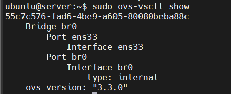
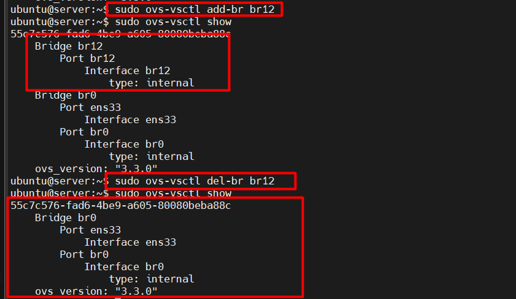
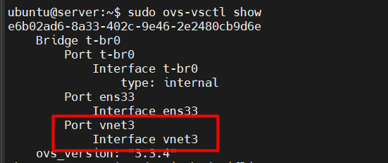
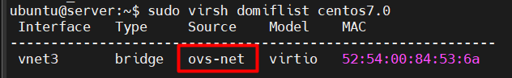

# Lab Open vSwitch

## I. Các nhóm lệnh chính

### 1. Open vSwitch Daemon Commands

- Dùng để điều khiển toàn hệ thống OVS.
- Công cụ chính: `ovs-vsctl` (tương tác với ovs-vswitchd).

Ví dụ:

```bash
# Kiểm tra cấu hình hiện tại
sudo ovs-vsctl show
```



> Hiển thị toàn bộ bridge, port, interface trong OVS.

### 2. Bridge Commands

- Quản lý virtual switch (bridge).

Ví dụ:

```bash
# Tạo bridge mới
sudo ovs-vsctl add-br br0

# Xóa bridge
sudo ovs-vsctl del-br br0

# Xem danh sách bridge
sudo ovs-vsctl list-br
```



> Mỗi bridge tương đương 1 switch ảo.

### 3. Port Commands

- Quản lý cổng (port) được gắn vào bridge.

Ví dụ:

```bash
# Thêm port vật lý ens33 vào br0
sudo ovs-vsctl add-port br0 ens33

# Thêm port nội bộ (internal)
sudo ovs-vsctl add-port br0 br0-int -- set interface br0-int type=internal

# Xóa port
sudo ovs-vsctl del-port br0 ens33

# Liệt kê port của bridge
sudo ovs-vsctl list-ports br0
```

> Mỗi port là slot trên switch để cắm card mạng.

### 4. Interface Commands

- Quản lý interface gắn với port.

Ví dụ:

```bash
# Liệt kê tất cả interfaces
sudo ovs-vsctl list interface

# Xem chi tiết interface cụ thể
sudo ovs-vsctl list interface ens33
```

> Interface = NIC thật (ens33), NIC ảo (tap/vnet), tunnel (vxlan, gre), patch...

### 5. Database Commands

- OVS sử dụng `ovsdb-server` để lưu trữ cấu hình trong dạng database.
- Các table chính: `Bridge`, `Port`, `Interface`, `Open_vSwitch`, `Flow_Table`...

Một số lệnh:

```bash
# Liệt kê tất cả bảng trong database
sudo ovs-vsctl list-tables

# Liệt kê record trong bảng Bridge
sudo ovs-vsctl list Bridge

# Hiển thị chi tiết record theo cột
sudo ovs-vsctl list interface name,type

# Tìm kiếm record có name=br0 trong bảng Bridge
sudo ovs-vsctl find Bridge name=br0
```

## II. Cấu hình máy ảo KVM sử dụng ovs

### 1. Cài plugin để libvirt hiểu OVS

```bash
sudo apt install openvswitch-switch
sudo apt install libvirt-daemon-system libvirt-clients
```

### 2. Tạo OVS bridge network trong `/etc/libvirt/qemu/networks/ovs.xml`

```xml
<network>
  <name>ovs-net</name>
  <forward mode='bridge'/>
  <bridge name='t-br0'/>
  <virtualport type='openvswitch'/>
</network>
```

Kích hoạt:

```bash
sudo virsh net-define /etc/libvirt/qemu/networks/ovs.xml
sudo virsh net-start ovs-net
sudo virsh net-autostart ovs-net
```

Sửa đổi file XML của máy ảo:

```xml
<interface type='network'>
  <mac address='52:54:00:84:53:6a'/>
  <source network='ovs-net'/>
  <model type='virtio'/>
</interface>
```

### 3. Kiểm tra

```bash
# Trên host
sudo ovs-vsctl show
```



- Cổng `vnetX` đã được thêm (chính là interface nối với VM).

```bash
# Trên host
sudo virsh domiflist centos7.0
```



- Cột `Source` = `ovs-net` nghĩa là VM đã nối qua OVS.
