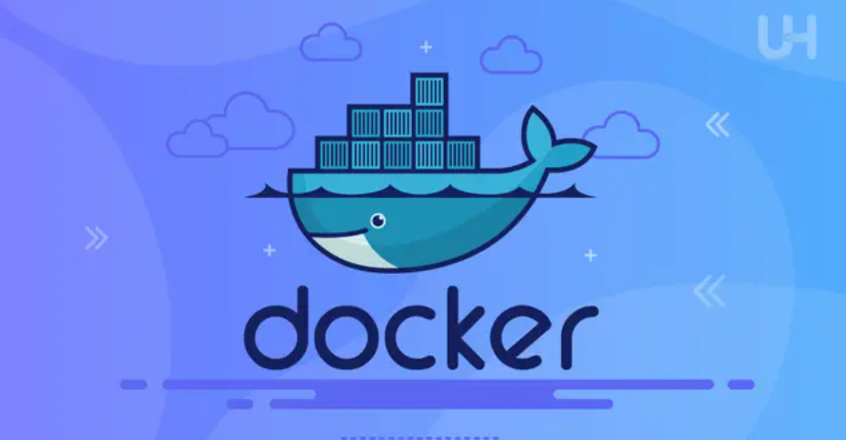

# Tìm hiểu về Docker

## I. Một số khái niệm cơ bản

### 1. Docker là gì?



**Docker** là một nền tảng mã nguồn mở cho phép đóng gói, triển khai và chạy ứng dụng trong các container - môi trường ảo hóa nhẹ, độc lập, và nhất quán trên mọi hệ thống.

**Docker** giúp nhà phát triển:

- Đóng gói toàn bộ ứng dụng cùng thư viện, công cụ, cấu hình vào một **Docker Image** nhỏ gọn.
- Chạy ứng dụng đó ở bất kỳ đâu mà không lo khác biệt môi trường (máy thật, server, cloud, v.v.).

`Ví dụ`: Một ứng dụng web cần Python 3.10, Flask, Redis. Thay vì cài đặt thủ công trên server, chỉ cần chạy:

```bash
docker run myflaskapp
```

- **Docker** sẽ tạo container có sẵn mọi thứ bạn cần, hoạt động đồng nhất ở mọi nơi.

### 2. Docker Container là gì?

**Docker Container** là một phiên bản đang chạy của một Docker Image. Nó là một môi trường thực thi nhẹ, độc lập và cô lập được tạo ra từ Docker Image.

**Container** sử dụng các tính năng của **Nhân Linux (Linux Kernel)** như **Namespaces** và **cgroups** để cô lập các tiến trình, mạng và hệ thống tệp khỏi các container khác và khỏi hệ thống máy chủ, nhưng vẫn chia sẻ chung nhân hệ điều hành.

### 3. Các thuật ngữ quan trọng trong Docker

1. **Dockerfile:** Là tập tin định nghĩa cách xây dựng Docker Image. Dockerfile chứa các chỉ thị (instruction) từng bước như:
   - `FROM` — chọn base image
   - `RUN` — cài gói
   - `COP`Y / `ADD` — sao chép file
   - `CMD` / `ENTRYPOINT` — chỉ định lệnh khởi chạy container

   ```bash
   FROM python:3.10
   WORKDIR /app
   COPY . .
   RUN pip install -r requirements.txt
   CMD ["python", "app.py"]
   # Chạy
   docker build -t myapp .
   ```

   - Sinh ra image `myapp`.

2. **Docker Container:** Là thực thể đang chạy của Docker Image. Đây là môi trường cô lập, nơi ứng dụng được thực thi. Mỗi container có:
   - ID riêng.
   - IP riêng.
   - File system riêng (các layer của image + layer ghi tạm thời).
3. **Docker Hub:** Là một **kho lưu trữ (Registry)** công cộng và lớn nhất cho Docker Images. Nó cho phép người dùng **lưu trữ**, **chia sẻ** và **tải xuống (pull)** các Image container.
4. **Docker Client:** Là **công cụ dòng lệnh (CLI)** mà bạn dùng để giao tiếp với **Docker**.
   - **Client** không chạy container, nó gửi yêu cầu qua REST API đến Docker Daemon.
   - Khi gõ lệnh `docker run`, thực tế đang sử dụng **Docker Client** để gửi yêu cầu đến **Docker Engine**.
5. **Docker Engine:** là thành phần cốt lõi của Docker, bao gồm daemon (`dockerd`) quản lý vòng đời container, CLI (docker) để tương tác, và runtime (`containerd` hoặc `runc`) để chạy container trên Linux kernel.
6. **Docker Daemon (dockerd):** Là một tiến trình nền (Server) chạy trên máy chủ Docker. Nó lắng nghe các yêu cầu từ Docker Client thông qua API và quản lý tất cả các đối tượng Docker: Images, Containers, Networks và Volumes.
7. **Docker Volumes:** Là cơ chế được sử dụng để lưu trữ dữ liệu bền vững (persistent data) cho các container. Dữ liệu trong Volumes được lưu trữ trên hệ thống tệp của máy chủ Host, độc lập với vòng đời của container, đảm bảo dữ liệu không bị mất khi container bị xóa.
8. **Docker Machine:** Là một công cụ (cũ hơn, ít dùng hiện nay) cho phép bạn cài đặt Docker Engine trên các máy ảo (VM) trên đám mây hoặc trên máy cục bộ, giúp quản lý các host Docker từ xa.
9. **Docker Compose:** Là công cụ để định nghĩa và chạy nhiều container cùng lúc (multi-container applications). Compose dùng file YAML (docker-compose.yml) để mô tả toàn bộ stack.
10. **Docker Image:** Docker Image là mẫu đóng gói (template) chứa toàn bộ ứng dụng, thư viện, hệ thống file cần thiết để chạy container. Mỗi image được tạo từ nhiều layer, chỉ ghi phần thay đổi (“copy-on-write”).

```pgsql
+------------------------------------------------------+
|                   Docker Client (CLI)                |
|   --> gửi yêu cầu đến Docker Daemon qua API          |
+------------------------------------------------------+
|                   Docker Daemon (dockerd)            |
|   --> quản lý container, image, network, volumes     |
|   --> gọi containerd + runc để chạy container        |
+------------------------------------------------------+
|                  Docker Engine (toàn bộ stack)       |
+------------------------------------------------------+
|                Docker Hub (Image Registry)           |
|   --> lưu trữ, chia sẻ Docker images                 |
+------------------------------------------------------+
|              Docker Volumes (Persistent Data)        |
|   --> lưu dữ liệu không mất khi container bị xóa     |
+------------------------------------------------------+
|               Docker Compose (Multi-container)       |
|   --> orchestration nhiều container cùng lúc         |
+------------------------------------------------------+
|                Docker Machine (Host Manager)         |
|   --> tạo & quản lý các Docker host (VM, cloud)      |
+------------------------------------------------------+
```

- **Docker** = Nền tảng quản lý container toàn diện.
- **Docker Container** = Môi trường thực thi độc lập được tạo từ **Docker Image**.
- **Dockerfile** = Hướng dẫn xây dựng image.
- **Docker Hub** = Kho lưu trữ image.
- **Docker Engine** = Hệ thống chạy Docker.
- **Docker Compose / Machine / Volumes** = Công cụ mở rộng quản lý và lưu trữ.

## II. Các thành phần của Docker

### 1. Các thành phần cốt lõi

**1.1 Docker Daemon (dockerd):**

- **Vai trò:** Là thành phần Server chính của kiến trúc, chạy dưới dạng một tiến trình nền trên máy chủ (Host).
- **Chức năng:**
  - Quản lý vòng đời của các container.
  - Xử lý các yêu cầu từ Docker Client thông qua API.
  - Quản lý các đối tượng Docker như Images, Containers, Networks và Volumes.

**1.2 Docker Client:**

- **Vai trò:** Là công cụ dòng lệnh (CLI) mà người dùng sử dụng để tương tác với Docker.
- **Chức năng:**
  - Gửi các lệnh và yêu cầu đến Docker Daemon qua REST API.
  - Không trực tiếp chạy container, mà chỉ gửi yêu cầu để Docker Daemon thực hiện.

**1.3 Rest API:**

- **Vai trò:** Là giao diện lập trình ứng dụng (API) mà Docker Client sử dụng để giao tiếp với Docker Daemon.
- **Chức năng:**
  - Cung cấp các endpoint để thực hiện các thao tác như tạo, quản lý container, image, network và volume.

### 2. Các đối tượng Docker (Docker Objects)

Đây là các thực thể mà Docker Daemon quản lý và thao tác để tạo nên một ứng dụng container hóa:

| Đối tượng | Vài trò và chức năng |
|-----------|----------------------|
| **Image** | Là bản thiết kế tĩnh, chỉ đọc (read-only), bao gồm mã ứng dụng, runtime, thư viện và cấu hình cần thiết. Image được tạo ra từ Dockerfile. |
| **Container** | Là phiên bản đang chạy của một Image. Đây là môi trường cô lập, nơi ứng dụng được thực thi. |
| **Registry** | Là nơi lưu trữ tập trung các Image Docker. Docker Hub là Registry công cộng mặc định. Bạn sử dụng lệnh docker pull để tải Image về và docker push để chia sẻ Image. |
| **Network** | Là cơ chế cho phép các container giao tiếp với nhau và với máy chủ/mạng bên ngoài. |
| **Volume** | Là cơ chế để lưu trữ dữ liệu bền vững (persistent data), tách biệt khỏi vòng đời của container. Điều này quan trọng cho dữ liệu cơ sở dữ liệu hoặc cấu hình. |

### 3. Các Công cụ Hỗ trợ (Supporting Tools)

**Docker Compose:**

- **Mục đích:** Quản lý các ứng dụng multi-container.
- **Hoạt động:** Sử dụng tệp YAML để định nghĩa tất cả các dịch vụ (container), mạng và volumes cần thiết cho một ứng dụng, cho phép khởi chạy toàn bộ ứng dụng bằng một lệnh duy nhất.

**Dockerfile:**

- **Mục đích:** Định nghĩa quy trình xây dựng Image.
- **Hoạt động:** Chứa các lệnh tuần tự để Docker Engine thực hiện nhằm tạo ra Image.

## III. Quy trình thực thi một hệ thống sử dụng Docker


Để triển khai một hệ thống Docker, ta cần trải qua các bước chính sau:

- **Build:** Đầu tiên, cần tạo một file Dockerfile chứa code. Dockerfile này sẽ được build ở một máy tính có cài đặt Docker Engine. Khi build xong, sẽ có một container chứa ứng dụng kèm bộ thư viện.
- **Push:** thực hiện push Container lên cloud và lưu lại sau khi có được container.
- **Pull & Run:** Ở máy chủ (server) cần chạy ứng dụng, ta sẽ pull container từ cloud về (máy chủ đó phải cài đặt trước Docker Engine. Tiếp theo, bạn mới thực hiện Run Container này).
