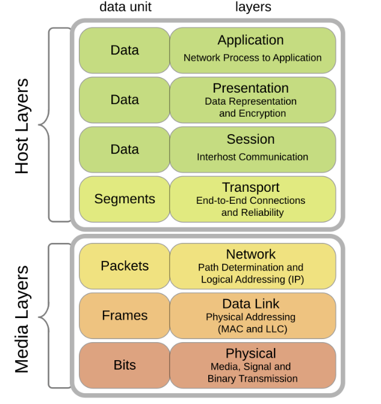
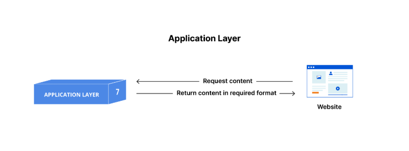
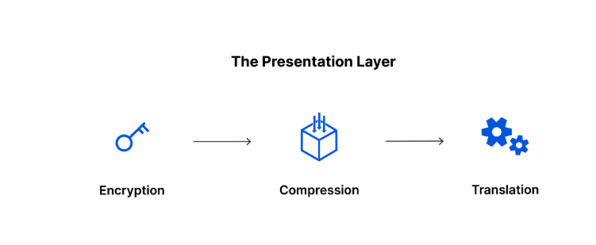
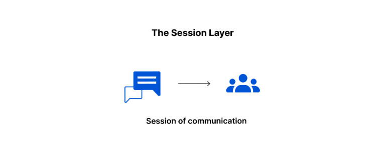
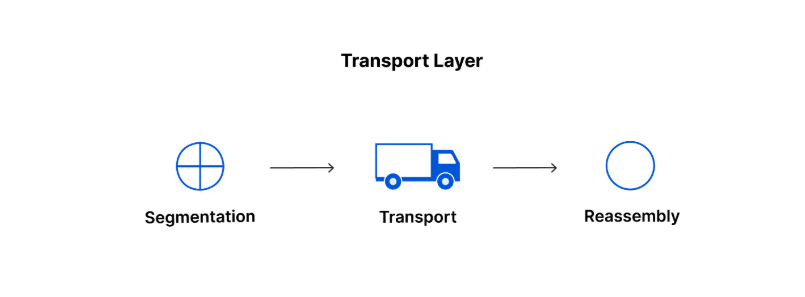
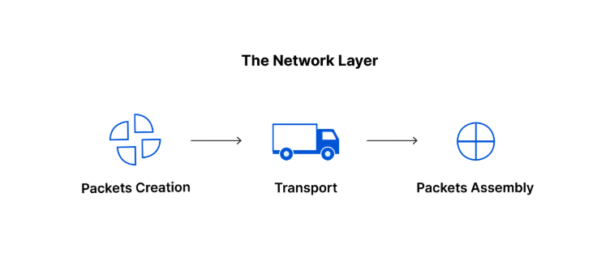
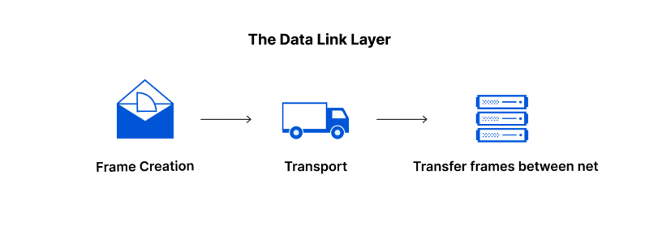

# OSI Model

## Tại sao lại sử dụng mô hình mạng phân lớp?

- Giảm thiểu được độ phức tạp của các hệ thống truyền dữ liệu: Các công việc được chia ra và riêng biệt hóa, vậy nên không có công ty nào phải đảm nhận tất cả công việc trong hệ thống. Các công ty chuyên về thiết bị, phần mềm nào thì sẽ thực hiện công việc đó.
- Chuẩn hóa về các giao diện của của các dòng sản phẩm: Mỗi lớp được chia ra đều quy định các đặc tính kỹ thuật, tính năng mà nhà sản xuất khi tham gia buộc phải tuân theo.
- Từ việc chuẩn hóa dẫn đến việc đảm bảo tính tương thích về mặt công nghệ:Thiết bị khác hãng có thể giao tiếp với nhau.
- Thúc đẩy kỹ thuật module hóa: nhà sản xuất mạnh về công việc nào thì chỉ tham gia vào lớp công việc đó.
- Từ 4 đặc điểm trên dẫn đến sự thúc đẩy sự phát triển của ngành công nghệ mạng.

## Mô hình OSI là gì?

**Mô hình OSI (Open Systems Interconnection)** là một mô hình tham chiếu chuẩn quốc tế được phát triển bởi ISO (International Organization for Standardization) để chuẩn hóa cách các thiết bị và hệ thống mạng giao tiếp với nhau. Mô hình OSI chia quá trình giao tiếp mạng thành bảy lớp (layers), mỗi lớp có nhiệm vụ cụ thể, giúp đảm bảo việc truyền dữ liệu từ nguồn đến đích diễn ra hiệu quả và chính xác.

**Các lớp mô hình OSI** được đánh số từ 7 đến 1:

- Lớp 7 - Application (Ứng dụng).
- Lớp 6 - Presentation (Trình bày).
- Lớp 5 - Session (Phiên).
- Lớp 4 - Transport (Vận chuyển).
- Lớp 3 - Network (Mạng).
- Lớp 2 - Data Link (Liên kết dữ liệu).
- Lớp 1 - Physical (Vật lý).

**Tại sao mô hình OSI quan trọng?**

- Chuẩn hóa dữ liệu mạng: Mô hình OSI cung cấp một ngôn ngữ chung để các thiết bị và giao thức của các nhà sản xuất khác nhau có thể tương thích.
- Dễ dàng xử lý sự cố: Chia mạng thành các lớp giúp kỹ sư mạng dễ dàng xác định và xử lý sự cố.
- Tối ưu hóa thiết kế mạng: Giúp phát triển các giao thức và công nghệ mạng mới tương thích với hệ thống hiện tại.
- Giáo dục và đào tạo: OSI là một công cụ hữu dụng để giảng dạy các khái niệm cơ bản và phức tạp về mạng.

## Các lớp của mô hình OSI: Khái niệm, đặc điểm, chức năng

### Lớp 7 - Application (Ứng dụng)

**Khái niệm:** được đặt ở vị trí cao nhất (lớp 7), phần lớn các ứng dụng chạy trên tầng này. Tầng này cung cấp những giao thức cần thiết để ứng dụng có thể trao đổi thông tin và hiển thị dữ liệu một cách có ý nghĩa đến người dùng.

**Đặc điểm:**

- Gần gũi với người dùng: Đây là lớp mà người dùng trực tiếp tương tác thông qua các ứng dụng như trình duyệt web, email, hay phần mềm chia sẻ tệp.
- Phụ thuộc vào giao thức: Các ứng dụng hoạt động dựa trên các giao thức mạng được triển khai tại lớp này (ví dụ: HTTP, FTP, SMTP).
- Chỉ xử lý giao diện ứng dụng: Lớp Application không chịu trách nhiệm vận chuyển dữ liệu qua mạng; các nhiệm vụ như đóng gói, truyền tải và định tuyến dữ liệu được thực hiện ở các lớp thấp hơn.
- Độc lập với phần cứng và hệ điều hành: Các giao thức lớp Application có thể hoạt động trên mọi thiết bị và hệ điều hành nếu được hỗ trợ đúng cách.

**Chức năng:**

- Cung cấp giao diện người dùng: Kết nối ứng dụng và mạng, cho phép người dùng sử dụng các dịch vụ mạng như gửi email, truy cập web, hoặc truyền tệp.
  
  VD: Trình duyệt web cung cấp giao diện để tải trang web thông qua giao thức HTTP.

- Xác thực và kiểm tra thông tin: Đảm bảo rằng người dùng hoặc ứng dụng được phép truy cập tài nguyên hoặc dịch vụ mạng.
  
  VD: Xác thực qua username và password khi đăng nhập vào một hệ thống email.
  
- Quản lý giao tiếp giữa các ứng dụng: Xử lý các yêu cầu và phản hồi giữa ứng dụng cục bộ và các dịch vụ mạng từ xa.
  
  VD: Khi người dùng tải tệp qua FTP, lớp Application sẽ quản lý quá trình yêu cầu và nhận dữ liệu.

- Hỗ trợ các dịch vụ mạng khác:
  - Dịch vụ dịch tên miền (DNS): Chuyển đổi tên miền (domain name) thành địa chỉ IP.
  - Email (SMTP, POP3, IMAP): Quản lý việc gửi, nhận và lưu trữ email.
  - Truyền tệp (FTP, SFTP): Cung cấp dịch vụ truyền và nhận tệp qua mạng.

### Lớp 6 - Presentation (Trình bày)

**Khái niệm:** Là lớp thứ 6 trong mô hình OSI, đảm nhận nhiệm vụ chuyển đổi dữ liệu giữa định dạng mà ứng dụng sử dụng và định dạng phù hợp để truyền tải trên mạng. Đây là lớp chịu trách nhiệm chuẩn hóa dữ liệu để các hệ thống khác nhau có thể hiểu được, bất kể nền tảng hoặc ngôn ngữ lập trình. Lớp thứ 6 trong mô hình OSI, đảm bảo dữ liệu được định dạng đúng cách để các hệ thống khác nhau có thể hiểu được khi truyền qua mạng.

**Đặc điểm:**

- Định dạng dữ liệu: Lớp này đảm bảo dữ liệu từ bên gửi được chuyển đổi sang định dạng mà bên nhận có thể hiểu.
- Nén dữ liệu: Giảm kích thước dữ liệu để tối ưu hóa băng thông mạng mà không làm mất dữ liệu.
- Mã hóa và giải mã: Đảm bảo dữ liệu được bảo mật khi truyền tải bằng cách mã hóa trước khi gửi và giải mã khi nhận.
- Độc lập với nền tảng: Lớp này cung cấp một chuẩn chung cho việc truyền dữ liệu, bất kể các hệ thống gửi và nhận có sử dụng hệ điều hành hoặc kiến trúc phần cứng khác nhau.

**Chức năng:**

- Mã hóa/Giải mã (Encryption/Decryption): Tầng Trình bày có khả năng mã hóa dữ liệu trước khi truyền và giải mã dữ liệu khi nhận, đảm bảo tính bảo mật trong quá trình truyền dữ liệu trên mạng.
- Nén/Giải nén (Compression/Decompression): Nén dữ liệu để giảm dung lượng truyền và giải nén dữ liệu khi nhận, giúp tăng tốc độ truyền dữ liệu và giảm sử dụng băng thông mạng.
- Định dạng dữ liệu (Data Formatting): Tầng Trình bày thực hiện việc chuyển đổi dữ liệu từ định dạng của ứng dụng thành định dạng chuẩn để truyền qua mạng và ngược lại, đảm bảo tính tương thích giữa các ứng dụng và hệ thống khác nhau.

### Lớp 5 - Session (Phiên)

**Khái niệm:** Là lớp thứ 5 trong mô hình OSI, đảm nhận nhiệm vụ quản lý và kiểm soát các phiên giao tiếp giữa các hệ thống. Nó tạo lập, duy trì, đồng bộ hóa và kết thúc các phiên giao tiếp, đảm bảo dữ liệu được truyền tải một cách chính xác và liên tục giữa các thiết bị.

**Đặc điểm:**

- Quản lý phiên: Tạo ra và duy trì các phiên giao tiếp giữa các thiết bị.
- Đồng bộ hóa: Đồng bộ dữ liệu trong quá trình truyền, đảm bảo rằng dữ liệu bị mất có thể được phát hiện và xử lý.
- Tách biệt các giao tiếp: Hỗ trợ nhiều phiên giao tiếp đồng thời mà không bị lẫn lộn.
- Kiểm soát lỗi ở mức phiên: Đảm bảo phục hồi các phiên giao tiếp bị lỗi hoặc bị gián đoạn.
- Phụ thuộc vào ứng dụng: Hoạt động ở mức ứng dụng, giúp các ứng dụng giao tiếp hiệu quả thông qua mạng.

**Chức năng:**

- Tạo lập phiên: Thiết lập kết nối logic giữa các ứng dụng hoặc thiết bị cần trao đổi dữ liệu.
- Duy trì phiên: Quản lý luồng dữ liệu trong phiên giao tiếp, bao gồm cơ chế đồng bộ hóa và kiểm soát phiên.
- Kết thúc phiên: Đảm bảo tài nguyên được giải phóng sau khi phiên giao tiếp hoàn tất.
- Đồng bộ hóa: Cung cấp các điểm kiểm tra (checkpoints) trong phiên để phục hồi dữ liệu nếu phiên bị gián đoạn.
- Quản lý đồng thời: Cho phép nhiều kết nối phiên hoạt động đồng thời mà không gây xung đột.

### Lớp 4 - Transport (Vận chuyển)

**Khái niệm:** Là lớp thứ 4 trong mô hình OSI, chịu trách nhiệm cung cấp dịch vụ truyền dữ liệu đáng tin cậy giữa các hệ thống đầu cuối (end-to-end). Nó phân phối dữ liệu từ lớp trên (Application) xuống lớp dưới (Network), đồng thời đảm bảo dữ liệu được gửi đúng thứ tự, không bị mất mát hoặc trùng lặp.

**Đặc điểm:**

- Kết nối đầu cuối: Quản lý giao tiếp trực tiếp giữa các ứng dụng trên các thiết bị khác nhau.
- Độ tin cậy: Đảm bảo dữ liệu được truyền tải chính xác, không bị lỗi hoặc mất gói.
- Kiểm soát luồng dữ liệu: Điều chỉnh tốc độ truyền dữ liệu giữa các thiết bị để tránh quá tải.
- Phân đoạn và tái lắp ghép: Chia dữ liệu thành các đoạn nhỏ (segments) trước khi truyền và ghép chúng lại ở đầu nhận.
- Khả năng chọn giao thức: Có thể hoạt động với giao thức kết nối đáng tin cậy (TCP) hoặc không kết nối (UDP), tùy vào yêu cầu của ứng dụng.

**Chức năng:**

- Phân đoạn dữ liệu:
  - Chia dữ liệu lớn từ lớp Application thành các đoạn nhỏ (segments) để truyền qua mạng.
  - Gắn số thứ tự vào từng đoạn để đảm bảo tái lắp ghép chính xác.
- Kiểm soát lỗi: Sử dụng cơ chế phát hiện và sửa lỗi để đảm bảo dữ liệu không bị sai lệch.
- Kiểm soát luồng: Đảm bảo tốc độ truyền dữ liệu phù hợp với khả năng xử lý của thiết bị nhận.
- Định danh địa chỉ cổng (Port Addressing): Sử dụng số cổng (Port Number) để định danh ứng dụng cụ thể trên máy tính.
- Quản lý kết nối: Thiết lập, duy trì và kết thúc kết nối truyền tải dữ liệu (đặc biệt với TCP).
- Hỗ trợ cả hai loại giao tiếp:
  - Kết nối đáng tin cậy (TCP): Đảm bảo dữ liệu được truyền chính xác và đúng thứ tự.
  - Không kết nối (UDP): Cung cấp truyền dữ liệu nhanh hơn, không kiểm tra lỗi hoặc thứ tự.

### Lớp 3 - Network (Mạng)

**Khái niệm:** Là lớp thứ 3 trong mô hình OSI, chịu trách nhiệm định tuyến và truyền dữ liệu từ thiết bị nguồn đến thiết bị đích qua nhiều mạng khác nhau. Nó quản lý địa chỉ logic (IP Address) và xác định đường đi tốt nhất cho dữ liệu.

**Đặc điểm:**

- Định tuyến dữ liệu: Lớp này xác định con đường tối ưu để truyền dữ liệu từ nguồn đến đích thông qua các bộ định tuyến (router).
- Địa chỉ hóa logic: Sử dụng địa chỉ IP để xác định nguồn và đích của dữ liệu.
- Tính độc lập với lớp dưới: Không quan tâm đến phương thức truyền vật lý (physical transmission).
- Mở rộng phạm vi kết nối: Hỗ trợ giao tiếp qua nhiều mạng khác nhau, đảm bảo dữ liệu truyền tải đúng nơi cần đến.

**Chức năng:**

- Định tuyến (Routing):
  - Lựa chọn đường dẫn tốt nhất để truyền dữ liệu dựa trên bảng định tuyến.
  - Dữ liệu được truyền qua nhiều mạng trung gian nếu cần.
- Đóng gói dữ liệu (Encapsulation): Thêm thông tin về địa chỉ IP nguồn và đích vào dữ liệu nhận từ lớp Transport.
- Phân mảnh và tái lắp ghép: Chia gói dữ liệu lớn thành các mảnh nhỏ hơn để phù hợp với kích thước của mạng, sau đó ghép lại tại đích.
- Quản lý địa chỉ IP: Xác định địa chỉ nguồn và đích để dữ liệu đến đúng nơi.
- Kiểm tra kết nối: Hỗ trợ phát hiện và xử lý lỗi liên quan đến định tuyến hoặc giao tiếp giữa các mạng.

### Lớp 2 - Data Link (Liên kết dữ liệu)

**Khái niệm:** là lớp thứ 2 trong mô hình OSI, chịu trách nhiệm đảm bảo dữ liệu được truyền tải đáng tin cậy qua liên kết vật lý giữa hai thiết bị. Lớp này tạo khung dữ liệu (frame), xử lý lỗi trong quá trình truyền và quản lý truy cập vào môi trường truyền thông.

**Đặc điểm:**

- Chia thành hai tầng con:
  - Tầng con LLC (Logical Link Control): Điều khiển luồng dữ liệu và quản lý kết nối logic.
  - Tầng con MAC (Media Access Control): Quản lý quyền truy cập vào môi trường truyền thông và sử dụng địa chỉ MAC để xác định thiết bị.
- Đóng gói dữ liệu: Dữ liệu từ lớp trên được đóng gói thành các khung (frame) để truyền qua mạng.
- Tương tác trực tiếp với lớp Physical: Lớp Data Link làm việc chặt chẽ với lớp Physical để điều khiển việc truyền tín hiệu.

**Chức năng:**

- Đóng gói và định dạng dữ liệu: Dữ liệu từ lớp Network được đóng gói thành các khung (frame) có cấu trúc rõ ràng để truyền qua môi trường vật lý.
- Địa chỉ hóa vật lý: Sử dụng địa chỉ MAC (Media Access Control) để xác định nguồn và đích của khung dữ liệu.
- Phát hiện và sửa lỗi: Sử dụng các cơ chế như kiểm tra chẵn lẻ (parity check), CRC (Cyclic Redundancy Check) để phát hiện lỗi trong quá trình truyền dữ liệu.
- Quản lý truy cập vào môi trường: Điều khiển quyền truy cập vào môi trường truyền dẫn khi có nhiều thiết bị sử dụng chung môi trường (ví dụ: mạng Ethernet sử dụng CSMA/CD).
- Điều khiển luồng dữ liệu: Điều chỉnh tốc độ truyền dữ liệu giữa các thiết bị để tránh mất mát dữ liệu.

### Lớp 1 - Physical (Vật lý)

**Khái niệm:**
Lớp Physical là lớp thấp nhất trong mô hình OSI, chịu trách nhiệm về việc truyền tải các tín hiệu vật lý qua các phương tiện truyền dẫn (cáp đồng, cáp quang, sóng vô tuyến, v.v.). Lớp này định nghĩa các đặc điểm kỹ thuật của phần cứng cần thiết để truyền dữ liệu giữa các thiết bị mạng.

**Đặc điểm:**

- Hoạt động ở mức tín hiệu: Thay vì xử lý dữ liệu logic, lớp Physical chuyển đổi dữ liệu thành các tín hiệu vật lý (điện, ánh sáng, sóng radio) để truyền qua mạng.
- Phụ thuộc vào loại phương tiện truyền dẫn: Các phương tiện truyền dẫn như cáp xoắn đôi, cáp quang, hoặc mạng không dây quyết định cách thức dữ liệu được truyền.
- Không quan tâm đến nội dung dữ liệu: Lớp này không hiểu hay kiểm soát nội dung của dữ liệu mà chỉ đảm bảo tín hiệu được truyền đi một cách chính xác.
- Tốc độ truyền tải: Xác định tốc độ dữ liệu (bit per second - bps) mà hệ thống có thể truyền tải.
- Đồng bộ hóa tín hiệu: Đảm bảo rằng cả thiết bị gửi và nhận hiểu được cách tín hiệu được gửi đi, chẳng hạn như định thời tín hiệu.

**Chức năng:**

- Xác định đặc tính phần cứng: Quy định cách thức kết nối vật lý giữa các thiết bị, bao gồm các loại cáp, đầu nối, và cấu hình giao diện.
- Chuyển đổi tín hiệu: Chuyển đổi dữ liệu nhị phân thành tín hiệu vật lý (điện áp, ánh sáng, hoặc sóng radio) để truyền qua môi trường vật lý.
- Truyền và nhận tín hiệu: Đảm bảo các tín hiệu được truyền tải chính xác từ thiết bị gửi đến thiết bị nhận.
- Đồng bộ hóa: Đồng bộ hóa các tín hiệu để đảm bảo dữ liệu được nhận đúng thứ tự và đúng thời điểm.
- Quản lý cơ chế truyền dẫn: Xác định hướng truyền dữ liệu
  - Simplex: Truyền một chiều (VD: truyền hình).
  - Half-duplex: Truyền hai chiều, nhưng không cùng lúc (VD: bộ đàm).
  - Full-duplex: Truyền hai chiều đồng thời (VD: điện thoại).
- Quy định tín hiệu vật lý: Định nghĩa dạng tín hiệu, mức điện áp, và các tham số kỹ thuật khác.

## Workflow - Quy trình hoạt động của mô hình OSI

- Bước 1: Khi thiết bị A gửi dữ liệu đến thiết bị B qua mạng bằng HTTP, một HTTP header được thêm vào lớp ứng dụng.
- Bước 2: TCP header hoặc UDP header được thêm vào dữ liệu. Nó được đóng gói thành TCP segments ở lớp Transport. Header này chứa cổng nguồn, cổng đích, và số thứ tự.
  - Chia thành cách segment: Dữ liệu từ tầng ứng dụng thường có kích thước lớn, việc chia nhỏ dữ liệu thành các segment giúp quản lý việc truyền tải hiệu quả hơn. Nếu một segment bị lỗi hoặc mất, chỉ cần gửi lại segment đó thay vì toàn bộ dữ liệu. Việc này phù hợp với giới hạn kích thước gói tin (MTU - Maximum Transmission Unit) mà tầng Network có thể xử lý.
  - Gắn số cổng nguồn và cổng đích: Mỗi ứng dụng trên thiết bị gửi/nhận đều sử dụng một cổng (port) để giao tiếp. Số cổng nguồn cho biết ứng dụng nào trên thiết bị gửi tạo ra dữ liệu, và số cổng đích xác định ứng dụng nào trên thiết bị nhận sẽ xử lý dữ liệu.
- Bước 3: Sau đó, các segments được đóng gói bằng một IP header tại lớp Network. IP header chứa địa chỉ IP nguồn và đích.
  - Đóng gói segment: Tầng network cần thêm thông tin như địa chỉ IP nguồn và đích để định tuyến gói tin qua các mạng khác nhau (Gói hóa - encapsulation).
  - Địa chỉ IP nguồn và đích: xác định vị trí logic của thiết bị trên mạng. Địa chỉ này đảm bảo gói tin có thể đến đúng đích qua các mạng trung gian. IP nguồn cho biết gói tin xuất phát từ đâu để thiết bị nhận có thể phản hồi lại nếu cần. IP đích xác định thiết bị nhận, giúp các router biết các gói tin cần được chuyển đến đâu.
- Bước 4: Tại tầng Data Link, MAC header được thêm vào gói dữ liệu IP (IP datagram). MAC header chứa địa chỉ MAC nguồn và đích. Tầng này đóng gói gói tin thành khung dữ liệu (frame).
  - Đóng gói packet thành khung: Thêm các thông tin cần thiết để truyền dữ liệu qua mạng cục bộ (LAN), như địa chỉ MAC nguồn/đích, kiểm tra lỗi (CRC), và các thông tin khác. Khung dữ liệu là đơn vụ truyền tải cơ bản trong mạng LAN.
  - Địa chỉ MAC xác định thiết bị vật lý trong mạng LAN, không phụ thuộc vào địa chỉ IP. MAC nguồn cho biết thiết bị nào trong mạng gửi dữ liệu, MAC đích xác định thiết bị nào nhận dữ liệu. Địa chỉ MAC cần thiết để các switch hoặc thiết bị mạng định tuyến dữ liệu đến đúng thiết bị đích
- Bước 5: Tại lớp Physical, frame được gửi qua mạng dưới dạng luồng bit.
- Bước 6-10: Khi thiết bị B nhận được các bit từ mạng, nó sẽ khởi tạo quy trình giải đóng gói, ngược lại với quy trình đóng gói. Các header dần được loại bỏ qua từng lớp cho đến khi thiết bị B có thể truy cập dữ liệu gốc.

## Ưu/Nhược điểm của mô hình OSI

**ƯU điểm:**

- Chuẩn hóa: Được Tổ chức Tiêu chuẩn Hóa Quốc tế (ISO) xác nhận, mô hình OSI là chuẩn mực toàn cầu được chấp nhận rộng rãi, giúp đảm bảo khả năng tương tác và giao tiếp giữa các hệ thống mạng đa dạng.
- Cấu trúc phân lớp: Với việc phân chia quy trình giao tiếp thành nhiều lớp độc lập, mỗi lớp đảm nhiệm một nhiệm vụ cụ thể, mô hình OSI làm cho việc quản lý và phân biệt các phần khác nhau của hệ thống mạng từ cơ bản đến nâng cao trở nên thuận tiện hơn.
- Tính mở: Mô hình OSI không chỉ xác định các giao thức cụ thể, mà còn cung cấp các khái niệm và nguyên tắc cơ bản. Điều này khuyến khích việc phát triển và mở rộng của các giao thức và ứng dụng mới.

**Nhược điểm:**

- Phức tạp và lãng phí: Mô hình OSI bao gồm 7 tầng, và việc triển khai đầy đủ các tầng này có thể phức tạp và tốn kém. Đối với các hệ thống mạng nhỏ và đơn giản, việc sử dụng toàn bộ mô hình OSI có thể gây lãng phí tài nguyên.
- Không phù hợp với thực tế: Mô hình OSI được xây dựng trên cơ sở lý thuyết nên không thể hoàn toàn đáp ứng các yêu cầu và tình huống thực tế của các mạng thực tế.
- Thiếu sự tương thích: Mặc dù mô hình OSI định nghĩa các giao thức tiêu chuẩn, việc triển khai thực tế có thể dẫn đến sự không tương thích giữa các hệ thống và thiết bị từ các nhà sản xuất khác nhau.
