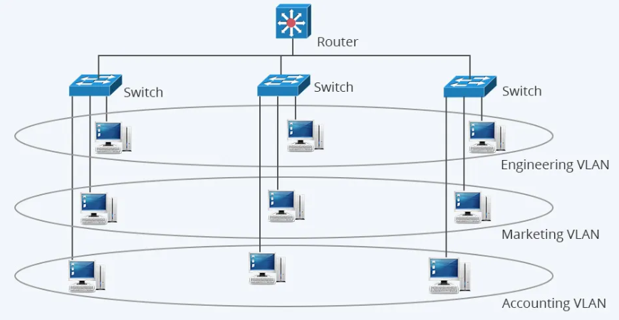
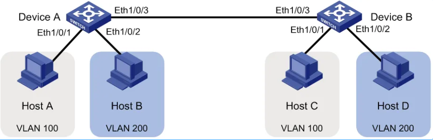
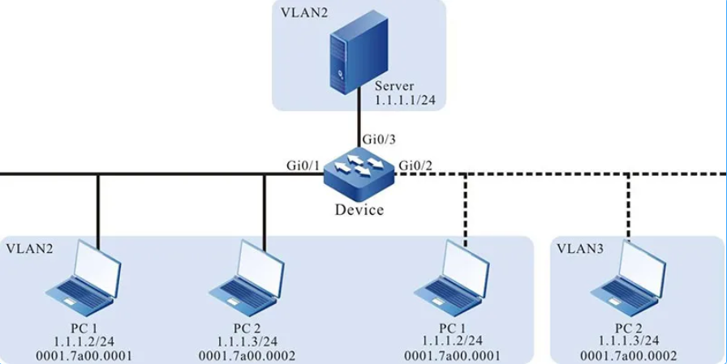

# VLAN

## Tại sao cần chia VLAN

### Tăng cường bảo mật

- **Cách ly dữ liệu**: Các VLAN tách biệt giúp đảm bảo thiết bị trong VLAN này không thể giao tiếp trực tiếp với thiết bị trong VLAN khác nếu không có thiết bị trung gian như router hoặc firewall. Điều này ngăn chặn truy cập trái phép giữa các phòng ban hoặc nhóm thiết bị.

- **Giảm nguy cơ tấn công nội bộ**: Nếu có một thiết bị bị nhiễm mã độc, VLAN giúp hạn chế sự lây lan của nó sang các thiết bị khác trong mạng.

### Giảm bớt broadcast, tăng hiệu suất mạng

- **Hạn chế broadcast storm**: Trong mạng LAN thông thường, khi một thiết bị gửi gói tin broadcast, toàn bộ thiết bị trong cùng mạng nhận được gói tin này. Nếu có quá nhiều thiết bị, mạng có thể bị chậm.

- Khi chia VLAN, broadcast chỉ giới hạn trong VLAN đó, giúp giảm tải cho mạng và tối ưu băng thông.

### Quản lý linh hoạt

- **Phân nhóm thiết bị logic**: Dễ dàng nhóm các thiết bị theo chức năng thay vì theo vị trí vật lý.

- **Đơn giản hóa việc quản lý**: Có thể quản lý các VLAN một cách tập trung thông qua switch hoặc router.

- **Tiết kiệm chi phí**: VLAN giúp tiết kiệm chi phí đầu tư cho thiết bị mạng. VD: Thay vì sử dụng nhiều switch riêng biệt, có thể sử dụng 1 switch duy nhất để tạo ra nhiều VLAN.

### Hỗ trợ QoS (Quality of Service)

- **Ưu tiên lưu lượng mạng**: Một số VLAN có thể được ưu tiên hơn. VD: VLAN cho hội nghị truyền hình có thể được ưu tiên băng thông hơn VLAN cho nhân viên văn phòng

- **Cải thiện hiệu suất cho các ứng dụng quan trọng** như VoIP, Video Call

## Khái niệm VLAN

VLAN (Virtual Local Area Network) là một kỹ thuật cho phép chia một mạng LAN vật lý thành các mạng logic riêng biệt, được gọi là các VLAN. Chúng hoạt động độc lập với nhau, ngay cả khi các thiết bị được kết nối vào cùng một switch (bộ chuyển mạch).

## Cách hoạt động VLAN

Mạng VLAN hoạt động bằng cách chia một mạng vật lý thành các mạng con ảo độc lập giúp tăng cường quản lý và an ninh, cũng như cải thiện hiệu suất mạng.

- **Phân chia mạng vật lý**: Mạng VLAN bắt đầu bằng việc phân chia mạng vật lý thành các phần nhỏ hơn gọi là VLANS. Mỗi VLAN tương ứng với một đơn vị tổ chức, bộ phận làm việc hoặc yêu cầu nào đó.

- **Gán VLAN IDs**: Mỗi VLAN được gán một VLAN ID, là một số nguyên dương đại diện cho mạng ảo đó. Các thiết bị mạng như switch, sẽ sử dụng VLAN ID để xác định các VLAN.

- **Gán cổng và cổng trừu tượng**: Các cổng trên switch được gán cho từng mạng VLAN cụ thể. Cổng này có thể là cổng vật lý hoặc cổng trừu tượng (port-based VLANs). Các thiết bị trong cùng một VLAN có thể giao tiếp trực tiếp với nhau và hạn chế giao tiếp với các thiết bị ở VLAN khác.

- **Access Ports và Trunk Ports**: Trong mạng VLAN, có hai loại cổng quan trọng: access ports và trunk ports. Cổng Access ports được gán cho một VLAN cụ thể, trong khi cổng trunk được sử dụng để chuyển dữ liệu giữa các switch và giữa các mạng VLAN.

- **Tagging và Untagging**: Khi dữ liệu đi qua cổng trunk, thông tin về VLAN ID thường được thêm vào gói tin (tagging). Ngược lại, khi dữ liệu rời khỏi mạng VLAN, thông tin này có thể được loại bỏ (untagging).

- **Tạo Broadcast Domains**: Mỗi VLAN tạo ra một broadcast domain độc lập, giảm thiểu lưu lượng broadcast trên mạng và cải thiện hiệu suất.

`Chi tiết về cách VLAN hoạt động`

1. Gửi khung Ethernet: Khi một thiết bị gửi khung Ethernet, nó sẽ thêm mã VLAN vào khung. Mã VLAN này xác định VLAN mà khung Ethernet thuộc về.
2. Chuyển khung đến bộ chuyển mạch: Khung Ethernet được truyền qua cáp đến bộ chuyển mạch.
3. Bộ chuyển mạch đọc mã VLAN: Bộ chuyển mạch đọc mã VLAN trong khung Ethernet.
4. Chuyển khung đến cổng tương ứng: Bộ chuyển mạch chuyển khung Ethernet đến cổng tương ứng với VLAN được xác định bởi mã VLAN.
5. Thiết bị nhận khung: Thiết bị trên cổng nhận được khung Ethernet và xử lý nó.

`Ví dụ`
Một mạng LAN với ba VLAN: VLAN 10 cho bộ phận kế toán, VLAN 20 cho bộ phận bán hàng và VLAN 30 cho bộ phận marketing. Khi một máy tính trong bộ phận kế toán gửi email cho một máy tính trong bộ phận bán hàng, khung Ethernet sẽ được đánh dấu với mã VLAN 10. Khi khung Ethernet đến bộ chuyển mạch, bộ chuyển mạch sẽ đọc mã VLAN và chuyển khung đến cổng được gán vào VLAN 20. Máy tính trong bộ phận bán hàng sau đó sẽ nhận được khung Ethernet và xử lý email.

## Phân loại VLAN

### 1. Port-based VLAN

Đây là phương thức phổ biến nhất, trong đó các thiết bị được gán vào VLAN dựa trên cổng switch mà chúng kết nối. Ưu điểm của phương thức này là đơn giản và dễ dàng cấu hình. Tuy nhiên, nó không linh hoạt vì việc di chuyển thiết bị sang cổng khác có thể thay đổi VLAN của chúng.

- Ví dụ: Cổng 1-10 thuộc VLAN 10, cổng 11-20 thuộc VLAN 20.

### 2. Tag-based VLAN (IEEE 802.1Q)

Thêm một thẻ VLAN vào các gói tin, cho phép chúng đi qua các kết nối trunk (dùng để truyền nhiều VLAN qua một đường truyền duy nhất).

### 3. MAC-based VLAN

Phương thức này gán thiết bị vào VLAN dựa trên địa chỉ MAC duy nhất của nó. Ưu điểm của phương thức này là linh hoạt hơn so với VLAN dựa trên cổng, vì việc di chuyển thiết bị không ảnh hưởng đến VLAN của nó. Tuy nhiên, chúng có thể phức tạp hơn để cấu hình và quản lý.

### 4. Protocol-based VLAN

Phương thức này gán thiết bị vào VLAN dựa trên giao thức mạng mà nó sử dụng (ví dụ: IP, IPX). Ưu điểm của phương thức này là nó có thể hữu ích cho việc phân chia lưu lượng truy cập mạng theo loại ứng dụng.

## Ưu/Nhược điểm của VLAN

`Ưu điểm`

- **Tăng cường bảo mật**: VLAN giúp cô lập lưu lượng truy cập của các nhóm người dùng khác nhau, giúp bảo vệ dữ liệu nhạy cảm khỏi những truy cập trái phép.

- **Cải thiện hiệu suất**: VLAN giúp giảm tắc nghẽn mạng bằng cách phân chia lưu lượng truy cập thành các nhóm nhỏ hơn. Điều này đặc biệt hữu ích trong các mạng lớn có nhiều người dùng và thiết bị.

- **Dễ dàng quản lý**: VLAN giúp đơn giản hóa việc quản lý mạng bằng cách cho phép quản trị viên mạng quản lý từng VLAN riêng biệt.

- **T- ăng tính linh hoạt**: VLAN giúp dễ dàng di chuyển và thêm người dùng vào mạng.

- **Giảm chi phí**: VLAN có thể giúp giảm chi phí bằng cách cho phép bạn sử dụng hiệu quả hơn các tài nguyên mạng hiện có.

`Nhược điểm`

- Packet có thể bị rò rỉ giữa các VLAN.

- Packet được inject có thể dẫn đến cyber attack.

- Các mối đe dọa ở trong một hệ thống đơn lẻ có thể phát tán virus cho toàn bộ mạng.

- Cần có một router bổ sung để kiểm soát workload trong những mạng lớn.

- Khả năng tương tác có thể gặp vấn đề.

- Một VLAN không thể chuyển tiếp lưu lượng mạng sang những VLAN khác.

## So sánh sự khác nhau giữa mạng LAN và VLAN

| | LAN | VLAN (Virtual LAN) |
|-----------|-------------|---------|
| Phạm vi | Là một mạng cục bộ, giới hạn trong một khu vực địa lý nhất định như một văn phòng, tòa nhà hoặc một khu dân cư. | Là một mạng ảo được tạo ra để chia phạm vi mạng LAN thành các phân đoạn ảo, không phụ thuộc vào vị trí địa lý. |
| Cách tổ chức | Tổ chức theo cấu trúc vật lý, với các máy tính được kết nối với cùng một bộ chuyển mạch hoặc cổng chia mạng. | Tổ chức logic, trong đó các thiết bị không cần phải kết nối vật lý với nhau, nhưng vẫn thuộc cùng một nhóm thông qua cấu hình phần mềm. |
| Quản lý và bảo mật | Quản lý dựa trên cấu hình vật lý của mạng, và bảo mật thường phải dựa vào các biện pháp khác như mật khẩu và cấu hình. | Quản lý dựa trên cấu hình logic, giúp tăng cường bảo mật bằng cách ngăn chặn truy cập giữa các VLAN khác nhau, làm tăng tính an toàn của dữ liệu. |
| Hiệu suất và linh hoạt | Có thể gặp vấn đề hiệu suất khi có nhiều máy tính cùng kết nối với một bộ chuyển mạch hoặc một đoạn mạng. | Có thể cải thiện hiệu suất và tính linh hoạt bằng cách chia mạng thành các nhóm ảo, giảm tải lưu lượng và cải thiện khả năng quản lý. |
| Chi phí và quản lý | Yêu cầu cấu hình vật lý và có thể tăng chi phí khi mở rộng mạng hoặc thay đổi cấu trúc. | Có thể giảm chi phí và thời gian quản lý khi cần thay đổi cấu hình mạng, do không cần thay đổi cấu trúc vật lý. |
