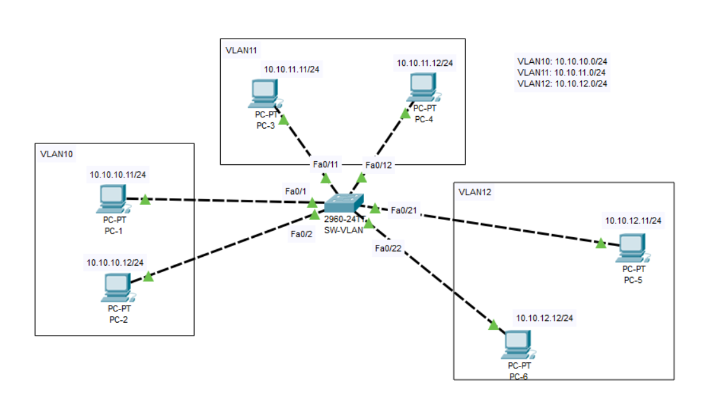
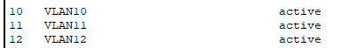
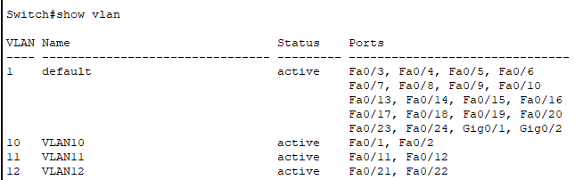
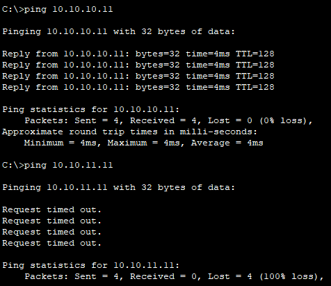

# Chia VLAN

## Yêu cầu cấu hình VLAN như ảnh



## Các bước thực hiện

### 1. Truy cập vào switch

- Mở Cisco Packet Tracer → Nhấn vào Switch → Chọn CLI.

### 2. Vào chế độ cấu hình

```plaintext
Switch> enable
Switch# configure terminal
```

- `enable`: Truy cập vào chế độ EXEC đặc quyền từ chế độ người dùng (User EXEC mode). Ở chế độ EXEC đặc quyền, có thể kiểm tra cấu hình và thực hiện các lệnh nâng cao hơn.
- `configure terminal`: Chuyển từ EXEC đặc quyền sang Global Configuration Mode để thay đổi cấu hình thiết bị. Khi vào chế độ này, có thể tạo VLAN, cấu hình cổng, đặt tên, v.v.

### 3. Tạo các VLAN

```plaintext
Switch(config)# vlan 10
Switch(config-vlan)# name VLAN10
Switch(config-vlan)# exit

Switch(config)# vlan 11
Switch(config-vlan)# name VLAN11
Switch(config-vlan)# exit

Switch(config)# vlan 12
Switch(config-vlan)# name VLAN12
Switch(config-vlan)# exit
```

- `vlan 10`: Tạo VLAN có ID là 10.
- `name VLAN10`: Đặt tên cho VLAN là VLAN 10.
- `exit`: Thoát khỏi chế độ cấu hình VLAN.
- Lặp lại các lệnh này cho từng VLAN muốn tạo.

**Kiểm tra VLAN vừa tạo:**

```plaintext
Switch# show vlan
```



### 4. Gán cổng vào VLAN

**Cổng Fa0/1 và Fa0/2 vào VLAN10 (PC-1, PC-2):**

```plaintext
Switch(config)# interface fastEthernet 0/1
Switch(config-if)# switchport mode access
Switch(config-if)# switchport access vlan 10
Switch(config-if)# exit

Switch(config)# interface fastEthernet 0/2
Switch(config-if)# switchport mode access
Switch(config-if)# switchport access vlan 10
Switch(config-if)# exit
```

- `interface fastEthernet 0/1`: Chọn cổng vật lý FastEthernet 0/1 để cấu hình.
- `switchport mode access`: Chuyển cổng sang chế độ Access (cổng này chỉ thuộc một VLAN duy nhất).
- `switchport access vlan 10`: Gán VLAN 10 cho cổng.
- `exit`: Thoát khỏi chế độ cấu hình cổng.

**Cổng Fa0/11 và Fa0/12 vào VLAN11 (PC-3, PC-4):**

```plaintext
Switch(config)# interface fastEthernet 0/11
Switch(config-if)# switchport mode access
Switch(config-if)# switchport access vlan 11
Switch(config-if)# exit

Switch(config)# interface fastEthernet 0/12
Switch(config-if)# switchport mode access
Switch(config-if)# switchport access vlan 11
Switch(config-if)# exit
```

**Cổng Fa0/21 và Fa0/22 vào VLAN12 (PC-5, PC-6):**

```plaintext
Switch(config)# interface fastEthernet 0/21
Switch(config-if)# switchport mode access
Switch(config-if)# switchport access vlan 12
Switch(config-if)# exit

Switch(config)# interface fastEthernet 0/22
Switch(config-if)# switchport mode access
Switch(config-if)# switchport access vlan 12
Switch(config-if)# exit
```

**Kiểm tra cấu hình VLAN đã đúng chưa:**

```plaintext
Switch# show vlan
```



### 5. Ping

1. Chọn từng PC → Desktop → IP Configuration
2. Nhập thông tin IP tĩnh theo VLAN tương ứng.

**Cấu hình chi tiết từng thiết bị:**

- PC-1:
  - IP Address: 10.10.10.11
  - Subnet Mask: 255.255.255.0
  - Default Gateway: (Bỏ trống nếu không có Router)
- Các PC khác làm tương tự.

**Thực hiện ping:**

1. Chọn PC muốn kiểm tra kết nối: Nhấn vào PC-1 hoặc PC khác trong sơ đồ.
2. Mở công cụ "Command Prompt": Vào tab Desktop → Chọn Command Prompt.
3. Thực hiện lệnh ping:

```plaintext
ping [địa_chỉ_IP]
```

Từ PC-1 ping đến PC khác. nếu cùng vlan sẽ trả về `reply`, khác vlan trả về `Request time out`.


