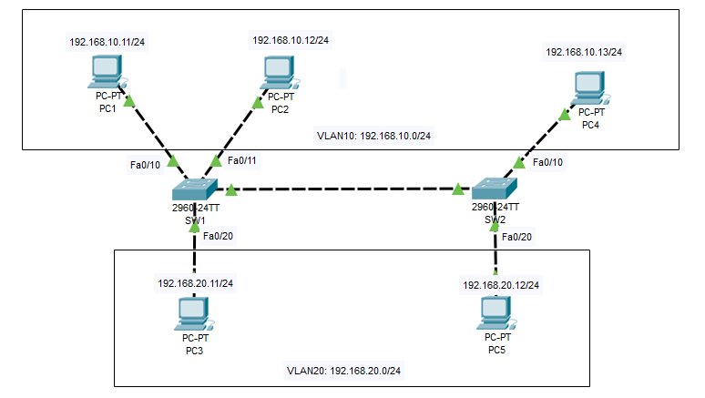
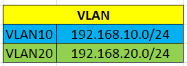
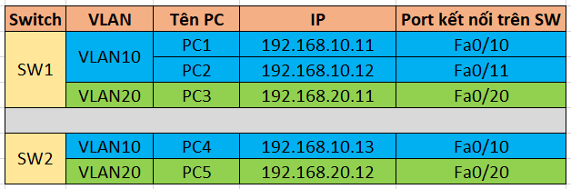
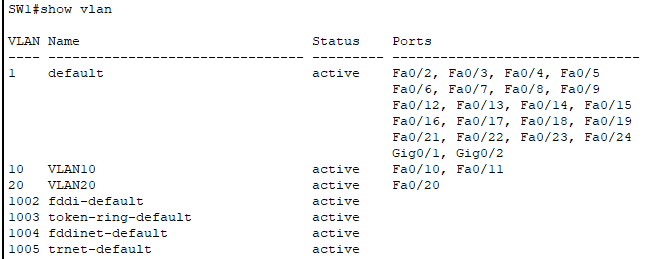
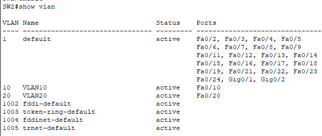

# Cấu hình VTP domain

## Sơ đồ lab



### Quy hoạch VLAN



### Quy hoạch IP và kết nối



## Cấu hình VTP

### 1. Cấu hình chi tiết từng thiết bị

- PC-1:
  - IP Address: 192.168.10.11
  - Subnet Mask: 255.255.255.0
  - Default Gateway: (Bỏ trống nếu không có Router)
- Các PC khác làm tương tự.

### 2. Thiết lập VLAN trên 2 switch

**Trên Switch1:**

Đặt tên:

```plaintext
Switch>enable 
Switch#configure terminal 
Switch(config)#hostname SW1
SW1(config)#
```

- `enable`: Chuyển từ chế độ "User EXEC mode" sang "Privileged EXEC mode". Cung cấp quyền truy cập vào các lệnh quản trị và cấu hình nâng cao.
- `configure terminal`: Chuyển từ chế độ "Privileged EXEC mode" sang "Global Configuration mode". Cho phép thực hiện các lệnh cấu hình chung trên switch.
- `hostname SW1`: Đặt tên switch là "SW1".

Tạo VLAN10 và VLAN20:

```plaintext
SW1(config)#vlan 10
SW1(config-vlan)#name VLAN10
SW1(config-vlan)#exit

SW1(config)#vlan 20
SW1(config-vlan)#name VLAN20
SW1(config-vlan)#exit

SW1(config)#
```

Gán các port vào các VLAN:

```plaintext
SW1(config)#interface fastEthernet 0/10
SW1(config-if)#switchport access vlan 10
SW1(config-if)#exit

SW1(config)#interface fastEthernet 0/11
SW1(config-if)#switchport access vlan 10
SW1(config-if)#exit

SW1(config)#interface fastEthernet 0/20
SW1(config-if)#switchport access vlan 20
SW1(config-if)#exit

SW1(config)#exit
```

Kiểm tra kết quả:



**Trên Switch2:**

Đặt tên:

```plaintext
Switch>enable 
Switch#configure terminal 
Switch(config)#hostname SW2
SW2(config)#
```

Tạo VLAN10 và VLAN20:

```plaintext
SW2(config)#vlan 10
SW2(config-vlan)#name VLAN10
SW2(config-vlan)#exit

SW2(config)#vlan 20
SW2(config-vlan)#name VLAN20
SW2(config-vlan)#exit

SW2(config)#
```

Gán các cổng vào VLAN

```plaintext
SW2(config)#interface fastEthernet 0/10
SW2(config-if)#switchport access vlan 10
SW2(config-if)#exit

SW2(config)#interface fastEthernet 0/20
SW2(config-if)#switchport access vlan 20
SW2(config-if)#exit

SW2(config)#exit
```

kiểm tra lại:



### 3. Cấu hình VTP

**Trên SW1:**

Đặt địa chỉ IP cho interface VLAN10 là `192.168.10.1` và VLAN20 là `192.168.20.1`

```plaintext
SW1#configure terminal 
SW1(config)#interface vlan 10
SW1(config-if)#
SW1(config-if)#ip address 192.168.10.1 255.255.255.0
SW1(config-if)#no shutdown
SW1(config-if)#exit
SW1(config)#

SW1(config)#interface vlan 20
SW1(config-if)#ip address 192.168.20.1 255.255.255.0
SW1(config-if)#no shutdown 
SW1(config-if)#exit 

SW1(config)#exit
SW1#
```

**Trên SW2:**

Đặt địa chỉ IP cho interface VLAN10 là `192.168.10.2` và VLAN20 là `192.168.20.2`

```plaintext
SW2#configure terminal 
SW2(config)#interface vlan 10
SW2(config-if)#
SW2(config-if)#ip address 192.168.10.2 255.255.255.0
SW2(config-if)#no shutdown
SW2(config-if)#exit
SW2(config)#

SW2(config)#interface vlan 20
SW2(config-if)#ip address 192.168.20.2 255.255.255.0
SW2(config-if)#no shutdown 
SW2(config-if)#exit 

SW2(config)#exit
SW2#
```

**Thiết lập VTP Server và VTP Client:**

- Switch 1: VTP Server.
- Switch 2: VTP CLient.
- VTP domain : DT
- VTP password: doantan28

**Trên SW1:**

```plaintext
SW1>enable 
SW1#configure terminal
SW1(vlan)#vtp mode server
SW1(vlan)#vtp domain DT
SW1(vlan)#vtp password doantan28
SW1(vlan)#exit
```

- `vtp mode server`: Đặt switch ở chế độ VTP Server, có thể tạo, sửa, xóa VLAN và đồng bộ với các switch client.
- `vtp doamin DT`: Đặt tên miền VTP là DT. Các switch muốn đồng bộ phải cùng domain.
- `vtp password doantan28`: Thiết lập mật khẩu doantan28 để bảo vệ và đảm bảo chỉ các switch có cùng mật khẩu mới đồng bộ dữ liệu.

**Trên SW2:**

```plaintext
SW2>enable 
SW2#configure terminal
SW2(vlan)#vtp mode client
SW2(vlan)#vtp domain DT
SW2(vlan)#vtp password doantan28
SW2(vlan)#exit
```

**Tạo đường trunk từ SW1 đến SW2:**

Bật trunking trên các port nối giữa 2 switch là Fa0/1 trên SW1 và Fa0/1 trên SW2.

SW1:

```plaintext
SW1#configure terminal 
SW1(config)#interface fastEthernet 0/1
SW1(config-if)#switchport mode trunk 
SW1(config-if)#end
SW1#
```

SW2:

```plaintext
SW2#configure terminal 
SW2(config)#interface fastEthernet 0/1
SW2(config-if)#switchport mode trunk 
SW2(config-if)#end
SW2#
```
