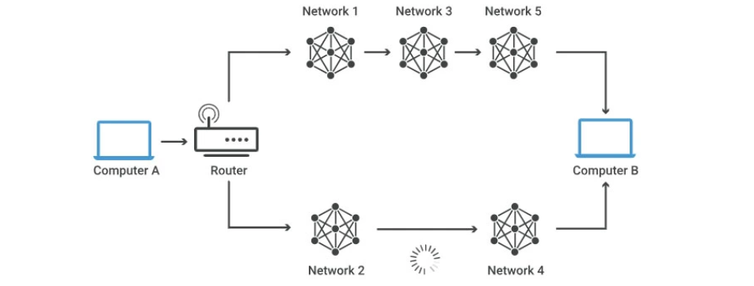
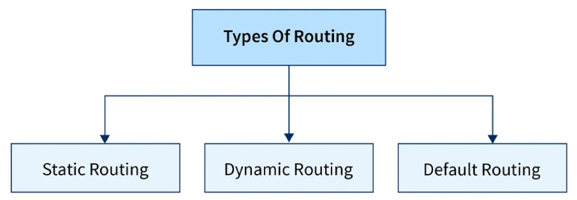
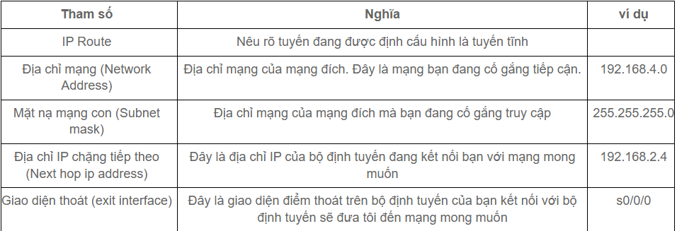
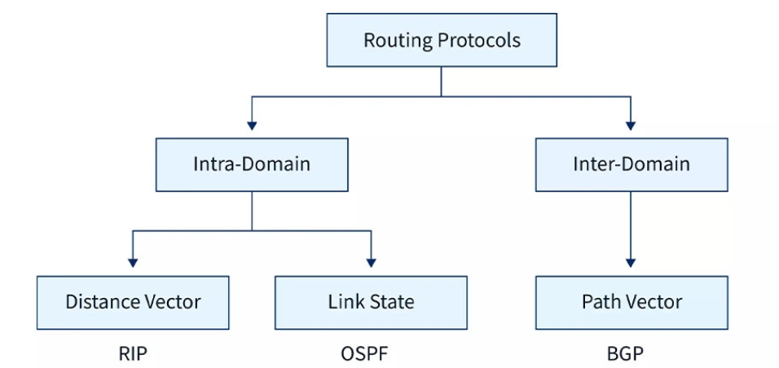

# Routing

## 1. Routing là gì?

### Khái niệm

**Routing (định tuyến)** là phương thức mà Router (Bộ định tuyến) hay PC (thiết bị mạng) dùng để chuyển các gói tin đến địa chỉ đích một cách tối ưu nhất, nghĩa là chỉ ra hướng và đường đi tốt nhất cho gói tin. Router thu thập và duy trì các thông tin định tuyến để cho phép truyền và nhận các dữ liệu. Quá trình Routing dựa vào thông tin trên bảng định tuyến (Routing table), là bảng chứa các lộ trình nhanh và tốt nhất đến các mạng khác nhau trên mạng, để hướng các gói dữ liệu đi một cách hiệu quả nhất.

Routing có vai trò quan trọng trong các hệ thống mạng, đặc biệt là mạng Internet, giúp đảm bảo các thiết bị có thể liên lạc với nhau một cách hiệu quả. Quá trình này được thực hiện bởi các thiết bị mạng như router, switch layer 3 và máy chủ mạng.



Theo ví dụ trên, Máy tính A muốn nhắn tin cho máy tính B có thể đi theo 2 đường dẫn:

- Đường 1: đi qua mạng 1, 3 và 5.
- Đường 2: đi qua mạng 2 và 4.

Khi dữ liệu từ máy tính A đến Router nó sẽ phân tích và quyết định lựa chọn đường dẫn tốt nhất trong 2 đường dẫn. Trong trường hợp này, Router sẽ chọn đường 1 vì đường truyền từ mạng 2 đến mạng 4 bị chậm.

### Các thành phần chính của định tuyến

**Router (Bộ định tuyến):**

- Thiết bị mạng chịu trách nhiệm chuyển tiếp gói dữ liệu giữa các mạng khác nhau.
- Sử dụng bảng định tuyến (routing table) để quyết định đường đi cho các gói dữ liệu.

**Bảng định tuyến (Routing Table):** là tập hợp các tuyến đường mà router sử dụng để quyết định nơi gửi gói tin.

- Chứa thông tin về các đường đi có sẵn trong mạng.
- Bao gồm các thông tin như địa chỉ mạng đích, cổng ra (interface), và metric (độ đo để so sánh các đường đi).

```plaintext
Destination      Gateway        Interface
192.168.1.0      0.0.0.0         Eth0
192.168.2.0      192.168.1.1     Eth1
0.0.0.0          192.168.1.254   Eth0 (default route)
```

**Giao thức định tuyến (Routing Protocol):**

- Các giao thức như RIP, OSPF, BGP được sử dụng để tự động cập nhật bảng định tuyến.
- Giúp router học và chia sẻ thông tin về các đường đi trong mạng.

### Nguyên tắc hoạt động của định tuyến

**Bảng định tuyến (routing table):** Mỗi router lưu trữ một bảng định tuyến, chứa thông tin về các mạng đích và đường dẫn tương ứng.

**Giao thức định tuyến (routing protocol):** Các router sử dụng giao thức định tuyến để trao đổi thông tin về mạng và cập nhật bảng định tuyến.

**Thuật toán định tuyến:** Router sử dụng thuật toán để tính toán đường đi tối ưu dựa trên thông tin trong bảng định tuyến.

## 2. Phân loại Routing



Định tuyến (routing) có thể chia thành 3 loại: định tuyến tĩnh, định tuyến mặc định, định tuyến động.

### Định tuyến tĩnh (Static routing)

- Là kiểu định tuyến mà quản trị viên mạng phải thiết lập thủ công đường đi của các gói tin.
- Phù hợp với các mạng nhỏ, có cấu trúc đơn giản và ít thay đổi.
- Không tiêu tốn tài nguyên hệ thống nhưng khó mở rộng và thiếu tính linh hoạt.

Cấu hình trên router cisco

```plaintext
Router(config)# ip route (network-address) (subnet-mask) (next-hop ip address/ exit interface)
```



### Định tuyến mặc định (default routing)

- Khi router không biết đường đi cụ thể của gói tin, nó sẽ chuyển đến một tuyến đường mặc định.
- Hữu ích trong các mạng có nhiều chi nhánh kết nối về trung tâm.

### Định tuyến động (dynamic routing)

- Các router sẽ tự động trao đổi thông tin để tính toán đường đi tốt nhất cho gói tin.
- Sử dụng các giao thức định tuyến động như RIP, OSPF, EIGRP, BGP.
- Phù hợp với các mạng lớn, có sự thay đổi thường xuyên.

| Giao thức | Loại | Tốc độ hội tụ | Sử dụng |
|-----------|-------------|---------|---------|
| RIP (Routing Information Protocol) | Distance Vector | Chậm | Mạng nhỏ |
| OSPF (Open Shortest Path First) | Link-State | Nhanh | Mạng lớn, doanh nghiệp |
| EIGRP (Enhanced Interior Gateway Routing Protocol) | Hybrid | Nhanh | Cisco, doanh nghiệp |
| BGP (Border Gateway Protocol) | Path-Vector | Chậm | Định tuyến trên internet |



### So sánh static routing và dynamic routing

| Tiêu chí | Static Routing | Dynamic Routing |
|-----------|-------------|---------|
| Cấu hình | Thủ công | Tự động cập nhật |
| Khả năng mở rộng | Kém | Tốt |
| Tài nguyên sử dụng | Ít | Nhiều (CPU, RAM, băng thông) |
| Phản ứng thay đổi | Không tự động | Tự động tìm đường thay thế |
| Ứng dụng phù hợp | Mạng nhỏ, đơn giản | Mạng lớn, thay đổi thường xuyên |

## 3. Các thuật toán routing

Các giao thức định tuyến sử dụng các thuật toán khác nhau để tìm ra đường đi tối ưu.

- Distance Vector (Khoảng cách – hướng đi)
  - Dựa vào số lượng bước nhảy (hop count).
  - Mỗi router chỉ biết thông tin từ router lân cận.
  - Ví dụ: RIP (giới hạn 15 bước nhảy).
- Link-State (Trạng thái liên kết)
  - Mỗi router có thông tin đầy đủ về toàn bộ mạng.
  - Sử dụng thuật toán Dijkstra để tìm đường đi ngắn nhất.
  - Ví dụ: OSPF.
- Path-Vector (Định tuyến theo đường dẫn)
  - Dùng trong định tuyến giữa các hệ thống mạng lớn.
  - Ví dụ: BGP (dùng trên Internet).
