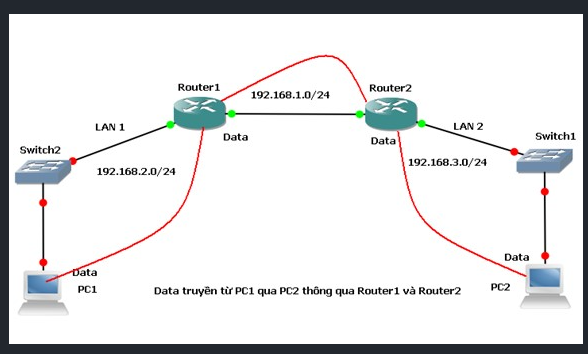
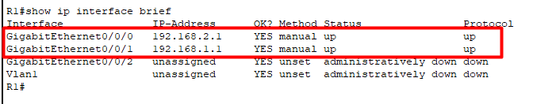
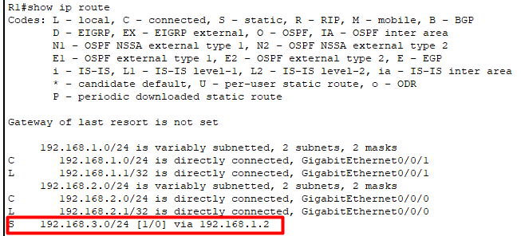
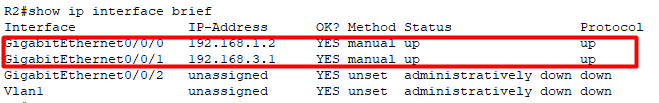
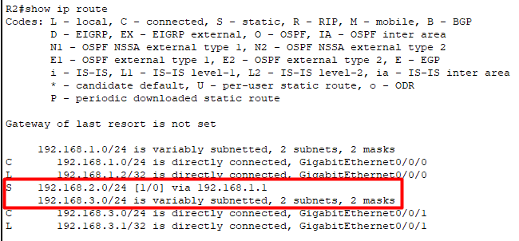
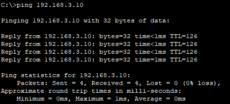

# Lab static routing

## Sơ đồ lab



## Cấu hình thiết bị

### 1. Cấu hình PC1

- Vào PC1 → Desktop → IP Configuration:
  - IP Address: `192.168.2.10`
  - Subnet Mask: `255.255.255.0`
  - Default Gateway: `192.168.2.1`

### 2. Cấu hình PC2

- Vào PC2 → Desktop → IP Configuration:
  - IP Address: `192.168.3.10`
  - Subnet Mask: `255.255.255.0`
  - Default Gateway: `192.168.3.1`

### 3. Cấu hình Switch1 (Kết nối với PC1) và Switch2 (Kết nối với PC2)

Không cần cấu hình gì thêm vì switch hoạt động ở lớp 2 (Layer 2).

### 4. Cấu hình Router1

- Chọn Router1 → CLI và nhập các lệnh sau:

Đặt tên cho Router1 thành R1 để minh bạch hơn:

```plaintext
Router>enable
Router#configure terminal
Router(config)#hostname R1
R1(config)#
```

Cấu hình cổng GigabitEthernet 0/0/0 (LAN1 kết nối PC1):

```plaintext
R1(config)#interface GigabitEthernet 0/0/0
R1(config-if)#ip address 192.168.2.1 255.255.255.0
R1(config-if)#no shutdown
R1(config-if)#exit
```

Cấu hình cổng GigabitEthernet 0/0/1 (WAN kết nối Router2):

```plaintext
R1(config)#interface GigabitEthernet 0/0/1
R1(config-if)#ip address 192.168.1.1 255.255.255.0
R1(config-if)#no shutdown
R1(config-if)#exit
```

Cấu hình định tuyến tĩnh đến mạng 192.168.3.0/24 (đi qua Router2) và lưu cấu hình bằng câu lệnh `write`

```plaintext
R1(config)#ip route 192.168.3.0 255.255.255.0 192.168.1.2
R1(config)#exit
R1#write
```

Kiểm tra kết quả:




### 5. Cấu hình Router2

- Chọn Router2 → CLI và nhập các lệnh sau:

Đặt tên cho Router2 thành R2 để minh bạch hơn:

```plaintext
Router>enable
Router#configure terminal
Router(config)#hostname R2
R2(config)#
```

Cấu hình cổng GigabitEthernet 0/0/0 (WAN kết nối R1):

```plaintext
R2(config)#interface GigabitEthernet 0/0/0
R2(config-if)#ip address 192.168.1.2 255.255.255.0
R2(config-if)#no shutdown
R2(config-if)#exit
```

Cấu hình cổng GigabitEthernet 0/0/1 (LAN2 kết nối PC2):

```plaintext
R2(config)#interface GigabitEthernet 0/0/1
R2(config-if)#ip address 192.168.3.1 255.255.255.0
R2(config-if)#no shutdown
R2(config-if)#exit
```

Cấu hình định tuyến tĩnh đến mạng 192.168.2.0/24 (đi qua R1) và lưu cấu hình bằng câu lệnh `write`

```plaintext
R2(config)#ip route 192.168.2.0 255.255.255.0 192.168.1.1
R2(config)#exit
R2#write
```

Kiểm tra kết quả:




### 6. Kiểm tra kết nối

- Sau khi cấu hình xong 2 router, kiểm tra bằng lệnh ping:
  - Từ PC1, mở Command Prompt và thực hiện lệnh: ping [ip đích].
  - Nếu cấu hình đúng, sẽ thấy thông báo `Reply from...`, chứng tỏ kết nối thành công.
  - Nếu không thành công, sẽ thấy thông báo `Requets time out.`
- Sau khi ping thành công:


