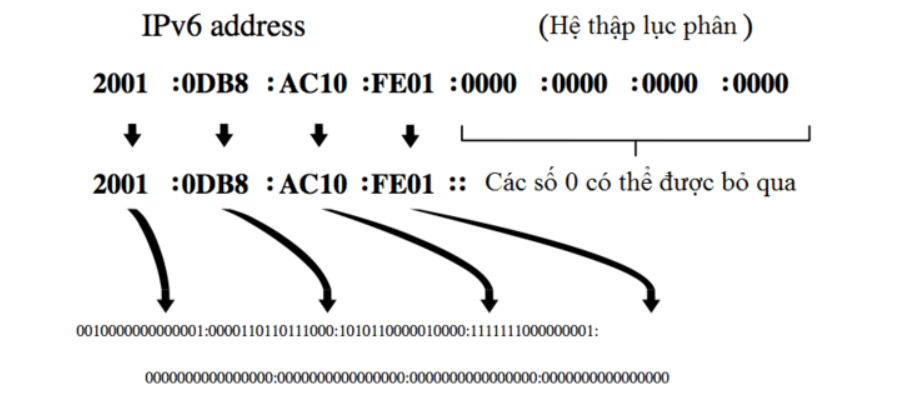
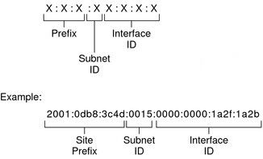
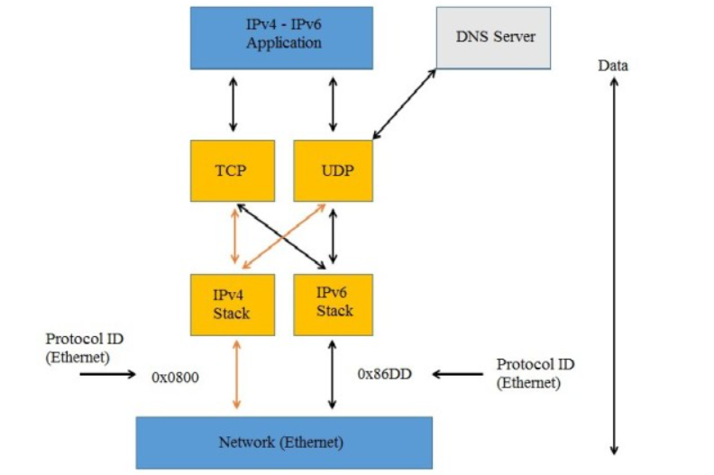

# IPv6

## Khái niệm

IPv6 (Internet Protocol version 6) là phiên bản mới nhất của giao thức Internet (IP), được thiết kế để thay thế IPv4 do tình trạng thiếu địa chỉ IP trên IPv4. Với không gian địa chỉ rộng lớn lên đến 128 bit, IPv6 mang đến khả năng kết nối cho hàng tỷ thiết bị trên toàn cầu. IPv6 có không gian địa chỉ 128 bit, cung cấp lượng địa chỉ khổng lồ.

IPv6 sẽ có dạng như sau: 2001:0db8:85a3:0000:0000:8a2e:0370:7334

## Cấu trúc

**Địa chỉ IPv6** dài 128 bit, được chia làm 8 nhóm, mỗi nhóm gồm 16 bit, được ngăn cách với nhau bằng dấu hai chấm “:”. Mỗi nhóm được biểu diễn bằng 4 số hexa.

VD:

- `FEDC:BA98:768A:0C98:FEBA:CB87:7678:1111`
- `1080:0000:0000:0070:0000:0989:CB45:345F`

### Nguyên tắc nhằm rút gọn địa chỉ

- Cho phép bỏ các số 0 nằm trước mỗi nhóm (octet).
- Thay bằng số 0 cho nhóm có toàn số 0.
- Thay bằng dấu “::” cho các nhóm liên tiếp nhau có toàn số 0.

Ví dụ: Địa chỉ `1080:0000:0000:0070:0000:0989:CB45:345F` được nén thành `1080::70:0:989:CB45:345F`

*Chú ý: Dấu “::” chỉ sử dụng được 1 lần trong toàn bộ địa chỉ IPv6 (nhiều dấu “::” có thể gây ra sự nhầm lẫn hoặc không thể biết đúng vị trí của các octet trong địa chỉ IPv6).*

## Thành phần

Địa chỉ IPv6 gồm 3 phần chính: Site Prefix, Subnet ID, InterfaceID. Các thành phần này tạo thành địa chỉ IPv6 hoàn chỉnh, mang đến không gian địa chỉ mở rộng, đảm bảo tính riêng tư và bảo mật, cũng như cung cấp sự linh hoạt để mạng có thể phát triển và đáp ứng nhu cầu kết nối internet ngày càng tăng.

### Site Prefix

- Đây là số ISP (Nhà cung cấp Dịch vụ Internet), được gán cho mỗi trang web. Site Prefix thường áp dụng cho tất cả máy tính ở cùng một vị trí. Bằng cách chia sẻ một Site Prefix, các máy tính trong mạng tự động nhận biết và cho phép mạng truy cập internet.
- Trong ảnh trên:
  - Site Prefix: `2001:0db8:3c4d`
  - Vai trò: Định danh một tổ chức hoặc một nhà cung cấp dịch vụ.

### Subnet ID

- Phần này miêu tả cấu trúc của mạng con trong trang web. Subnet ID giúp tổ chức chia mạng thành các đơn vị nhỏ hơn, gọi là subnet. Mỗi IPv6 subnet có cấu trúc tương tự như mạng con IPv4.
- Trong ảnh trên:
  - Subnet ID: `0015`
  - Vai trò: Giúp tổ chức hoặc doanh nghiệp chia nhỏ mạng thành các phân đoạn dễ quản lý hơn.

### Interface ID

- Là phần định danh duy nhất của một thiết bị trong mạng. Interface ID giúp xác định một thiết bị cụ thể trong mạng. Định dạng EUI-64 thường được sử dụng để định dạng giao diện của Interface ID.
- Trong ảnh trên:
  - Interface ID: `0000:0000:1a2f:1a2b`
  - Vai trò: Mỗi thiết bị trong mạng có một Interface ID duy nhất để giao tiếp.

## Phân loại địa chỉ IPv6

### IPv6 Unicast

Địa chỉ Unicast đại diện cho một thiết bị duy nhất trong mạng. Dữ liệu được gửi đến một địa chỉ Unicast sẽ chỉ đến đúng thiết bị đó. IPv6 Unicast dùng để định danh các thiết bị (như máy tính, máy chủ) trong mạng, tương tự như địa chỉ IP trong IPv4.

**Các loại Unicast:**

- **Global Unicast:** Địa chỉ công cộng có thể truy cập qua Internet. Ví dụ: `2001:0db8::1`.
- **Link-local Unicast:** Tự động gán cho thiết bị trong mạng nội bộ, không định tuyến ra ngoài. Ví dụ: `fe80::1`.
- **Unique Local Address** (ULA): Được dùng trong mạng nội bộ, tương tự địa chỉ riêng trong IPv4 (192.168.x.x). Ví dụ: `fc00::1`.

### IPv6 Multicast

Multicast cho phép gửi dữ liệu đến nhiều thiết bị trong cùng một nhóm. Dữ liệu sẽ được nhận bởi tất cả các thiết bị thuộc nhóm Multicast. IPv6 Multicast được dùng để phát trực tiếp nội dung (ví dụ: hội nghị truyền hình, phát sóng video), quản lý thiết bị trong mạng (ví dụ: thông báo định tuyến).

**Đặc điểm:** Địa chỉ Multicast luôn bắt đầu bằng FF. Ví dụ: `ff02::1` (gửi đến tất cả các thiết bị trong mạng nội bộ).

### IPv6 Anycast

Địa chỉ Anycast cho phép gửi dữ liệu đến thiết bị gần nhất (theo khoảng cách định tuyến) trong một nhóm thiết bị có cùng địa chỉ. IPv6 Anycast được dùng để tối ưu hóa lưu lượng mạng và giảm độ trễ, thường được sử dụng trong các trung tâm dữ liệu và máy chủ DNS.

**Đặc điểm:**

- Các thiết bị chia sẻ cùng một địa chỉ Anycast.
- Dữ liệu sẽ được chuyển đến thiết bị có đường dẫn ngắn nhất hoặc hiệu quả nhất.

## Dual stack

Dual-stack (hay còn gọi là "xếp chồng kép") là một cơ chế cho phép cả hai giao thức IPv4 và IPv6 cùng hoạt động trên một thiết bị hoặc mạng. Điều này có nghĩa là thiết bị có thể giao tiếp với các thiết bị khác bằng cả hai giao thức.

- Ứng dụng hỗ trợ cả IPv4 & IPv6, có thể sử dụng cả hai giao thức.
- Giao thức vận chuyển: TCP/UDP hoạt động với cả hai giao thức mạng.
- Lớp mạng có cả IPv4 & IPv6, ứng dụng sẽ chọn sử dụng IPv4 hoặc IPv6 tùy thuộc vào loại kết nối.
- Ethernet có thể sử dụng cả hai Protocol ID:
  - `0x0800` cho IPv4.
  - `0x86DD` cho IPv6.

### Cách thức hoạt động

- Hai giao thức cùng tồn tại: Dual-stack cho phép cả IPv4 và IPv6 cùng tồn tại trên một thiết bị hoặc mạng.
- Lựa chọn giao thức: Khi một thiết bị muốn giao tiếp với một thiết bị khác, nó sẽ lựa chọn giao thức nào phù hợp nhất. Nếu cả hai thiết bị đều hỗ trợ cả IPv4 và IPv6, thiết bị gửi thường ưu tiên sử dụng IPv6 vì nó có nhiều ưu điểm hơn.
- Tương thích ngược: Dual-stack cho phép các thiết bị IPv6 giao tiếp với các thiết bị IPv4 thông qua các cơ chế chuyển đổi như NAT64 hoặc đường hầm (tunneling).

### Ưu/Nhược điểm của Dual-stack

`Ưu điểm`

- Tương thích: Dual-stack cho phép các thiết bị IPv6 giao tiếp với các thiết bị IPv4, đảm bảo tính tương thích trong quá trình chuyển đổi từ IPv4 sang IPv6.
- Linh hoạt: Dual-stack cho phép các thiết bị lựa chọn giao thức phù hợp nhất cho từng tình huống, tận dụng ưu điểm của cả hai giao thức.
- Dễ dàng triển khai: Dual-stack là một cơ chế chuyển đổi tương đối dễ dàng triển khai, không yêu cầu thay đổi lớn trong cơ sở hạ tầng mạng.

`Nhược điểm`

- Phức tạp: Dual-stack yêu cầu cấu hình và quản lý cả hai giao thức IPv4 và IPv6, có thể làm phức tạp hệ thống mạng.
- Tốn kém tài nguyên: Dual-stack yêu cầu thiết bị phải có đủ tài nguyên (bộ nhớ, CPU) để xử lý cả hai giao thức, có thể làm tăng chi phí đầu tư.
