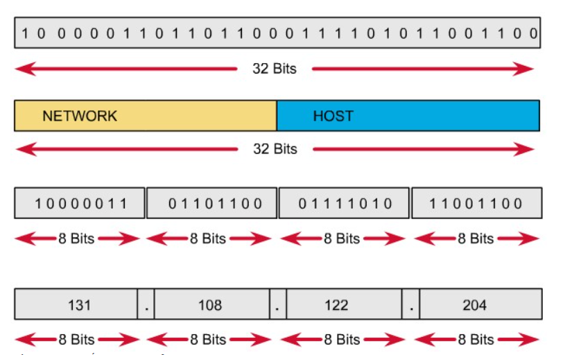

# IPv4 DOCS

## IPv4 là gì?

IP (Internet Protocol) là một giao thức trong bộ giao thức TCP/IP, được sử dụng để định danh và truyền thông tin giữa các thiết bị trong một mạng máy tính hoặc trên internet. IP đóng vai trò quan trọng trong việc đảm bảo các gói dữ liệu được gửi đi và nhận đúng nơi.

IPv4 (Internet Protocol version 4) là giao thức internet phiên bản 4. Đây là phiên bản đầu tiên của IP được sử dụng rộng rãi. Hệ thống địa chỉ này được sử dụng để định danh và liên kết các thiết bị kết nối vào mạng internet hoặc mạng nội bộ. Mỗi thiết bị kết nối vào mạng sẽ được gán một địa chỉ IPv4 duy nhất (hoặc một địa chỉ công cộng nếu kết nối trực tiếp internet)

## Các loại IPv4

Về cơ bản có 2 loại IPv4 chính: **Địa chỉ IPv4 công cộng** và **Địa chỉ IPv4 riêng tư**

- **Địa chỉ IPv4 công cộng (Public IPv4 address)**: Đây là địa chỉ được gán cho các thiết bị kết nối trực tiếp vào internet. Chúng là duy nhất trên toàn cầu và được cấp phát bởi các tổ chức quản lý địa chỉ IP (ví dụ: IANA, RIR). Gồm có 2 loại:
  - Địa chỉ IP động: Địa chỉ IP động là một địa chỉ IP được cấp phát tự động cho một thiết bị bởi máy chủ DHCP (Dynamic Host Configuration Protocol) mỗi khi thiết bị kết nối vào mạng. Địa chỉ này có thể thay đổi sau mỗi lần kết nối hoặc sau một khoảng thời gian nhất định.
  - Địa chỉ IP tĩnh: Là một địa chỉ IP được gán cố định cho một thiết bị và không thay đổi theo thời gian. Địa chỉ này thường được gán thủ công bởi quản trị viên mạng hoặc được cấu hình trên thiết bị.

  | Đặc điểm | IP tĩnh | IP động |
  |-----------|-------------|---------|
  | Gán địa chỉ | Thủ công hoặc cấu hình trên thiết bị | Tự động bởi máy chủ DHCP |
  | Thay đổi | Không thay đổi | Thay đổi sau mỗi lần kết nối hoặc theo thời gian |
  | Ổn định truy cập | Rất ổn định | Khó khăn hơn, cần Dynamic DNS |
  | Quản lý | Khó hơn, cần theo dõi cẩn thận | Dễ dàng hơn, tự động bởi DHCP |
  | Chi phí | Thường tốn kém hơn  | Thường rẻ hơn |
  | Phù hợp cho | Máy chủ web, email, game, truy cập từ xa | Thiết bị người dùng thông thường (máy tính, điện thoại) |

- **Địa chỉ IPv4 riêng tư (Private IPv4 address)**: Đây là địa chỉ được sử dụng trong mạng nội bộ (LAN), ví dụ như mạng gia đình, mạng văn phòng. Chúng không được định tuyến trực tiếp trên internet và có thể được sử dụng lại trong các mạng LAN khác nhau.

- Dải địa chỉ private (được quy định trong RFC 1918):
  - Lớp A: 10.0.0.0 - 10.255.255.255
  - Lớp B: 172.16.0.0 - 172.31.255.255
  - Lớp C: 192.168.0.0 - 192.168.255.255
- Ngoại trừ các địa chỉ private trong dải trên, toàn bộ phần còn lại đều là địa chỉ public.
- Kỹ thuật NAT (Network Address Translation) được sử dụng để chuyển đổi giữa IP private và IP public.
  - VD: Khi một thiết bị trong mạng nội bộ (điện thoại, máy tính) muốn truy cập internet, nó sẽ gửi một gói tin đến router (thiết bị thực hiện chức năng NAT). Router sẽ thay thế địa chỉ IP private của thiết bị đó bằng địa chỉ IP public của chính nó (hoặc một địa chỉ IP public được cấu hình sẵn). Gói tin với địa chỉ IP public mới sẽ được gửi đi qua Internet. Khi có phản hồi từ Internet, router sẽ nhận được gói tin và dựa vào thông tin lưu trữ (bảng NAT) để xác định thiết bị nào trong mạng nội bộ là đích đến cuối cùng của gói tin. Router sẽ thay thế địa chỉ IP public trong gói tin trở lại thành địa chỉ IP private ban đầu và chuyển tiếp gói tin đến thiết bị đích.
- **Địa chỉ IP private được sử dụng để bảo tồn địa chỉ IP public đang dần cạn kiệt**: IPv4 có chiều dài 32 bit để đánh địa chỉ, theo đó, số địa chỉ tối đa có thể sử dụng là 4.294.967.296 (2^32). Một số địa chỉ IP được sử dụng cho các mục đích khác như cấp cho mạng cá nhân (xấp xỉ 18 triệu địa chỉ), hoặc sử dụng làm địa chỉ quảng bá (xấp xỉ 16 triệu), nên số lượng địa chỉ thực tế có thể sử dụng cho mạng Internet công cộng bị giảm xuống. Thay vì mỗi thiết bị cần một địa chỉ Public, các thiết bị trong mạng nội bộ sử dụng địa chỉ Private. Router hoặc thiết bị NAT (Network Address Translation) dịch địa chỉ Private thành một địa chỉ Public duy nhất để giao tiếp với Internet, điều này cho phép hàng triệu thiết bị nội bộ sử dụng chung một địa chỉ Public. Địa chỉ Private không cần duy nhất trên toàn cầu, chúng có thể được sử dụng lại ở nhiều mạng khác nhau mà không gây xung đột (vì không được định tuyến trên Internet).

## Phân biệt IPv4 public, IPv4 private

| IPv4 Private | IPv4 Public |
|-------------|---------|
| Chỉ được sử dụng trong mạng nội bộ (mạng LAN), không được định tuyến trên môi trường Internet. | là địa chỉ IP sử dụng cho các gói tin đi trên môi trường Internet, được định tuyến trên môi trường Internet, không sử dụng trong mạng LAN. |
| Có thể được sử dụng lặp đi lặp lại trong các mạng LAN khác nhau. | Địa chỉ public phải là duy nhất cho mỗi host tham gia vào Internet. |
| Có sẵn miễn phí. | Không miễn phí. |
| yêu cầu NAT để giao tiếp với các thiết bị. | không yêu cầu dịch mạng. |

## Đặc điểm, cấu trúc IPv4

- **Độ dài**: gồm 32 bit nhị phân, chia thành 4 cụm 8 bit (gọi là các octet).
- **Biểu diễn**: Các octet được biểu diễn dưới dạng thập phân và được ngăn cách nhau bằng các dấu chấm.
- **Cấu trúc**: IPv4 được chia thành 2 phần:
  - Phần mạng (Network ID): Xác định mạng cụ thể nơi mà một hoặc nhiều hosts có thể được kết nối.
  - Phần host (host ID): Xác định thiết bị cụ thể trong mạng đó.

### Lý do chia network và host

- **Quản lý hiệu quả hơn**: Trong một mạng lớn, việc chia địa chỉ thành phần network giúp định tuyến dễ dàng hơn. Router chỉ cần quan tâm đến phần network để định tuyến gói tin, thay vì phải xử lý từng thiết bị cụ thể.
- **Tiết kiệm tài nguyên**: Nếu không chia network và host, toàn bộ 32 bit sẽ phải dùng để quản lý từng thiết bị duy nhất, làm lãng phí tài nguyên. Với cách chia này, nhiều thiết bị có thể chia sẻ cùng một phần network, tiết kiệm địa chỉ.
- **Hỗ trợ định tuyến**: Phần network giúp các thiết bị (router) trên mạng biết cách gửi dữ liệu qua các mạng khác nhau mà không cần biết chi tiết từng thiết bị.
- **Phân chia trách nhiệm quản trị**: Mỗi mạng con (subnet) có thể được giao cho một quản trị viên khác nhau. Điều này giúp phân tách quản trị mạng theo quy mô hoặc khu vực.

- Quy tắc đặt địa chỉ IP:
  - Các bit phần mạng không được phép đồng thời bằng 0.

    VD: địa chỉ 0.0.0.1 với phần mạng là 0.0.0 và phần host là 1 là không hợp lệ.
  - Nếu các bit phần host đồng thời bằng 0, ta có một địa chỉ mạng.

    VD: địa chỉ 192.168.1.1 là một địa chỉ có thể gán cho host nhưng địa chỉ 192.168.1.0 là một địa chỉ mạng, không thể gán cho host được.
  - Nếu các bit phần host đồng thời bằng 1, ta có một địa chỉ quảng bá (broadcast).
    VD: địa chỉ 192.168.1.255 là một địa chỉ broadcast cho mạng 192.168.1.0

## Phân biệt các lớp IPv4

### Phân biệt theo giá trị và cấu trúc

| Lớp | Phạm vi giá trị (thập phân) | Octet đầu (nhị phân) | Số bit cho mạng/host |
|-----------|-----------|-------------|---------|
| A | 0.0.0.0 - 127.255.255.255 | 0xxxxxxx | 8 bit mạng, 24 bit host |
| B | 128.0.0.0 - 191.255.255.255 | 10xxxxxx | 16 bit mạng, 16 bit host |
| C | 192.0.0.0 - 223.255.255.255 | 110xxxxx | 24 bit mạng, 8 bit host |
| D | 224.0.0.0 - 239.255.255.255 | 1110xxxx | Không chia mạng/host |
| E | 240.0.0.0 - 255.255.255.255 | 1111xxxx | Không chia mạng/host |

### Phân biệt theo chức năng và sử dụng

| Lớp | Mục đích sử dụng |
|-----------|-------------|
| A | Được thiết kế cho các tổ chức lớn với số lượng host nhiều (ISP, doanh nghiệp toàn cầu). |
| B | Dành cho các tổ chức vừa và lớn như trường đại học, doanh nghiệp vừa. |
| C | Phục vụ các mạng nhỏ như văn phòng, tổ chức nhỏ, mạng gia đình. |
| D | Dùng cho truyền thông multicast, tức là gửi dữ liệu đến một nhóm máy tính cụ thể. |
| E | Được dành riêng cho nghiên cứu hoặc sử dụng trong tương lai, không được sử dụng công khai. |

Ví dụ:

- 10.0.0.1 -> Octet đầu tiên là 10 (trong phạm vi 0 - 127). Đây là lớp A.
- 172.16.0.1 -> Octet đầu tiên là 172 (trong phạm vi 128 - 191). Đây là lớp B.
- 192.168.1.1 -> Octet đầu tiên là 192 (trong phạm vi 192 - 223). Đây là lớp C.
- 224.0.0.1 -> Octet đầu tiên là 224 (trong phạm vi 224 - 239). Đây là địa chỉ multicast thuộc lớp D.
- 240.0.0.1 -> Octet đầu tiên là 240 (trong phạm vi 240 - 255). Đây là lớp E, không sử dụng cho mạng công khai.

## Chia subnet IPv4

### Subnet mask và số prefix

**Subnet mask** là một dải 32 bit nhị phân đi kèm với một địa chỉ IP, được các host sử dụng để xác định địa chỉ mạng của địa chỉ IP này. Để làm được điều đó, host sẽ đem địa chỉ IP thực hiện phép tính AND từng bit một của địa chỉ với subnet mask của nó, kết quả host sẽ thu được địa chỉ mạng tương ứng của địa chỉ IP.

VD: Xét địa chỉ 192.168.1.1  với subnet mask tương ứng là 255.255.255.0

|  | Dạng thập phân | Dạng nhị phân |
|-----------|-------------|---------|
| Địa chỉ IP | 192.168.1.1 | 11000000.10101000.00000001.00000001 |
| Subnet mask | 255.255.255.0 | 11111111.11111111.11111111.00000000 |
| Địa chỉ mạng | 192.168.1.0 | 11000000.10101000.00000001.00000000 |

**Số prefix**: Để mô tả một địa chỉ IP, người ta dùng một đại lượng khác được gọi là số prefix. Số prefix có thể hiểu một cách đơn giản là số bit mạng trong một địa chỉ IP, được viết ngay sau địa chỉ IP, và được ngăn cách với địa chỉ này bằng một dấu “/”.

VD: 192.168.1.1/24, 172.16.0.0/16 hay 10.0.0.0/8

**Nguyên lý của kỹ thuật chia subnet**: Để có thể chia nhỏ một mạng lớn thành nhiều mạng con bằng nhau, người ta thực hiện mượn thêm một số bit bên phần host để làm phần mạng, các bit mượn này được gọi là các bit subnet. Tùy thuộc vào số bit subnet mà ta có được các số lượng các mạng con khác nhau với các kích cỡ khác nhau
