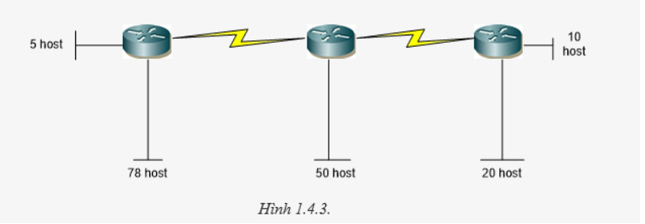

# Bài tập

1. Cho biết địa chỉ nào sau đây có thể dùng cho host

Địa chỉ host hợp lệ:

- Địa chỉ IP không được là địa chỉ mảng (toàn bộ phần host là 0).
- Địa chỉ IP không được là địa chỉ broadcast (toàn bộ phần host là 1).
- Địa chỉ IP không thuộc dải đặc biệt như:
  - Dải 127.0.0.0 - 127.255.255.255 (loopback).
  - Dải địa chỉ multicast (224.0.0.0 - 239.255.255.255).
  - Địa chỉ không hợp lệ (ví dụ: giá trị trong một octet vượt quá 255)

| Địa chỉ | Dùng cho host? | Giải thích |
|-----------|-------------|---------|
| 150.100.255.255 | Không | Là địa chỉ broadcast |
| 175.100.255.18 | Có | Là địa chỉ hợp lệ của lớp B |
| 195.234.253.0 | Không | Là địa chỉ mạng |
| 100.0.0.23 | Có | Là địa chỉ hợp lệ của lớp A |
| 188.258.221.176 | Không | Giá trị octet không hợp lệ (258 > 255). |
| 127.34.25.189 | Không | Thuộc dải loopback (127.x.x.x). |
| 224.156.217.73 | Không | Thuộc dải multicast (224.0.0.0/4). |

## 1.4.6.1. Cho mạng và số bit mượn. Giả sử có hỗ trợ subnet zero. Hãy xác định

- Số subnet có thể có.
- Số host/subnet.
- Với mỗi subnet, hãy xác định: địa chỉ mạng, địa chỉ host đầu, địa chỉ host cuối, địa chỉ broadcast (nếu số lượng mạng quá nhiều chỉ cần ghi ra một vài mạng đầu và mạng cuối cùng), subnet mask và số prefix.

a. **192.168.2.0/24 mượn 5 bit**

Số subnet: 2^5 = 32

Số host/subnet: 2^3 - 2 = 6 host

Subnet mask: 255.255.255.248 và prefix /29

Địa chỉ từng subnet:

- Mạng 1: 192.168.2.0/29 (host: 192.168.2.1 → 192.168.2.6, broadcast: 192.168.2.7).
- Mạng 2: 192.168.2.8/29 (host: 192.168.2.9 → 192.168.2.14, broadcast: 192.168.2.15).
- Mạng 3: 192.168.2.16/29 (host: 192.168.2.17 → 192.168.2.22, broadcast: 192.168.2.23).

- .......

- Mạng cuối: 192.168.2.248/29 (host: 192.168.2.249 → 192.168.2.254, broadcast: 192.168.2.255).

b. **192.168.12.0/24 mượn 3 bit**

Số subnet: 2^3 = 8

Số host/subnet: 2^5 - 2 = 30 host

Subnet mask: 255.255.255.224 và prefix /27

Địa chỉ từng subnet:

- Mạng 1: 192.168.12.0/27 (host: 192.168.12.1 → 192.168.12.30, broadcast: 192.168.12.31).
- Mạng 2: 192.168.12.32/27 (host: 192.168.12.33 → 192.168.12.62, broadcast: 192.168.12.63).
- Mạng 3: 192.168.12.64/27 (host: 192.168.12.65 → 192.168.12.94, broadcast: 192.168.12.95).

- .......

- Mạng cuối: 192.168.12.224/27 (host: 192.168.12.225 → 192.168.12.254, broadcast: 192.168.12.255).

c. **172.16.2.0/24 mượn 2 bit**

Số subnet: 2^2 = 4

Số host/subnet: 2^6 - 2 = 62 host

Subnet mask: 255.255.255.192 và prefix /26

Địa chỉ từng subnet:

- Mạng 1: 192.16.2.0/26 (host: 192.16.2.1 → 192.16.2.62, broadcast: 192.16.2.63).
- Mạng 2: 192.16.2.64/26 (host: 192.16.2.65 → 192.16.2.126, broadcast: 192.16.2.127).
- Mạng 3: 192.16.2.128/26 (host: 192.16.2.129 → 192.16.2.190, broadcast: 192.16.2.191).
- Mạng 4: 192.16.2.192/26 (host: 192.16.2.193 → 192.16.2.254, broadcast: 192.16.2.255).

d. **172.16.0.0/16 mượn 3 bit**

Số subnet: 2^3 = 8

Số host/subnet: 2^13 - 2 = 8190 host

Subnet mask: 255.255.224.0 và prefix /19

Địa chỉ từng subnet:

- Mạng 1: 172.16.0.0/19 (host: 172.16.0.1 → 172.16.31.254, broadcast: 172.16.31.255).
- Mạng 2: 172.16.32.0/19 (host: 172.16.32.1 → 172.16.63.254, broadcast: 172.16.63.255).
- .....
- Mạng cuối: 172.16.224.0/19 (host: 172.16.224.1 → 172.16.255.254, broadcast: 172.16.255.255).

e. **172.16.0.0/16 mượn 12 bit**

Số subnet: 2^12 = 4096

Số host/subnet: 2^4 - 2 = 14 host

Subnet mask: 255.255.255.240 và prefix /28

Địa chỉ từng subnet:

- Mạng 1: 172.16.0.0/28 (host: 172.16.0.1 → 172.16.0.14, broadcast: 172.16.0.15).
- Mạng 2: 172.16.0.16/28 (host: 172.16.0.17 → 172.16.0.30, broadcast: 172.16.0.31).
- .....
- Mạng cuối: 172.16.0.240/28 (host: 172.16.0.241 → 172.16.255.254, broadcast: 172.16.255.255).

f. **10.0.0.0/8 mượn 5 bit**

Số subnet: 2^5= 32

Số host/subnet: 2^19 - 2 = 524286 host

Subnet mask: 255.248.0.0 và prefix /13

Địa chỉ từng subnet:

- Mạng 1: 10.0.0.0/13 (host: 10.0.0.1 → 10.7.255.254, broadcast: 10.7.255.255).
- Mạng 2: 10.8.0.0/13 (host: 10.8.0.1 → 10.15.255.254, broadcast: 10.15.255.255).
- .....
- Mạng cuối: 10.248.0.0/13 (host: 10.248.0.1 → 10.255.255.254, broadcast: 10.255.255.255).

g. **10.0.0.0/8 mượn 10 bit**

Số subnet: 2^10= 1024

Số host/subnet: 2^14 - 2 = 16382 host

Subnet mask: 255.255.192.0 và prefix /18

Địa chỉ từng subnet:

- Mạng 1: 10.0.0.0/18 (host: 10.0.0.1 → 10.0.63.254, broadcast: 10.0.63.255).
- Mạng 2: 10.0.64.0/18 (host: 10.0.64.1 → 10.0.127.254, broadcast: 10.0.127.255).
- .....
- Mạng cuối: 10.255.192.0/18 (host: 10.255.192.1 → 10.255.255.254, broadcast: 10.255.255.255).

h. **10.0.0.0/8 mượn 18 bit**

Số subnet: 2^18= 262144

Số host/subnet: 2^6 - 2 = 62 host

Subnet mask: 255.255.255.192 và prefix /26

Địa chỉ từng subnet:

- Mạng 1: 10.0.0.0/26 (host: 10.0.0.1 → 10.0.0.62, broadcast: 10.0.0.63).
- Mạng 2: 10.0.0.64/26 (host: 10.0.0.65 → 10.0.0.126, broadcast: 10.0.0.127).
- .....
- Mạng cuối: 10.0.0.192/26 (host: 10.0.0.193 → 10.255.255.254, broadcast: 10.255.255.255).

## 1.4.6.2. Cho mạng 172.16.5.0/24. Hãy chia nhỏ sao cho phù hợp với sơ đồ sau

Mạng 78 host:

- Số host cần: 78
- Công thức: 2^m - 2 >= 78 => m = 7 (7 bit phần host)
- subnet mask: /25 => 255.255.255.128
- Mỗi subnet có 2^7 - 2 = 126 host
- Địa chỉ mạng 172.16.5.0/25 => Dải địa chỉ: 172.16.5.0 -> 172.16.5.127
- Địa chỉ mạng: 172.16.5.0 (không sử dụng được)
- Địa chỉ broadcast: 172.16.5.127 (không sử dụng được)
Địa chỉ có thể sử dụng: 172.16.5.1 – 172.16.5.126

Mạng 50 host:

- Số host cần: 50
- Công thức: 2^m - 2 >= 50 => m = 6 (6 bit phần host)
- subnet mask: /26 => 255.255.255.192
- Mỗi subnet có 2^6 - 2 = 62 host
- Địa chỉ mạng 172.16.5.0/26 => Dải địa chỉ: 172.16.5.128 -> 172.16.5.191
- Địa chỉ mạng: 172.16.5.128 (không sử dụng được)
- Địa chỉ broadcast: 172.16.5.191 (không sử dụng được)
- Địa chỉ có thể sử dụng: 172.16.5.129 – 172.16.5.190

Mạng 20 host:

- Số host cần: 20
- Công thức: 2^m - 2 >= 20 => m = 5 (5 bit phần host)
- subnet mask: /25 => 255.255.255.224
- Mỗi subnet có 2^5 - 2 = 30 host
- Địa chỉ mạng 172.16.5.0/27 => Dải địa chỉ: 172.16.5.192 -> 172.16.5.223
- Địa chỉ mạng: 172.16.5.192 (không sử dụng được)
- Địa chỉ broadcast: 172.16.5.223 (không sử dụng được)
- Địa chỉ có thể sử dụng: 172.16.5.193 – 172.16.5.222

Mạng 10 host:

- Số host cần: 10
- Công thức: 2^m - 2 >= 10 => m = 4 (4 bit phần host)
- subnet mask: /28 => 255.255.255.240
- Mỗi subnet có 2^4 - 2 = 14 host
- Địa chỉ mạng 172.16.5.0/28 => Dải địa chỉ: 172.16.5.224 -> 172.16.5.239
- Địa chỉ mạng: 172.16.5.224 (không sử dụng được)
- Địa chỉ broadcast: 172.16.5.239 (không sử dụng được)
- Địa chỉ có thể sử dụng: 172.16.5.225 – 172.16.5.238

Mạng 5 host:

- Số host cần: 5
- Công thức: 2^m - 2 >= 5 => m = 3 (3 bit phần host)
- subnet mask: /29 => 255.255.255.248
- Mỗi subnet có 2^3 - 2 = 6 host
- Địa chỉ mạng 172.16.5.0/29 => Dải địa chỉ: 172.16.5.240 -> 172.16.5.247
- Địa chỉ mạng: 172.16.5.240 (không sử dụng được)
- Địa chỉ broadcast: 172.16.5.247 (không sử dụng được)
- Địa chỉ có thể sử dụng: 172.16.5.241 – 172.16.5.246

Hai liên kết điểm - điểm:

- Số host cần: 2 (mỗi mạng)
- Công thức: 2^m - 2 >= 2 => m = 2 (2 bit cho phần host)
- subnet mask: /30 => 255.255.255.252
- Địa chỉ mạng:
  - Liên kết 1: 172.16.5.248/30 => Dải 172.16.5.248->172.16.5.251. Địa chỉ có thể sử dụng: 172.16.5.249 – 172.16.5.250
  - Liên kết 2: 172.16.5.252/30 => Dải 172.16.5.252->172.16.5.255. Địa chỉ có thể sử dụng: 172.16.5.253 – 172.16.5.254

## 1.4.6.3. Cho các địa chỉ host sau đây. Hãy xác định các địa chỉ subnet tương ứng và cho biết địa chỉ này có thể dùng đặt cho host được không

a. **192.168.1.130/29**

Địa chỉ:     11000000.10101000.00000001.10000010

Subnet mask: 11111111.11111111.11111111.11111000

AND:         11000000.10101000.00000001.10000000 <-> 192.168.1.128/29

=> 192.168.1.128/29 không thể dùng (đây là địa chỉ mạng)

b. **172.16.34.57/18**

Địa chỉ:     10101100.00010000.00100010.00111001

subnet mask: 11111111.11111111.11000000.00000000

AND:         10101100.000100000.0000000.00000000 <-> 172.16.0.0/18

=> 172.16.0.0/18 không thể dùng (đây là địa chỉ mạng)

c. **203.162.4.191/28**

Địa chỉ:     11001011.10100010.00000100.10111111

subnet mask: 11111111.11111111.11111111.11110000

AND:         11001011.10100010.00000100.10110000 <-> 203.162.4.176/28

=> 203.162.4.176/28 không thể dùng (đây là địa chỉ mạng)

d. **1.1.1.1/30**

Địa chỉ:     00000001.00000001.00000001.00000001

subnet mask: 11111111.11111111.11111111.11111100

AND:         00000001.00000001.00000001.00000000 <-> 1.1.1.0/30

=> 1.1.1.0/30 không thể dùng (đây là địa chỉ mạng)

e. **10.10.10.89/29**

Địa chỉ:     00001010.00001010.00001010.01011001

subnet mask: 11111111.11111111.11111111.11111000

AND:         00001010.00001010.00001010.01011000 <-> 10.10.10.88/29

=> 10.10.10.88/29 không thể dùng (đây là địa chỉ mạng)

f. **70.9.12.35/30**

Địa chỉ:     01000110.00001001.00001100.00100011

subnet mask: 11111111.11111111.11111111.11111100

AND:         01000110.00001001.00001100.00100000 <-> 70.9.12.32/30

=> 70.9.12.32/30 không thể dùng (đây là địa chỉ mạng)

g. **158.16.23.208/29**

Địa chỉ:     10011110.00010000.00010111.11010000

subnet mask: 11111111.11111111.11111111.11111000

AND:         10011110.00010000.00010111.11010000 <-> 158.16.23.208/29

=> 158.16.23.208/29 không thể dùng (đây là địa chỉ mạng)

## 1.4.6.4. Tóm tắt các địa chỉ mạng

a.

192.168.0.0/24 -> 11000000.10101000.00000000.00000000

192.168.1.0/24 -> 11000000.10101000.00000001.00000000

192.168.2.0/24 -> 11000000.10101000.00000010.00000000

192.168.3.0/24 -> 11000000.10101000.00000011.00000000

Xác định số bit mạng (prefix) /22. Vậy có mạng tóm tắt là 192.168.0.0/22

b.

172.16.16.0/24 -> 10101100.00010000.00010000.00000000

172.16.20.0.24 -> 10101100.00010000.00010100.00000000

172.16.24.0/24 -> 10101100.00010000.00011000.00000000

172.16.28.0/24 -> 10101100.00010000.00011100.00000000

Xác định số bit mạng (prefix) /20. Vậy có mạng tóm tắt là 172.16.16.0/20
