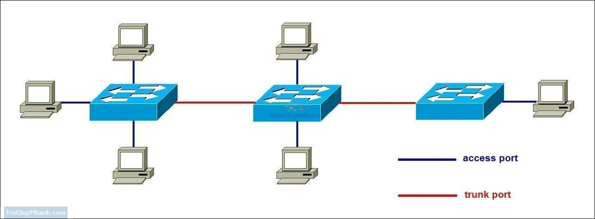

# Trunk

## 1. Khái niệm

Trunk là một kiểu kết nối được sử dụng để truyền nhiều VLAN qua cùng một đường link vật lý giữa các thiết bị mạng (thường là giữa các Switch hoặc giữa Switch với Router).

`Đặc điểm`

- Cho phép truyền dữ liệu của nhiều VLAN qua một cổng vật lý duy nhất bằng cách gắn thêm tag VLAN vào gói tin.
- Thường sử dụng giao thức 802.1Q để đánh dấu (tag) các gói tin.
- Được sử dụng khi cần kết nối giữa các Switch với nhau hoặc giữa Switch với Router để truyền tải dữ liệu của nhiều VLAN.

Khi một cổng được cấu hình trunk, dữ liệu từ nhiều VLAN sẽ truyền qua cùng một đường truyền. Để phân biệt gói tin thuộc VLAN nào, người ta sử dụng các giao thức gắn thẻ (tagging). Có 2 chuẩn phổ biến là IEEE 802.1Q (DOT1Q) và ISL

## 2. Chuẩn IEEE 802.1Q (DOT1Q)

### Định nghĩa 802.1Q

- IEEE 802.1Q (còn gọi là DOT1Q) là tiêu chuẩn mở do IEEE phát triển, được sử dụng rộng rãi trên các thiết bị mạng của nhiều hãng khác nhau (Cisco, HP, Juniper...).
- Gói tin VLAN khi đi qua cổng trunk sẽ được gắn thẻ VLAN (VLAN Tagging) theo chuẩn 802.1Q.


### Cách hoạt động

- Thêm một thẻ (tag VLAN) vào gói tin Ethernet để xác định VLAN mà nó thuộc về.
- Kích thước tag VLAN: 4 byte (32 bit) được chèn vào giữa phần Header và Payload của gói tin Ethernet.
- Có khái niệm Native VLAN: Gói tin thuộc Native VLAN sẽ không gắn tag khi truyền qua Trunk.
- Khái niệm Native VLAN: Gói tin thuộc Native VLAN sẽ không gắn tag khi truyền qua Trunk.

### Cấu trúc thẻ VLAN (802.1Q VLAN Tag - 4 byte)

| Thành phần | Kích thước | Ý nghĩa |
|-----------|-------------|---------|
| Type | 2 byte | Luôn có giá trị 0x8100, giúp thiết bị mạng nhận biết đây là gói tin VLAN |
| Priority (PRI - Class of Service - CoS) | 3 bit | Xác định mức độ ưu tiên của gói tin (giá trị từ 0 - 7). Dùng cho QoS (Quality of Service). |
| Token Ring Encapsulation (CFI - Canonical Format Indicator) | 1 bit | Dùng để xác định định dạng địa chỉ MAC. Thường là 0 (Ethernet chuẩn). Nếu là 1, có thể dùng trong Token Ring (hiếm khi dùng) |
| VLAN ID (VID - VLAN Identifier) | 12 bit | Xác định VLAN của gói tin, giá trị từ 1 - 4094 (0 và 4095 bị cấm sử dụng) |

### Ví dụ VLAN Tagging với 802.1Q

Gói tin từ VLAN 10 khi truyền qua Trunk Port sẽ được thêm Tag VLAN 10. Switch nhận được gói tin sẽ đọc tag này để biết nó thuộc VLAN nào.

## 3. Chuẩn ISL (Inter-Switch Link) của Cisco

### Định nghĩa ISL

- ISL (Inter-Switch Link) là giao thức độc quyền của Cisco dùng để đánh dấu VLAN trên cổng trunk.
- Không phải là tiêu chuẩn mở, chỉ hoạt động trên thiết bị Cisco đời cũ.

### Cách hoạt động ISL

- Thêm toàn bộ header ISL (30 byte) vào gói tin Ethernet gốc thay vì chỉ chèn thêm 4 byte như 802.1Q.
- Không có Native VLAN, tất cả gói tin đều được gắn tag khi truyền qua Trunk.

### Cấu trúc Header ISL (30 byte)

| Thành phần | Kích thước | Ý nghĩa |
|-----------|-------------|---------|
| DA (Destination Address) | 6 byte | Địa chỉ MAC đích |
| Type | 2 byte | Xác định gói tin là ISL |
| User Field | 1 byte | Độ ưu tiên |
| VLAN ID | 15 byte | Chứa VLAN của gói tin |
| SA (Source Address) | 6 byte | Địa chỉ MAC nguồn |
| Tổng cộng | 30 byte | Header ISL |

### Ví dụ VLAN Tagging với ISL

- Gói tin từ VLAN 20 khi đi qua Trunk Port sẽ bọc toàn bộ bằng header ISL.
- Switch nhận được sẽ kiểm tra header ISL để xác định VLAN.

## 4. Access port và Trunk port



### Access port (Cổng truy nhập)

- Một cổng trên Switch sẽ hoạt động trong chế độ cổng truy nhập (Access link) hoặc cổng trung kế (Trunk link).
- Trong chế độ cổng truy nhập, cổng chỉ thuộc một VLAN. Tất cả các máy tính cắm vào cổng mày đều thuộc VLAN đó.
- Frame được gửi trên cổng truy nhập sẽ tuân theo chuẩn định dạng khung ethernet (802.3).
- Cổng truy nhập thường dùng khi cổng được kết nối đến máy trạm.

Cấu hình access port:

```plaintext
Switch#config terminal
Switch(config)#interface fastetnernet slot/port_number
Switch(config)#switchport mode access
```

Trong đó slot/port_number là cổng cần cấu hình.

### Trunk port (Cổng trung kế)

- Cổng trung kế (Trunk link) là một kết nối vật lý và logic để hỗ trợ các VLAN trên các Switch liên kết với nhau.
- Cổng trung kế cho phép frame của nhiều VLAN có thể truyền trên đó. Một cổng trung kế không được gán cho một VLAN riêng biệt.
- Cổng trung kế thường được dùng để kết nối giữa các Switch hoặc giữa Switch và Router. Chính vì vậy cổng trung kế thường là cổng có băng thông lớn.
- Các VLAN được ghép kênh qua cổng trung kế. Để ghép kênh lưu lượng của các VLAN, một giao thức đặc biệt sẽ được sử dụng để đóng gói frame để thiết bị có thể xác định được nó thuộc VLAN nào. Chuẩn frame được sử dụng đó là 802.1Q hoặc ISL.
- Nhờ cổng trung kế mà một VLAN có thể được mở rộng ra toàn mạng.
- Chỉ cần một đường vật lý cho cả hai VLAN giữa hai Switch.

Cấu hình trunk port:

```plaintext
Switch#config terminal
Switch(config)#interface fastetnernet slot/port_number
Switch(config-if)#switchport trunk encapsulation [dot1q | isl]
Switch(config-if)#switchport mode trunk
```

Trong đó slot/port_number là cổng cần cấu hình. Lựa chọn một trong hai giao thức trung kế 802.1Q (Dot1Q) hoặ ISL.

## 5. VTP, STP

- VTP quản lý thông tin VLAN, trong khi STP đảm bảo không có vòng lặp trong mạng khi các VLAN được triển khai.
- Cả hai giao thức đều hoạt động độc lập nhưng hỗ trợ lẫn nhau để duy trì một mạng VLAN ổn định và hiệu quả.

### VTP (VLAN Trunking Protocol)

VTP (VLAN Trunking Protocol) là giao thức độc quyền của Cisco, được dùng để quản lý và đồng bộ hóa VLAN trên nhiều Switch trong cùng một hệ thống mạng.

`Mục đích`

- Tự động đồng bộ VLAN trên toàn bộ hệ thống mà không cần cấu hình thủ công từng Switch.
- Giảm thiểu lỗi cấu hình khi triển khai mạng lớn.
- Tiết kiệm thời gian vì chỉ cần tạo VLAN trên một Switch, tất cả các Switch khác trong cùng hệ thống VTP sẽ nhận được.

`Cách hoạt động`

- Trong mạng có nhiều Switch, một Switch được đặt làm VTP Server.
- Khi VLAN mới được tạo trên VTP Server, nó sẽ gửi thông báo đến tất cả các Switch khác thông qua Trunk Link.
- Các Switch khác sẽ cập nhật VLAN mới vào database của mình.

Lưu ý: VTP chỉ đồng bộ VLAN, không đồng bộ Port Assignment (gán cổng vào VLAN).

`Các chế độ hoạt động của VTP`

**VTP Server:**

- Chế độ mặc định của switch Cisco
- Tạo, sửa, xóa VLANs.
- Các thay đổi sẽ được quảng bá đến các switch khác trong cùng một VTP domain.
- Switch Server lưu trữ thông tin về VLAN trong NVRAM (Non-Volatile RAM).

**VTP Client:**

- Không thể tạo, xóa hoặc sửa đổi VLAN.
- Chỉ nhận thông tin VLAN từ VTP Server.
- Chuyển tiếp các gói tin VTP mà nó nhận được từ Server đến các Client khác.

**VTP Transparent:**

- Không nhận/sử dụng VLAN từ VTP Server.
- Cho phép tạo VLAN cục bộ (local).
- Vẫn chuyển tiếp VTP Advertisements đến Switch khác.

`Cấu trúc của VTP Advertisement (Thông điệp VTP)`

- VTP Version (1 byte):
  - VTP v1: Phiên bản cơ bản, chỉ hỗ trợ VLAN từ 1-1005.
  - VTP v2: Cải tiến v1, hỗ trợ Token Ring VLANs, hoạt động tốt hơn với Transparent Mode.
  - VTP v3: Hỗ trợ VLAN 1-4094, bảo mật cao hơn, cho phép rollback cấu hình.
- VTP Message Type (1 byte):
  - **Summary Advertisement**: Gửi mỗi 5 phút, chứa số Revision Number và VLAN hiện có.
  - **Subset Advertisement**: Gửi khi có thay đổi VLAN (tạo, xóa, sửa VLAN).
  - **Advertisement Request**: Khi Switch vừa khởi động, nó gửi yêu cầu cập nhật VLAN từ VTP Server.
  - VD: Khi admin tạo VLAN 20 trên VTP Server, nó sẽ gửi Subset Advertisement đến các Switch Client để cập nhật VLAN 20.
- Management Domain (32 byte): Tên miền VTP (VTP Domain).
- Revision Number (4 byte): Số thứ tự cập nhật VLAN (càng lớn, cập nhật càng mới).
- VLAN Information (biến đổi): Danh sách VLAN được quản lý.

### STP (Spanning Tree Protocal)

STP (Spanning Tree Protocol) là một giao thức mạng Layer 2 (Datalink Layer) giúp ngăn chặn các vòng lặp (loops) trong mạng Ethernet bằng cách tạo ra một cây bao trùm (spanning tree) để đảm bảo chỉ có một đường dẫn hoạt động giữa các switch.

STP tránh các vấn đề nghiệm trọng từ vòng lặp như:

- Broadcast storm: Các gói tin broadcast được sao chép và lan truyền liên tục trong mạng, gây nghẽn mạng.
- Duplicate frames: Các thiết bị nhận được nhiều bản sao của cùng một gói tin, gây nhầm lẫn và xử lý sai.
- MAC address table instability: Bảng địa chỉ MAC trên switch bị cập nhật liên tục, gây khó khăn cho việc chuyển tiếp gói tin.

`Nguyên lý hoạt động`

STP sử dụng thuật toán Spanning Tree Algorithm (STA) để xác định đường đi tối ưu, dựa trên: Election of Root Bridge (Chọn Root Bridge), Port Roles (Vai trò cổng), Path Cost (Chi phí đường truyền) với các bước:

- Bước 1: Chọn Root Bridge (Cầu Gốc):
  - Tất cả các Switch gửi BPDU (Bridge Protocol Data Unit) để bầu chọn Root Bridge.
  - Switch có Bridge ID (Priority + MAC Address) nhỏ nhất sẽ trở thành Root Bridge.
  - Bridge ID = Bridge Priority + MAC Address.
- Bước 2: Xác định Root Port (RP) trên mỗi Switch:
  - Root Port là cổng có đường đi ngắn nhất đến Root Bridge. Nếu có 2 đường đến Root Bridge, đường có chi phí nhỏ hơn sẽ được chọn làm Root Port.
  - Tính Path Cost (Chi phí đường truyền) dựa trên tốc độ cổng: 10 Mbps = 100, 100 Mbps = 19, 1 Gbps = 4, 10 Gbps = 2.
  - Nếu 2 cổng bằng nhau, thì cổng nào đấu với cổng có BID nhỏ hơn sẽ trở thành root port.
- Bước 3: Xác định Designated Port (DP)
  - Designated Port là cổng trên mỗi segment chịu trách nhiệm chuyển tiếp gói tin.
  - Trên mỗi đường truyền, Switch nào có đường đi ngắn hơn đến Root Bridge sẽ có Designated Port.
- Bước 4: Xác định Blocked Port (BP)
  - Cổng nào không phải Root Port hoặc Designated Port sẽ bị chặn (Blocking).
  - Cổng bị chặn vẫn lắng nghe BPDU để có thể kích hoạt lại nếu mạng bị lỗi.
