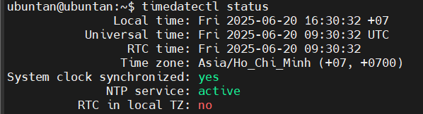
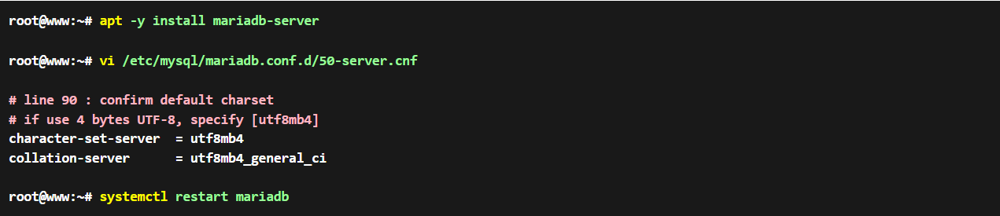
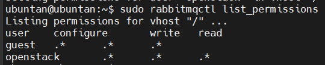

# OpenStack Epoxy : Pre-Requirements

## 1. Cấu hình NTP để điều chỉnh ngày

### Bước 1: Kiểm tra và cài đặt `systemd-timesyncd`

- `systemd-timesyncd` thường được cài sẵn trong Ubuntu.
- Kiểm tra trạng thái dịch vụ:

    ```bash
    systemctl status systemd-timesyncd
    ```

- Nếu chưa có hoặc bị gỡ, cài lại:

    ```bash
    sudo apt update
    sudo apt install systemd-timesyncd
    ```

### Bước 2: Cấu hình `systemd-timesyncd` để dùng NTP từ internet

- Mở file cấu hình:

    ```bash
    sudo vim /etc/systemd/timesyncd.conf
    ```

- Tìm và chỉnh sửa (hoặc thêm dòng) sau:

    ```ini
    [Time]
    # Danh sách các NTP server chính để đồng bộ
    NTP=0.vn.pool.ntp.org 1.vn.pool.ntp.org time.google.com
    # Dùng nếu các server chính không hoạt động
    FallbackNTP=time.windows.com
    ```

### Bước 3: Đặt múi giờ Việt Nam

- Đặt múi giờ Việt Nam (Asia/Ho_Chi_Minh):

    ```bash
    sudo timedatectl set-timezone Asia/Ho_Chi_Minh
    ```

### Bước 4: Khởi động và bật `systemd-timesyncd`

- Khởi động dịch vụ:

    ```bash
    sudo systemctl start systemd-timesyncd
    ```

- Bật dịch vụ tự khởi động khi hệ thống khởi động:

    ```bash
    sudo systemctl enable systemd-timesyncd
    ```

### Bước 5: Kiểm tra trạng thái đồng bộ thời gian

- Kiểm tra trạng thái đồng bộ:

    ```bash
    timedatectl status
    ```

- Kết quả:

    

## 2. Cài đặt MariaDB Server

### Bước 1: Cài đặt MariaDB Server

- Cài đặt MariaDB Server:

    ```bash
    sudo apt install mariadb-server python3-pymysql -y
    ```

  - `python3-pymysql`: Cài thư viện Python cho phép các script hoặc service viết bằng Python 3 kết nối với MySQL/MariaDB. Dùng trong các thành phần như **Zabbix Proxy**, một số service **OpenStack** như Keystone.

### Bước 2: Cấu hình MariaDB cho OpenStack

- Mở file cấu hình:

    ```bash
    sudo vim /etc/mysql/mariadb.conf.d/50-server.cnf
    ```

    

- Khởi động lại MariaDB:

    ```bash
    sudo systemctl restart mariadb
    sudo systemctl enable mariadb
    ```

### Bước 3: Thiết lập ban đầu cho MariaDB

- Chạy lệnh sau để thiết lập bảo mật cho MariaDB:

    ```bash
    sudo mysql_secure_installation
    ```

    | Questions | Results |
    |---------|---------|
    | Switch to unix_socket authentication | n |
    | Change the root password? | n |
    | Remove anonymous users? | y |
    | Disallow root login remotely? | y |
    | Remove test database and access to it? | y |
    | Reload privilege tables now? | y |

## 3. Cấu hình kho lưu trữ OpenStack Epoxy (Repository)

### Cài tiện ích để tương tác với kho phần mềm

```bash
sudo apt install software-properties-common -y
```

Mục đích:

- Cài tiện ích để tương tác với kho phần mềm:
- Gói này chứa lệnh `add-apt-repository`, cho phép thêm kho lưu trữ phần mềm.

> Ubuntu không cài sẵn add-apt-repository trong bản tối giản. Cần cài gói này để có thể thêm kho OpenStack.

### Thêm kho lưu trữ chính thức của OpenStack Expoxy

```bash
sudo add-apt-repository cloud-archive:epoxy
```

- `cloud-archive` là kho do **Canonical (Ubuntu)** duy trì, chứa các gói OpenStack cho từng phiên bản.
- `cloud-archive:Expoxy` sẽ thêm dòng tương tự vào file `sources.list.d`:

    ```bash
    deb http://ubuntu-cloud.archive.canonical.com/ubuntu jammy-updates/Expoxy main
    ```

Mục đích: Thêm kho lưu trữ chính thức của Openstack Expoxy vào hệ thống.

## 4. Cài đặt RabbitMQ, Memcached, Nginx

- **RabbitMQ** = trung tâm giao tiếp các dịch vụ OpenStack
- **Memcached** = tăng tốc hệ thống bằng cache, chủ yếu cho token xác thực

### 4.1 RabbitMQ là gì?

**RabbitMQ** là message broker – trình xếp hàng và chuyển tiếp thông điệp giữa các dịch vụ.

Ví dụ trong OpenStack:

- Các dịch vụ như `nova-api`, `nova-compute`, `neutron`, `cinder`… không gọi nhau trực tiếp.
- Thay vào đó, chúng gửi thông điệp đến RabbitMQ, giúp hệ thống:
  - Tách rời các phần.
  - Xử lý bất đồng bộ.
  - Ổn định hơn khi trễ mạng hoặc lỗi tạm thời.

>Cụ thể: Dùng giao thức AMQP (Advanced Message Queuing Protocol). Trong OpenStack, gần như mọi dịch vụ đều dùng RabbitMQ để giao tiếp nội bộ.

### 4.2 Memcached là gì?

**Memcached** là một bộ nhớ đệm (cache) – dùng để lưu tạm dữ liệu trên RAM để truy xuất nhanh hơn.

Trong OpenStack, dùng để cache token xác thực của KeyStone:

- Không phải kiểm tra DB mỗi lần xác thực token.
- Giảm tải cho dịch vụ keystone.
- Tăng tốc độ xử lý API.

>Dịch vụ OpenStack liên kết với Memcached qua `127.0.0.1:11211`

### 4.3 Install RabbitMQ, Memcached, Nginx

**Cài đặt RabbitMQ Server:**

```bash
sudo apt install -y rabbitmq-server
```

- Cài RabbitMQ, một message broker dựa trên giao thức AMQP.
- Dùng trong các hệ thống phân tán như OpenStack, Zabbix (HA setup) để các dịch vụ giao tiếp với nhau qua hàng đợi (queue).

**Cài đặt Memcached:**

```bash
sudo apt install -y memcached
```

- Cài Memcached, hệ thống cache key-value trong RAM.
- Dùng để cache truy vấn cơ sở dữ liệu, phiên đăng nhập, tăng tốc hệ thống.
- Thường dùng với web server hoặc ứng dụng có backend PHP/Python.

**Webserver nginx:**

```bash
sudo apt install -y nginx
```

- Cài Nginx, một web server hiệu suất cao.
- Dùng để phục vụ nội dung tĩnh, reverse proxy, load balancing.

**Nginx stream mode modules:**

```bash
sudo apt install -y libnginx-mod-stream
```

- Cài module stream cho Nginx, hỗ trợ xử lý kết nối TCP và UDP, ngoài HTTP thông thường.
- Dùng khi cần proxy hoặc load-balance các dịch vụ như: như MySQL, Redis, SMTP, hoặc Custom TCP service.

**Tạo user mới trong hệ thống RabbitMQ:**

```bash
sudo rabbitmqctl add_user openstack doantan28
```

- `rabbitmqctl`: Công cụ dòng lệnh quản trị RabbitMQ (ctl = control).
- `add_user openstack doantan28`: Tạo người dùng mới có tên `openstack` với mật khẩu `doantan28`.

**Cấp quyền truy cập cho user `openstack` trên rabbitMQ:**

```bash
sudo rabbitmqctl set_permissions openstack ".*" ".*" ".*"
```

- cho phép user này quản lý, gửi và nhận message trên tất cả các queue và exchange.
- `set_permissions`: Lệnh cấp quyền cho user `openstack`.
- `".*"`: Cấp cho tất cả.

  
  - -> `configure`: Cho phép tạo/chỉnh sửa cấu hình của exchange/queue.
  - -> `write`: Gửi message vào exchange (publish)
  - -> `read`: Nhận message từ queue (consume)

**Cấu hình MariaDB Server:**

```bash
sudo vim /etc/mysql/mariadb.conf.d/50-server.cnf
```

Tìm và chỉnh sửa các dòng sau:

```bash
# Cho phép MariaDB lắng nghe trên tất cả các địa chỉ IP
bind-address = 192.168.133.133

# Mặc định của MariaDB là 151 kết nối đồng thời. Tăng lên 500 để hỗ trợ nhiều kết nối hơn
max_connections = 1000
```

**Cấu hình Memcached lắng nghe IP:**

```bash
sudo vim /etc/memcached.conf
```

Chỉnh dòng:

```bash
# Lắng nghe trên tất cả các địa chỉ IP
-l 192.168.133.133
```

- `-l` là tùy chọn cấu hình địa IP mà Memcached sẽ lắng nghe.
- Mặc định thường là `127.0.0.1` → chỉ chấp nhận kết nối từ localhost (nội bộ).
**Vô hiệu hóa site mặc định trong nginx**

```bash
sudo unlink /etc/nginx/sites-enabled/default
```

Khởi động lại các dịch vụ đã chỉnh sửa:

```bash
sudo systemctl restart mariadb rabbitmq-server memcached nginx 
```
