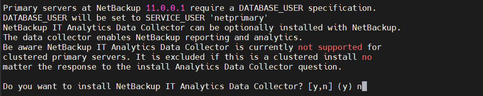
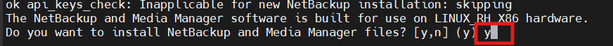
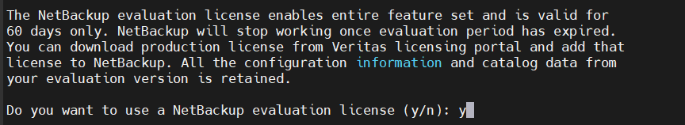
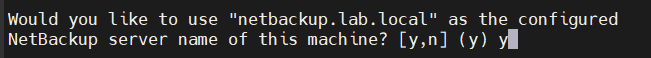
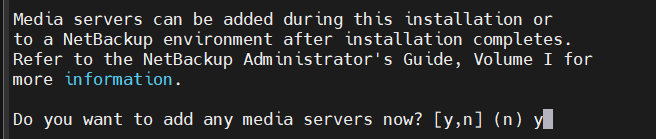
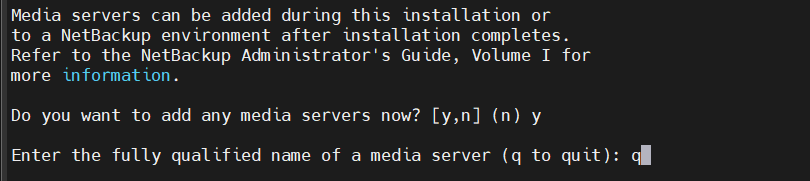
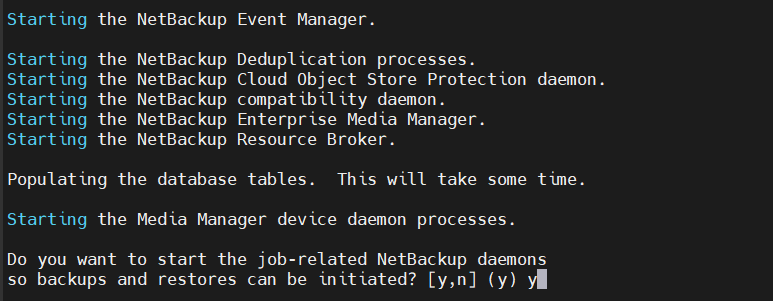
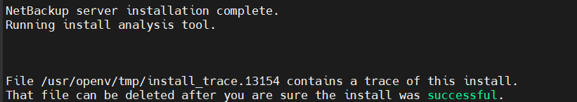
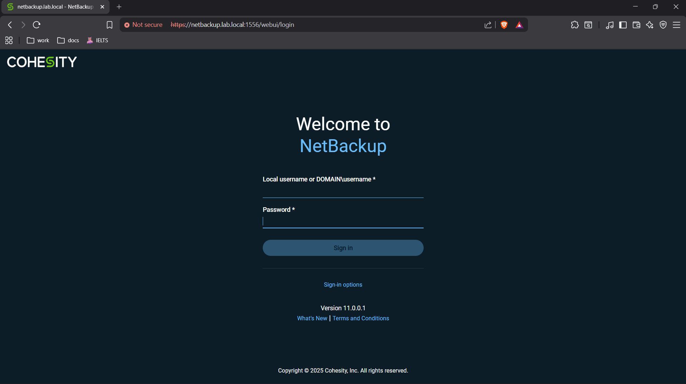

# Cài đặt Veritas NetBackup 11.0.0.1 (All-in-One: Master và Media Server trên cùng một máy) trên Oracle Linux 9.6 (RHCK)

Oracle Linux 9.6 với Red Hat Compatible Kernel (RHCK) được hỗ trợ đầy đủ cho NetBackup 11.0.0.1 làm Master Server, Media Server và Client, theo tài liệu Release Notes chính thức của Veritas. Cấu hình All-in-One (Master và Media trên cùng máy) phù hợp cho môi trường lab, nơi Master Server tự động hoạt động như Media Server mà không cần cấu hình bổ sung.

**Lưu ý quan trọng:**

- Yêu cầu tài khoản Veritas hỗ trợ để tải phần mềm và license từ `https://www.veritas.com/support/en_US/downloads/detail.REL373480`.
- Thực hiện trên môi trường lab (khuyến nghị máy ảo để dễ snapshot/rollback).
- Sử dụng công cụ Veritas SORT để kiểm tra tương thích chi tiết trước khi cài đặt.
- IP của máy: 192.168.70.15 – sử dụng trong cấu hình hostname/FQDN.

## I. Yêu cầu hệ thống tối thiểu

| Yêu cầu | Khuyến nghị cho lab |
|---------|---------------------|
| **CPU** | 4 cores (x86-64) |
| **RAM** | 16 GB (tối thiểu 8 GB) |
| **Disk Space** | 100 GB+ (riêng partition cho `/usr/openv` và storage backup, ví dụ `/backup`) |
| **Kernel** | RHCK (5.14.x) – đã phù hợp với yêu cầu của bạn |
| **SELinux** | Permissive hoặc Disabled |
| **Firewall** | Tắt hoặc mở port: 1556 (PBX), 13724 (vnetd), 443 (Web UI) |
| **Packages cần thiết** | `libnsl`, `libaio`, `ksh` (không cần compat-libstdc++ cũ trên OL 9) |

Cài đặt packages:

```bash
sudo dnf install -y libnsl libaio ksh
sudo dnf update -y
```

## II. Cài đặt

### 1. Sửa file `/etc/security/limits.conf` và tắt SELinux

Thêm hoặc sửa nội dung như dòng dưới:

```bash
*                hard    nofile          8192
*                soft    nofile          8192
```

Tắt SELinux:

```bash
# Chỉnh sửa file /etc/selinux/config
# Đổi enforcing thành disabled
SELINUX=disabled
```

### 2. Tải gói và công cụ cần thiết

```bash
dnf install libXrender libXtst -y
dnf install libxcrypt-compat -y
dnf install chkconfig -y
dnf install libtirpc -y
```

- `libXrender` và `libXtst`: Đây là các thư viện đồ họa thuộc hệ thống X11 (X Window System).
- `libxcrypt-compat`: Gói tương thích bảo mật, đảm bảo tương thích với các ứng dụng legacy (cũ) cần thư viện mã hóa cũ, thường gặp khi cài đặt phần mềm như Steam, GLPI agent, hoặc các công cụ khác trên hệ thống mới.
- `chkconfig`: Là công cụ quản lý dịch vụ hệ thống (services) trong hệ thống init SysV cổ điển, dùng để bật/tắt dịch vụ tự động khởi động ở các runlevel khác nhau (ví dụ: chkconfig httpd on để bật Apache tự khởi động).
- `libtirpc`: Cài gói libtirpc để cung cấp thư viện `libtirpc.so.3`. OL9 tích hợp `libtirpc.so.4` theo default, Không có package cho `.so.3` trong repos.

### 3. Đổi hosts và hostname cho server

Chỉnh sửa file `/etc/hosts`, thêm dòng sau:

```bash
192.168.70.15    netbackup.lab.local netbackup
```

Chỉnh sửa hostname:

```bash
sudo hostnamectl set-hostname netbackup.lab.local
```

reboot hệ thống để áp dụng các thay đổi với lệnh `reboot`.

### 4. Giải nén và cài đặt NetBackup

Tải file NetBackup từ Veritas Support, giải nén và cài đặt:

```bash
tar -xvzf NetBackup_11.0.0.1_LinuxR_x86_64.tar.gz
cd NetBackup_11.0.0.1_LinuxR_x86_64
```

### 5. Tạo user và group để cài đặt NetBackup

```bash
groupadd nbwebgrp
useradd -g nbwebgrp nbwebsvc
groupadd main
useradd -g main -c 'NetBackup Service Account' -d /usr/openv/ netprimary
usermod -a -G nbwebgrp netprimary
passwd netprimary
```

Chỉnh sửa file `/etc/sudoers` để cấp quyền sudo không cần mật khẩu:

```bash
# Thêm dòng sau vào cuối file /etc/sudoers
netprimary ALL=(ALL) NOPASSWD: ALL
```

### 6. Cài đặt Netbackup Primary Server và Media Server

Sai khi di chuyển vào folder `/NetBackup_11.0.0.1_LinuxR_x86_64`, chạy lệnh `./install` để bắt đầu cài đặt:


- Chọn `y` để tiếp tục.


- Chọn `y` để lựa chọn đây là host primary server.
- Kế tiếp chọn `n` để không thực hiện cài đặt disaster recovery.


- Nhập user `netprimary` vừa tạo



- Chọn `n` để không cài đặt NetBackup IT Analytics Data Collector



- Chọn `y` để cài đặt Media Server trên cùng máy với Primary Server (All-in-One)


- Chọn `n` để không add license.



- Chọn `y` để sử dụng license trail 60 ngày.



- Chọn `y` để sử dụng backup-server đang là hostname của VM làm tên của Netback server.



- Chọn `y` để thêm media server.



- Chọn `q` để bỏ qua.



- Chọn `y` để tiếp tục.



- Quá trình cài đặt hoàn tất, truy cập browser với đường dẫn `https://netbackup.lab.local:1556/webui` để đăng nhập giao diện web NetBackup.



- Tài khoản đăng nhập:
  - Username: `root`
  - Password: `<Mật khẩu của root>`

## III. Sử dụng script để auto mount disk và extend khi nâng cấp volume

### 1. Auto grow partition

**Script:** `/usr/local/sbin/nb-growpart.sh`

```bash
#!/bin/bash
set -e

DISK="/dev/vdb"
PART="1"
MOUNTPOINT="/usr/openv"

# Grow partition
/usr/bin/growpart $DISK $PART || true

# Grow filesystem
/usr/sbin/xfs_growfs $MOUNTPOINT || true
```

- NetBackup 11 ưu tiên XFS (Veritas recommendation)

```bash
chmod +x /usr/local/sbin/nb-growpart.sh
```

### 2. Auto mount disk

**Mount bằng UUID (bắt buộc)**:

```bash
blkid
```

Ví dụ:

```bash
UUID=abc-123 /usr/openv xfs defaults,nofail 0 0
```

- `nofail` là recommend của Veritas → NetBackup không fail boot nếu disk attach chậm.

### 3. Systemd service

File service:

```bash
vim /etc/systemd/system/nb-grow-mount.service
```

```ini
[Unit]
Description=NetBackup auto grow and mount volumes
After=local-fs.target
Before=netbackup.service

[Service]
Type=oneshot
ExecStart=/usr/local/sbin/nb-growpart.sh
RemainAfterExit=yes

[Install]
WantedBy=multi-user.target
```

Enable:

```bash
systemctl daemon-reload
systemctl enable nb-grow-mount
systemctl start nb-grow-mount
```

### 4. Logrotate

File riêng cho NetBackup:

```bash
vim /etc/logrotate.d/netbackup
```

```conf
/usr/openv/netbackup/logs/*/*.log
/usr/openv/wmc/webserver/logs/*.log
/usr/openv/db/data/instance/log/*.log
{
    weekly
    rotate 12
    compress
    delaycompress
    missingok
    notifempty
    copytruncate
}
```

Test logrotate:

```bash
logrotate -d /etc/logrotate.d/netbackup
```
