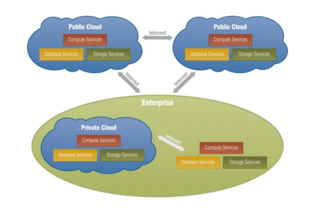
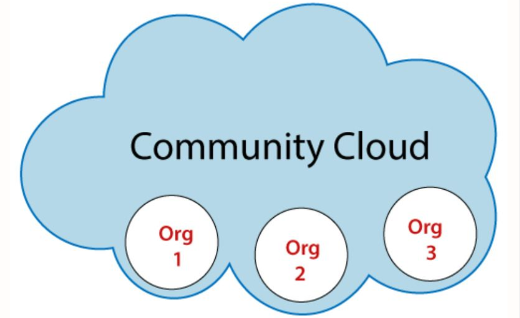

# Cloud Computing - Điện toán đám mây

## Tổng quan về Cloud Computing (Điện toán đám mây)

### 1. Khái niệm

Cloud Computing (Điện toán đám mây) là mô hình cung cấp tài nguyên CNTT (máy chủ, lưu trữ, cơ sở dữ liệu, phần mềm, v.v.) qua Internet, theo nhu cầu, với chi phí tính dựa trên mức sử dụng. Người dùng truy cập dịch vụ từ xa mà không cần sở hữu hạ tầng vật lý.

### 2. Ưu/Nhược điểm

`Ưu điểm`

- **Tiết kiệm chi phí:** Chi trả cho tài nguyên sử dụng, không cần đầu tư hạ tầng ban đầu.
- **Khả năng mở rộng:** Dễ dàng tăng, giảm tài nguyên theo nhu cầu.
- **Truy cập linh hoạt:** Sử dụng dịch vụ mọi lúc, mọi nơi qua Internet.
- **Bảo trì đơn giản:** Nhà cung cấp chịu trách nhiệm quản lý, cập nhật hệ thống.
- **Hiệu quả cao:** Tài nguyên chia sẻ, tối ưu hóa sử dụng.

`Nhược điểm`

- **Phụ thuộc internet:** Cần kết nối ổn định, mất mạng gây gián đoạn.
- **Bảo mật và quyền riêng tư:** Dữ liệu trên cloud có nguy cơ bị truy cập trái phép.
- **Chi phí dài hạn:** Có thể tốn kém hơn nếu sử dụng lâu dài so với hạ tầng sở hữu.
- **Phụ thuộc nhà cung cấp:** Khó chuyển đổi giữa các nhà cung cấp (vendor lock-in).
- **Hạn chế kiểm soát:** Người dùng không trực tiếp quản lý hạ tầng vật lý.

## Đặc điểm thiết yếu của Cloud Computing

### 1. On-demand self-service (Dịch vụ tự phục vụ theo nhu cầu)

- Người dùng có thể tự yêu cầu và sử dụng tài nguyên (như máy chủ, lưu trữ, hoặc ứng dụng) qua giao diện web mà không cần liên hệ trực tiếp với nhà cung cấp.
- *Ví dụ:* Tạo máy ảo trên AWS EC2 hoặc thêm dung lượng lưu trữ trên Google Cloud chỉ bằng vài cú nhấp chuột.
- **Ý nghĩa:** Tiết kiệm thời gian, tăng tính chủ động cho người dùng.

### 2. Broad network access (Truy cập mạng rộng)

- Dịch vụ cloud có thể truy cập qua Internet từ bất kỳ thiết bị nào (PC, laptop, điện thoại, tablet) bằng các giao thức chuẩn (HTTP, HTTPS).
- *Ví dụ:* Sử dụng Google Workspace từ trình duyệt trên điện thoại hoặc máy tính ở bất kỳ đâu.
- **Ý nghĩa:** Đảm bảo tính di động và tiện lợi, hỗ trợ làm việc từ xa.

### 3. Resource pooling (Tài nguyên chia sẻ)

- Tài nguyên (CPU, RAM, lưu trữ, băng thông) được tập hợp và chia sẻ cho nhiều người dùng, được phân bổ động theo nhu cầu.
- *Ví dụ:* Nhiều khách hàng dùng chung một cụm máy chủ trên AWS, nhưng tài nguyên được phân tách ảo hóa để đảm bảo riêng tư.
- **Ý nghĩa:** Tối ưu hóa sử dụng tài nguyên, giảm chi phí cho nhà cung cấp và người dùng.

### 4. Rapid elasticity (Khả năng mở rộng linh hoạt)

- Tài nguyên có thể tự động mở rộng (scale up/out) hoặc thu hẹp (scale down/in) nhanh chóng để đáp ứng nhu cầu thay đổi.
- *Ví dụ:* Một website trên Heroku tự động tăng máy chủ khi lưu lượng truy cập tăng cao trong dịp mua sắm.
- **Ý nghĩa:** Đảm bảo hiệu suất ổn định, tránh lãng phí tài nguyên khi nhu cầu thấp.

### 5. Measured service (Dịch vụ đo lường)

- Tài nguyên được giám sát, đo lường (CPU, băng thông, lưu trữ) và người dùng chỉ trả phí dựa trên mức sử dụng thực tế.
- *Ví dụ:* AWS tính phí theo giờ sử dụng máy ảo hoặc dung lượng lưu trữ trên S3.
- **Ý nghĩa:** Minh bạch chi phí, giúp người dùng tối ưu ngân sách và dự đoán chi phí dễ dàng.

## Các mô hình triển khai Cloud

### 1. Public Cloud

**Public Cloud** là mô hình cloud mà hạ tầng và tài nguyên được sở hữu và vận hành bởi bên thứ ba (nhà cung cấp cloud) và chia sẻ cho nhiều người dùng thông qua Internet.

**Đặc điểm:** Chi phí thấp, dễ mở rộng, nhưng ít kiểm soát hơn.

>Nhà cung cấp tiêu biểu: **AWS**, **Microsoft Azure**, **Google Cloud Platform (GCP)**, **IBM Cloud**.

### 2. Private Cloud

**Private Cloud** là mô hình đám mây được sử dụng riêng (trong nội bộ) bởi một tổ chức. Tài nguyên có thể được đặt tại chỗ (on-premise) hoặc thuê từ bên thứ ba, nhưng hạ tầng là dành riêng cho tổ chức đó.

**Đặc điểm:** Bảo mật cao, kiểm soát toàn bộ hạ tầng, tùy chỉnh theo nhu cầu tổ chức.

>Nền tảng triển khai phổ biến: **OpenStack**, **VMware vSphere**, **Microsoft Azure Stack**.

### 3. Hybrid Cloud

**Hybrid Cloud** kết hợp **Private Cloud** và **Public Cloud** cho phép tổ chức chạy một phần ứng dụng nội bộ và một phần trên đám mây công cộng, nhờ đó tận dụng ưu điểm của cả hai.

Mục đích của **Hybrid cloud**: tạo ra một môi trường thống nhất, tự động, có thể mở rộng, tận dụng tất cả những gì cơ sở hạ tầng đám mây công cộng có thể cung cấp, trong khi vẫn duy trì quyền kiểm soát dữ liệu quan trọng.

*Ví dụ:*

- Chạy hệ thống chính (CSDL) trong Private Cloud để đảm bảo an toàn.
- Đẩy phần frontend hoặc ứng dụng phụ lên Public Cloud để tận dụng tính mở rộng

### 4. Community Cloud

**Community Cloud** là mô hình đám mây được chia sẻ giữa các tổ chức có cùng nhu cầu (ví dụ: an ninh, chính sách).

## Các mô hình dịch vụ Cloud

### 1. IaaS (Infrastructure as a Service) - Hạ tầng như mội dịch vụ

**Khái niệm:** là mô hình cho thuê hạ tầng phần cứng ảo hóa như: máy ảo (VM), ổ cứng, mạng, firewall...

**Đặc điểm:** Bạn phải tự cài đặt hệ điều hành, phần mềm, và cấu hình mọi thứ trên đó.

**Người dùng được cung cấp:**

- Máy ảo (Virtual Machine).
- Ổ cứng ảo (Virtual Disk).
- Mạng ảo (Virtual Network).
- Firewall, Load balancer.

**Người dùng tự làm:**

- Cài hệ điều hành (Linux/Windows).
- Cài web server (Apache, Nginx).
- Cài runtime (Node.js, PHP, Java...).
- Cài CSDL (MySQL, PostgreSQL).
- Tự cấu hình bảo mật, cập nhật, backup...

*ví dụ:* Tạo một máy chủ ảo (EC2 trên AWS), cài Ubuntu, sau đó tự tay cài Apache, PHP, MySQL để chạy WordPress.

### 2. PaaS (Platform as a Service) - Nền tảng như một dịch vụ

**Khái niệm:** PaaS là mô hình cung cấp sẵn toàn bộ nền tảng phát triển ứng dụng như hệ điều hành, runtime, server, cơ sở dữ liệu,...

**Đặc điểm:** Người dùng chỉ cần viết code và triển khai, không cần cài đặt hay quản lý hệ thống.

*Ví dụ:* Google App Engine, Heroku.

### 3. SaaS (Software as a Service) - Phần mềm như một dịch vụ

**Khái niệm:** Cung cấp phần mềm qua Internet, người dùng truy cập trực tiếp mà không cần cài đặt hoặc quản lý.

**Đặc điểm:** Dễ sử dụng, nhà cung cấp quản lý toàn bộ (phần mềm, cập nhật, bảo trì), nhưng tùy chỉnh hạn chế. Người dùng chỉ cần quản lý tài khoản, dữ liệu sử dụng và một số cấu hình người dùng.

*Ví dụ:* Gmail, Google Drive, Google Docs, Microsoft Office 365.
