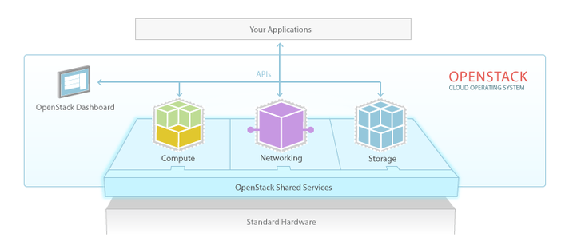

# OpenStack

## OpenStack là gì?

### 1. Khái niệm

**Openstack** là nền tảng điện toán đám mây nguồn mở, có khả năng hỗ trợ cả **public cloud** và **private cloud**. Nền tảng này cung cấp cho người dùng giải pháp xây dựng hạ tầng điện toán đám mây có khả năng mở rộng cao, với nhiều tính năng nổi bật.

**OpenStack** là tập hợp các công cụ phần mềm (gọi là "projects") để quản lý tài nguyên tính toán (compute), lưu trữ (storage) và mạng (networking) trong trung tâm dữ liệu.

**Hình ảnh minh họa:**

**Your Application:** lớp trên cùng đại diện cho ứng dụng của người dùng (ứng dụng web, dịch vụ, v.v.). chạy trên OpenStack.

**OpenStack:**

- **APIs:** Giao diện lập trình ứng dụng (API) cho phép ứng dụng và công cụ giao tiếp với các thành phần OpenStack, cung cấp cách thức tự động hóa và tích hợp.
- **OpenStack Dashboard:** Giao diện web (horizon) cho phép người dùng quản lý tài nguyên (tạo máy ảo, cấu hình mạng, lưu trữ) thông qua bảng điều khiển trực quan.
- **Openstack Shared Services:** lớp trung gian chứa các thành phần cốt lõi của OpenStack. Trong hình là một trong số các thành phần cơ bản của OpenStack:
  - **Compute (Nova):** Quản lý tài nguyên tính toán, tạo và quản lý máy ảo.
  - **Networking (Neutron):** Quản lý mạng, định tuyến, và kết nối giữa các tài nguyên.
  - **Storage (Swift/Cinder):** Cung cấp lưu trữ đối tượng (Swift) và lưu trữ khối (Cinder) cho máy ảo và dữ liệu.

**Standard Hardware:** phần cứng tiêu chuẩn (máy chủ, ổ cứng, mạng) mà OpenStack ảo hóa để cung cấp dịch vụ đám mây.

### 2. Các phiên bản OpenStack

[Các phiên bản OpenStack](https://releases.openstack.org/)

- Phiên bản đầu tiên của OpenStack được Rackspace và NASA phát hành vào tháng 10/2010.
- Các phiên bản tiếp theo được phát hành định kỳ, thường là 6 tháng một lần. Chúng được đặt tên bắt đầu với chữ cái A, B, C,... (`Austin`, `Bexar`, `Cactus`,...). Sau khi phát hành bản **Zed** (tháng 4/2023), các phiên bản tiếp sẽ thêm năm vào phía trước (`2023.1 Antelope`, `2023.2 Bobcat`, v.v.).`

## Các thành phần chính của OpenStack

| Service | Code name | Description |
|---------|-----------|-------------|
| Identity Service | `Keystone` | Quản lý người dùng, vai trò, và xác thực. Cung cấp hệ thống phân quyền (authentication/authorization) cho các dịch vụ OpenStack. |
| Compute Service | `Nova` | Quản lý máy ảo (VM), bao gồm tạo, xóa, và lập lịch tài nguyên tính toán. |
| Image Service | `Glance` | Lưu trữ và quản lý hình ảnh ảo (kernel image, disk image) để triển khai máy ảo. |
| Dashboard | `Horizon` | Giao diện web (GUI) cho phép quản lý tài nguyên OpenStack qua trình duyệt. |
| Object Storage | `Swift` | Cung cấp lưu trữ đối tượng (object storage) để lưu dữ liệu không cấu trúc, có khả năng chịu lỗi cao. |
| Block Storage | `Cinder` | Cung cấp lưu trữ khối (block storage) để gắn vào máy ảo như ổ đĩa cứng ảo. |
| Network Service | `Neutron` | Quản lý mạng ảo, bao gồm định tuyến, subnet, và kết nối giữa các tài nguyên. |
| Load Balancing Service | `Octavia` | Cung cấp tính năng cân bằng tải (load balancing) cho các máy ảo. |
| Orchestration Service | `Heat` | Tự động hóa triển khai và quản lý cấu hình cho các máy ảo và ứng dụng. |
| Metering Service | `Ceilometer` | Đo lường mức sử dụng tài nguyên để hỗ trợ kế toán và giám sát. |
| Rating Service | `CloudKitty` | Xử lý tính toán hóa đơn và định giá dựa trên mức sử dụng. |
| Database Service | `Trove` | Quản lý tài nguyên cơ sở dữ liệu như MySQL, PostgreSQL. |
| Container Service | `Magnum` | Quản lý hạ tầng container (như Docker, Kubernetes). |
| Data Processing Service | `Sahara` | Hỗ trợ xử lý dữ liệu lớn (big data) với các framework như Hadoop. |
| Bare Metal Provisioning | `Ironic` | Cung cấp khả năng triển khai máy chủ vật lý (bare metal) thay vì ảo hóa. |
| Shared File System | `Manila` | Cung cấp dịch vụ chia sẻ tệp (file sharing) cho người dùng. |
| DNS Service | `Designate` | Quản lý dịch vụ DNS cho các tài nguyên trong OpenStack. |
| Key Manager Service | `Barbican` | Quản lý khóa mã hóa và bí mật (secrets) để bảo mật dữ liệu. |
