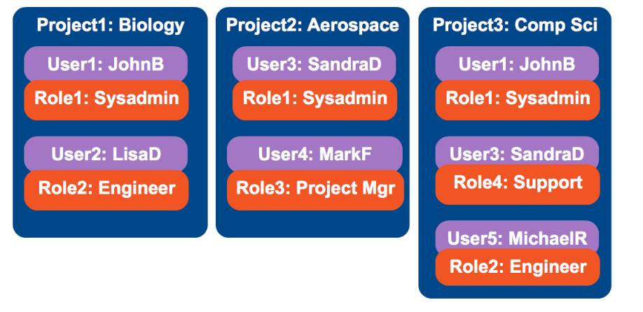
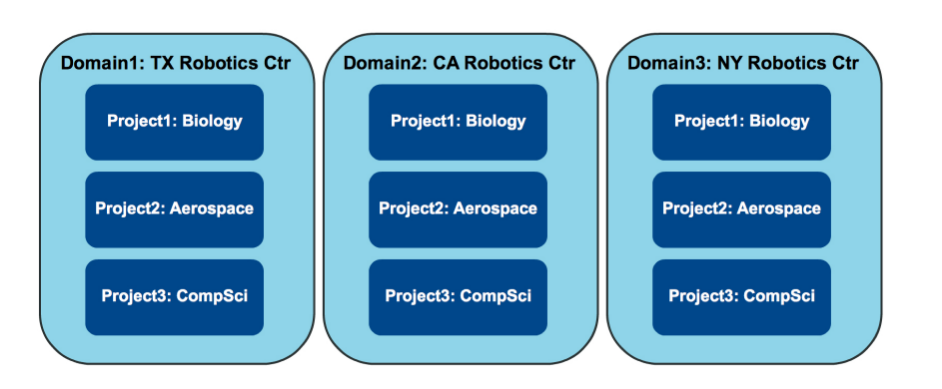
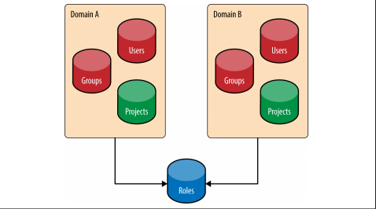
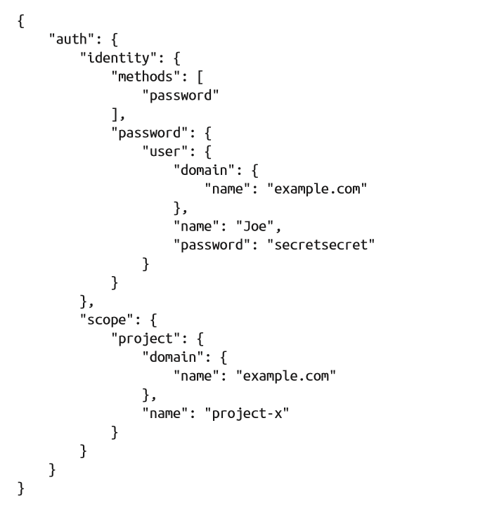
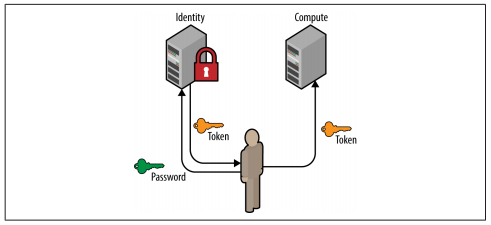
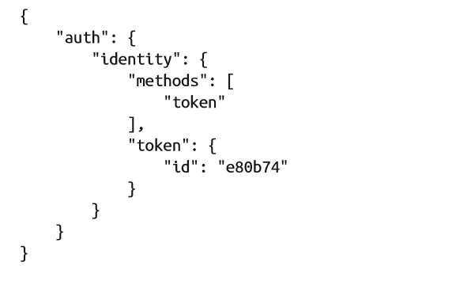
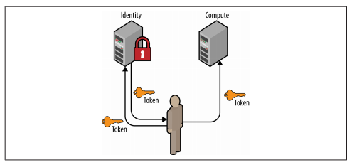
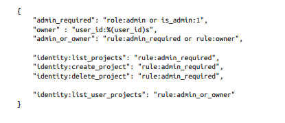
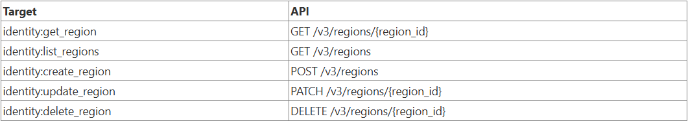
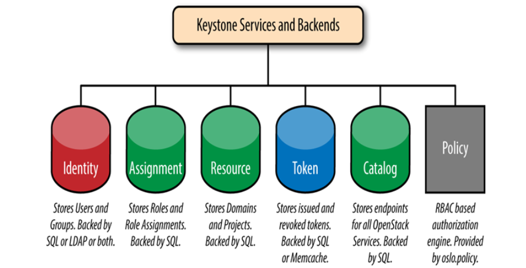

# Tổng quan về Keystone

## Khái niệm Keystone

**Keystone** là dịch vụ quản lý danh tính (Identity Service), chịu trách nhiệm xác thực (authentication) và phân quyền (authorization) cho người dùng, dự án, và dịch vụ. Nó cung cấp token để truy cập tài nguyên, hỗ trợ quản lý vai trò, chính sách, và thông tin đăng nhập.

## Các chức năng của Keystone

### 1. Identity - Danh tính

**Chức năng:** quản lý thông tin về user, group, và domain. Nó lưu trữ và xác định các thực thể (entities) có thể truy cập hệ thống, bao gồm thông tin như tên, mật khẩu, hoặc thuộc tính từ hệ thống bên ngoài (LDAP, IdP). Identity cung cấp cơ sở để xác thực (authentication) và phân quyền (authorization) trong OpenStack.

> Đây là phần nền tảng, giúp định nghĩa "ai" đang thực hiện hành động.

### 2. Authentication - Xác thực

**Chức năng:** đảm bảo người dùng là đúng như họ khai báo (Ví dụ: nhập đúng username và password). Cụ thể:

- Hỗ trợ xác thực qua username/password, token, cert, LDAP, hoặc federated identity (SSO).
- Nếu xác thực thành công, Keystone sẽ phát hành một token (mã xác thực tạm thời).
- Token này được dùng để truy cập các dịch vụ OpenStack khác như Nova, Glance, v.v.

> Chức năng này trả lời cho câu hỏi: "Bạn có đúng là bạn không?"

### 3. Access Management (Authization) - Quản lý truy cập, quyền hạn

**Chức năng:** quản lý và cấp quyền truy cập tài nguyên dựa trên vai trò (roles) và chính sách (policies). Nó xác định user hoặc group có thể thực hiện hành động gì trong project hoặc domain thông qua assignment (gán vai trò). Quyền được kiểm tra dựa trên chính sách RBAC (Role-Based Access Control) lưu trong backend (thường là JSON hoặc SQL).

- Dựa trên thông tin token, Keystone sẽ xác định quyền của người dùng. (*Ví dụ:* người dùng A có role `admin` trong project `dev`, có thể tạo VM trong `dev`.)
- Cung cấp token kèm theo thông tin ủy quyền để dịch vụ khác kiểm tra.

> Trả lời cho câu hỏi: "Bạn được phép làm gì?"

## Các khái niệm trong Keystone

### 1. Project (Trước đây gọi là Tenant)

- Là một không gian làm việc logic (container logic) đại diện cho một môi trường hoặc nhóm sử dụng tài nguyên OpenStack.
- **Mục đích:** dùng để phân tách tài nguyên (VM, volume, network...) giữa các nhóm người dùng.
- *Ví dụ:* Project `dev` cho nhóm phát triển, `qa` cho kiểm thử.

> Người dùng phải thuộc một project để sử dụng dịch vụ OpenStack.

### 2. Domain

- Là một miền quản trị độc lập, bao gồm một tập các user, group, và project.
- **Mục đích:**
  - Hỗ trợ đa tổ chức (multi-tenancy).
  - Mỗi domain có thể có người quản trị riêng, chính sách riêng.
- **Mặc định:** Keystone có sẵn domain tên là `Default`.

> Domain giúp quản lý nhiều tổ chức hoặc khách hàng trong một hệ thống OpenStack duy nhất.

### 3. User và User Group

- **User** là cá nhân hoặc thực thể truy cập hệ thống; **User Group** là tập hợp user để quản lý quyền tập thể.
- *Ví dụ:* Nhóm developers có 5 user, được gán role `member` trong project `dev`.

### 4. Roles

- Vai trò xác định mức quyền truy cập của user hoặc group trong project/domain.
- Ví dụ:
  - `amdin` - toàn quyền.
  - `member` - quyền sử dụng tài nguyên.
  - `reader` - chỉ đọc.

> Roles không mang ý nghĩa gì nếu không có Assignment.

### 5. Assignment

- Là liên kết giữa user/group, role và project/domain. Nó quy định xem ai có quyền gì trong dự án nào.
- *Ví dụ:*
  - User `alice` có role `admin` trong project `dev`.
  - Group `developers` có role `member` trong project `dev`.

> Đây là nền tảng của quản lý truy cập (authorization) trong Keystone.

### 6. Target

- Project và Domain đều có thể gán role. Từ đó sinh ra khái niệm target. Chính là project hoặc domain nào sẽ được gán Role cho user.
- Ví dụ: Nếu user có role "admin" trong project A, thì project A là target, và user chỉ có quyền admin trong phạm vi project A, không áp dụng cho project B.

### 7. Token

- Là một chuỗi ký tự đại diện cho thông tin xác thực của người dùng.
- **Mục đích:** sau khi xác thực thành công, Keystone cấp token để dùng khi truy cập dịch vụ khác.
- Có 2 loại chính:
  - **UUID token** (cũ, ngắn, dễ lưu trữ).
  - **Fernet token** (mới, không cần lưu trữ trong database, an toàn hơn).

### 8. Catalog

- Là danh sách các dịch vụ OpenStack mà Keystone biết đến.
- Bao gồm:
  - Tên dịch vụ (Nova, Glance, Neutron...).
  - Endpoint (địa chỉ API) của dịch vụ theo từng region và loại giao diện: `public`, `internal`, `admin`.
- Mục đích: Khi người dùng xác thực và nhận token, keystone trả lại **catalog** để các dịch vụ biết đường kết nối.
- *Ví dụ:* catalog chứa các endpoint `https://glance.example.com:9292` cho dịch vụ Glance.

## Backend của mỗi chức năng

### 1. Identity BE

**`SQL`:** backend mặc định và phổ biến nhất cho keystone.

- **Chi tiết:** Keystone sử dụng cơ sở dữ liệu quan hệ (MySQL, postgreSQL, hoặc MariaDB) để lưu trữ thông tin về người dùng, nhóm, dự án, vai trò (role) và các mối quan hệ giữa chúng.
- **Cách hoạt động:** Khi một user được tạo, thông tin user đó (bao gồm tên, mật khẩu, email, v.v.) sẽ được lưu vào các bảng trong cơ sở dữ liệu.
- **Ưu điểm:** Dễ cài đặt, quản lý và tích hợp với hầu hết các môi trường OpenStack. Hiệu suất tốt cho các môi trường triển khai từ nhỏ đến lớn.
- **Nhược điểm:** Việc quản lý người dùng thực hiện trực tiếp trong OpenStack, không đồng bộ với các hệ thống quản lý danh tính doanh nghiệp hiện có.

**`LDAP (Lightweight Directory Access Protocol)`:** cho phép Keystone tích hợp với một dịch vụ thư mục LDAP hiện có, chẳng hạn như Microsoft Active Directory hoặc OpenLDAP.

- **Chi tiết:** Keystone có thể sử dụng LDAP để xác thực người dùng và lấy thông tin danh tính từ thư mục LDAP.
- **Cách hoạt động:** Khi người dùng cố gắng đăng nhập, Keystone sẽ chuyển tiếp yêu cầu xác thực đến máy chủ LDAP. Nếu thành công, Keystone sẽ tạo một vai trò (role) cho người dùng đó trong ngữ cảnh OpenStack. Thông tin người dùng (như tên và tư cách thành viên nhóm) được ánh xạ từ LDAP sang OpenStack.
- **Ưu điểm:** Cho phép sử dụng các hệ thống quản lý danh tính hiện có, dễ dàng đồng bộ hóa người dùng và nhóm từ LDAP vào OpenStack.
- **Nhược điểm:** Cấu hình phức tạp hơn so với SQL.

**`Multiple backend`:** Keystone có khả năng sử dụng nhiều backend cho Identity cùng một lúc bằng cách cấu hình "domain-specific backends".

- **Chi tiết:** Có thể cấu hình keystone để một domain sử dụng SQL, trong khi một doanh nghiệp khác sử dụng LDAP. (*Ví dụ: Sử dụng SQL cho người dùng nội bộ và LDAP cho người dùng doanh nghiệp*).
- **Cách hoạt động:** Mỗi domain có thể được cấu hình để sử dụng một backend khác nhau. Khi người dùng đăng nhập, Keystone sẽ xác định domain của họ và sử dụng backend tương ứng để xác thực.
- **Ưu điểm:** Linh hoạt trong việc quản lý người dùng từ nhiều nguồn khác nhau, cho phép tích hợp với các hệ thống hiện có.
- **Nhược điểm:** Cấu hình phức tạp hơn, cần quản lý nhiều backend khác nhau.

**`Identity provider (IdP)`:** cho phép người dùng đăng nhập vào OpenStack mà không cần tạo tài khoản riêng. Thay vào đó sẽ sử dụng danh tính bên ngoài như Google, Facebook, hoặc các dịch vụ SSO (single sign-on) khác.

- **Chi tiết:** Keystone đóng vai trò là Nhà cung cấp Dịch vụ (Service Provider - SP) và tin tưởng vào một IdP bên ngoài để xác thực người dùng.
- **Cách hoạt động:**

  1. gười dùng truy cập OpenStack và được chuyển hướng đến trang đăng nhập của IdP.
  2. Người dùng đăng nhập thành công tại IdP.
  3. IdP gửi một "assertion" (khẳng định) chứa thông tin về người dùng đã được xác thực về cho Keystone.
  4. Keystone xác minh assertion này, ánh xạ các thuộc tính của người dùng (như nhóm) sang các vai trò trong OpenStack và cấp cho người dùng một token truy cập.

- **Ưu điểm:** Cho phép đăng nhập một lần (Single Sign-On), tăng cường bảo mật bằng cách không lưu trữ mật khẩu của người dùng, và đơn giản hóa việc truy cập cho người dùng từ các tổ chức đối tác.

**`use case for identity backend`:**

- **SQL:**
  - Sử dụng nếu thử nghiệm hoặc phát triển với OpenStack.
  - Phù hợp với lượng người dùng nhỏ.
  - Dành cho các tài khoản chuyên biệt của OpenStack (như tài khoản dịch vụ).
- **LDAP:**
  - Sử dụng nếu hệ thống LDAP đã được triển khai sẵn trong doanh nghiệp.
  - Chỉ nên sử dụng LDAP nếu có thể tạo tài khoản dịch vụ cần thiết trong LDAP.
- **Multiple backend:** Lựa chọn được ưu tiên trong phần lớn các doanh nghiệp. Sử dụng nếu các tài khoản dịch vụ không được phép tồn tại trong LDAP.
- **Identity provider (IdP):**
  - Tận dụng các cơ chế định danh liên kết mới (Federated Identity).
  - Nếu hệ thống đã có sẵn một nhà cung cấp định danh (để thực hiện đăng nhập một lần - SSO).
  - Keystone không thể truy cập LDAP.
  - Nguồn định danh không phải là LDAP.
  - Việc tương tác LDAP được chuyển giao cho nền tảng hoặc máy chủ web phía dưới (ví dụ dùng SSSD).

### 2. Authentication BE

Chức năng tổng quan:

- Kiểm tra tính hợp lệ của thông tin người dùng.
- Cấp token để truy cập OpenStack.

**`Authentication password`:** Đây là phương thức phổ biến nhất để xác thực user và service. Ví dụ payload của một yêu cầu xác thực có thể bao gồm:

- Payload của request phải chứa đầy đủ thông tin để tìm kiếm user đã tồn tại nằm ở đâu, xác thực đúng user, các tùy chọn, khôi phục lại danh mục các service dựa trên phạm vi quyền hạn của user (trong project nào).
- Mô tả: Người dùng gửi `username` + `password` → Keystone kiểm tra trong backend (SQL/LDAP), nếu hợp lệ → Keystone trả về token xác thực.

  

**`Authentication token`:** Khi đã có token hợp lệ, người dùng có thể dùng token đó thay cho username/password trong các lần truy cập sau. Ví dụ định dạng 1 token:

### 3. Access Management and Authorization BE

Quản lý truy cập và quy định users được sử dụng APIs nào là một trong những yếu tố quyết định Keystone trở nên quan trọng trong OpenStack. Về bản chất, Keystone sẽ tạo ra Role-Based Access Control (RBAC) policy trên mỗi một public APIs endpoints. Các policies này nằm trên file `policy.json`.

Ví dụ về file `policy.json`, chứa targets và rules. Targets nằm bên trái và rules nằm ở phía bên phải. Trên đầu file, targets được thiết lập để xác định admin, owner và những user khác:

Mỗi rule sẽ được ánh xạ với một target cụ thể. Ví dụ, nếu một user có role `admin` trong project `dev`, họ sẽ có quyền truy cập vào các APIs liên quan đến quản lý dự án trong phạm vi đó.

[Bảng ánh xạ mục tiêu chính sách đến API (Mapping of policy target to API)](https://docs.openstack.org/keystone/pike/getting-started/policy_mapping.html)

### 4. Backends and services

**4.1. Identity (Danh tính):**

- Mô tả: Lưu trữ thông tin về user và group,
- Backend: Sử dụng SQL hoặc LDAP, hoặc cả hai, để quản lý danh tính.

**4.2. Assignment (Gán vai trò):**

- Mô tả: Lưu trữ role và role assignment (liên kết vai trò với user/group).
- Backend: Sử dụng SQL để lưu trữ dữ liệu.

**4.3. Resource (Tài nguyên):**

- Mô tả: Quản lý domain và project.
- Backend: Sử dụng SQL để lưu trữ thông tin về domain và project.

**4.4. Token (Mã thông báo):**

- Mô tả: Phát hành và thu hồi token xác thực.
- Backend: Sử dụng SQL hoặc Memcached để lưu trữ và quản lý token.

**4.5. Catalog (Danh mục):**

- Mô tả: Lưu trữ endpoint cho tất cả dịch vụ OpenStack.
- Backend: Sử dụng SQL để quản lý danh sách endpoint.

**4.6. Policy (Chính sách):**

- Mô tả: Cung cấp RBAC-based authorization (phân quyền dựa trên vai trò).
- Backend: Sử dụng oslo.policy engine để thực thi chính sách.

## Keystone workflow
