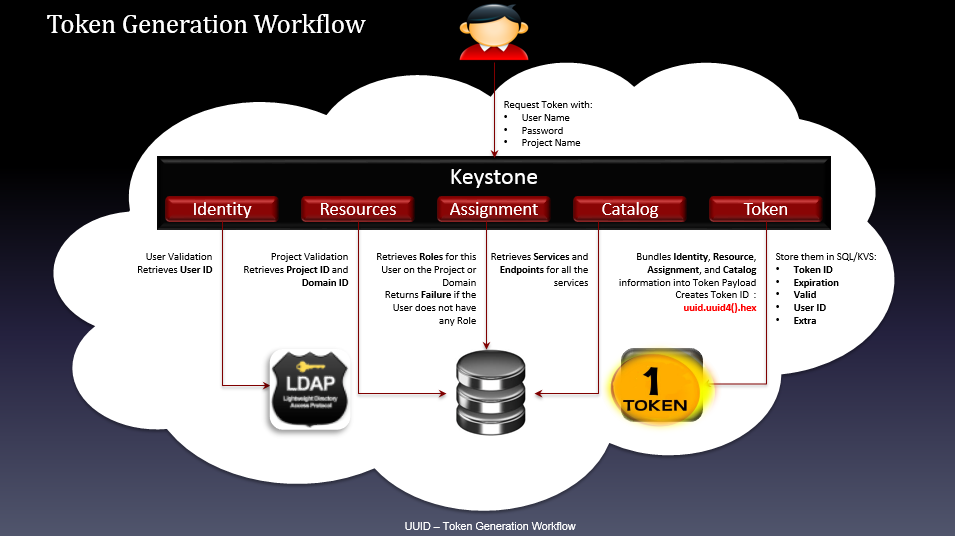
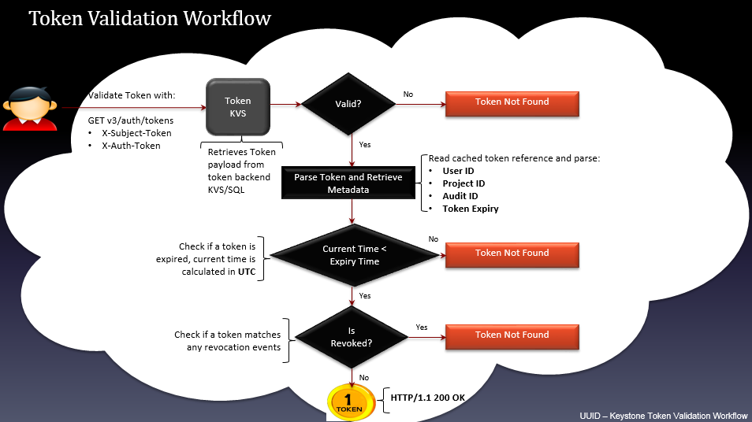
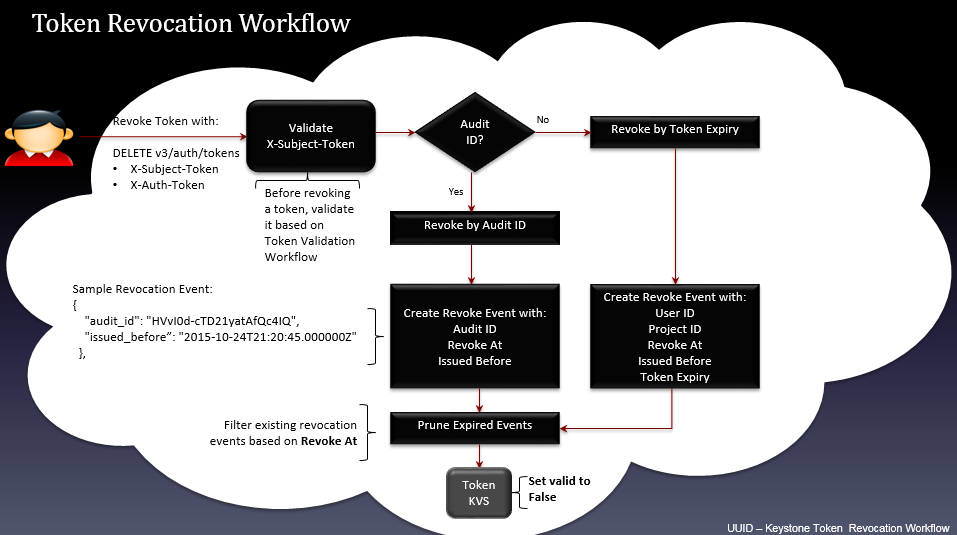
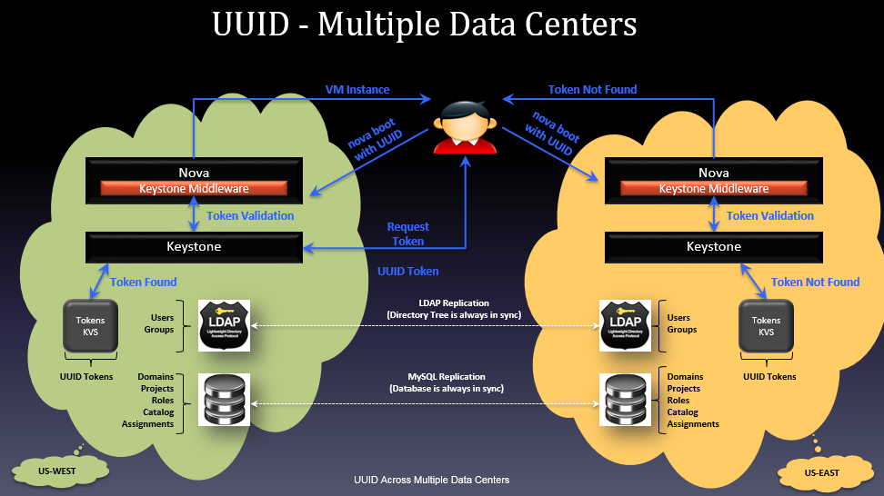

# Các loại token trong Keystone

## I. UUID

### 1. Khái niệm

**UUID (Universally Unique Identifier)** là một định danh duy nhất toàn cầu, được sử dụng để xác định các đối tượng trong hệ thống. Trong Keystone, UUID được sử dụng làm token để xác thực và ủy quyền người dùng truy cập vào các dịch vụ OpenStack.

- **UUID** được tạo ngẫu nhiên với định dạng 32 ký tự hex, hiển trị trong 5 nhóm được phân cách bằng dấu gạch ngang với dạng `8-4-4-4-12`.
- Có tổng cộng 36 ký tự, trong đó 32 ký tự chữ với 4 dấu gạch ngang.
- **UUID** có 5 phiên bản, trong đó keystone sử dụng UUIDv4.

> Ví dụ: `550e8400-e29b-41d4-a716-446655440000`

**Đặc điểm UUID:**

| Thuộc tính | Giá trị |
|-------------|---------|
| Kiểu dữ liệu | Chuỗi UUID |
| Lưu trữ | Cần lưu trong **SQL database** của Keystone |
| Truy xuất | Keystone phải truy vấn DB để xác minh chuỗi token |
| Cấp phát | Sinh ngẫu nhiên khi xác thực thành công |
| Sử dụng | Được sử dụng trong header `X-Auth-Token` khi gọi API |

### 2. Ưu điểm và nhược điểm

**Ưu điểm:**

- Đơn giản: Dễ tạo, dễ hiểu, dễ triển khai.
- Phổ biến: Các hệ thống khác cũng dùng UUID cho session/token.
- Tương thích: Được hỗ trợ bởi mọi thành phần trong OpenStack.

**Nhược điểm:**

- Phụ thuộc DB: Mỗi lần dịch vụ xác minh token -> keystone phải truy vấn DB.
- Tăng tải DB: Với nhiều user/service -> DB trở thành điểm nghẽn.
- Không mở rộng tốt (not scalable): Không phù hợp với hệ thống lớn hoặc phân tán.
- Cần đồng bộ DB nếu keystone được triển khai đa node: Gây khó khăn trong High Availability – Độ sẵn sàng cao

### 3. UUID workflow

**Token Generation Workflow (Quá trình tạo token):**

1. **User request:**
    - Người dùng gửi yêu cầu token với: **Username**, **Password**, **Project name**.
    - Keystone sẽ xử lý lần lượt qua các module nội bộ như: `Identity` → `Resources` → `Assignment` → `Catalog` → `Token`.
2. **Identity:** Xác thực danh tính người dùng:
    - Keystone kiểm tra username/password qua backend (SQL hoặc LDAP).
    - Nếu hợp lệ → Truy xuất `User ID`.
    > LDAP/SQL Backend: là nơi chứa dữ liệu user.
3. **Resources:** Lấy thông tin về project(tenant)
    - Thực hiện **Project Validation** (Xác thực project) để lấy **Project ID** và **Domain ID**.
    - Kiểm tra xem user có quyền trên project/domain không.
4. **Assignment:** Kiểm tra phân quyền (role)
    - Lấy danh sách **Roles** (vai trò) của user trên project/domain.
    - Nếu user không có quyền, trả về lỗi (Return failure on the Domain).
    > Đây là phần xử lý Access Management (RBAC).
5. **Lấy danh sách dịch vụ (Catalog):**
    - Truy xuất danh sách các service mà user được phép sử dụng (Nova, Glance, Neutron…).
    - Lấy thông tin các endpoints cho từng dịch vụ.
    > Dùng để client biết nên gọi API ở đâu.
6. **Token:** Tạo và lưu token
    - Tổng hợp thông tin:
      - **Identity** (User ID)
      - **Resource** (Project ID, Domain ID)
      - **Assignment** (Role)
      - **Catalog** (Danh sách dịch vụ và endpoints)
    - Tạo **Token ID** dưới dạng UUID: `uuid[uuid4].hex` (ví dụ: `a85b352203d04209b66a812e3f1f6d6e`).
    - Token được lưu trong SQL hoặc key-value store với:
      - **Token ID**
      - **Expiration**
      - **User ID**
      - **Valid = true/false**
      - **Extra** (payload)

**Token Validation Workflow (Quá trình xác thực token):**

**Token Revocation Workflow (Quá trình thu hồi token):**

**Multiple Data Centers Workflow (Quá trình làm việc với nhiều trung tâm dữ liệu):**

## II. PKI token

## III. Ferret token
