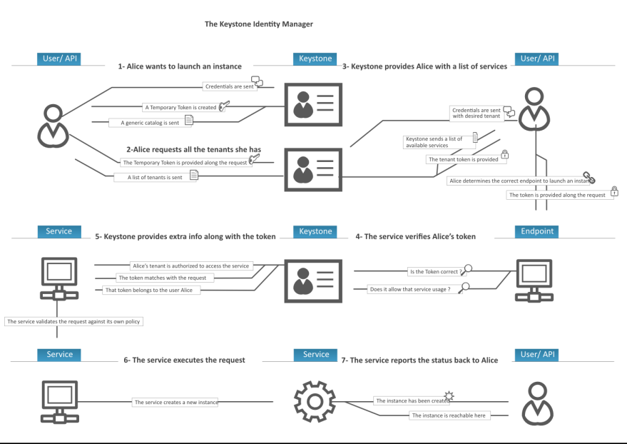

# Keystone workflow

##

### 1. User muốn khởi tạo server

- User gửi credential (username/password) đến Keystone.
- Keystone tạo một temporary token (unscoped token).
- Gửi lại service catalog tạm thời.

**User** gửi tới **Keystone**:

- Credential (`username`, `password`)
- `domain` (thường là `Default`)
- (Không gửi `project` → nên đây là **unscoped authentication**)

**Keystone** trả về:

- Temporary token (unscoped token)
- Danh sách services (catalog) chung (nếu bật return_all_endpoints = true trong keystone.conf)

>Mặc định thì Keystone không trả catalog đầy đủ cho unscoped token. Nhưng một số triển khai có thể cấu hình để gửi "generic catalog" tạm thời.

### 2. User yêu cầu các tenants (projects) mà họ có quyền

- User gửi token tạm thời và yêu cầu danh sách các project mà họ thuộc về.
- Keystone trả về danh sách projects (tenants).
- User chọn một project cụ thể để thực hiện hành động.

### 3. Keystone cấp token có phạm vi (scoped token)

- User gửi lại credentials + project đã chọn.
- Keystone cấp project-scoped token và gửi service catalog đầy đủ theo scope.
- User xác định đúng endpoint để gọi dịch vụ (Nova, Glance,...).

### 4. User gửi yêu cầu tạo server + token

- User gửi token scoped + yêu cầu tạo server đến endpoint Nova.
- Nova cần kiểm tra lại token.

### 5. Dịch vụ (Nova) xác thực token

- Nova hỏi Keystone:
  - Token có hợp lệ không?
  - Token có thuộc về User này?
  - User này có quyền trên project này không?
- Nếu dùng Fernet token, Nova có thể tự giải mãi token mà không cần hỏi Keystone (không có database lookup, chỉ cần key).

### 6. Dịch vụ xác thực quyền và thực thi

- Dịch vụ kiểm tra chính sách trong file `policy.yaml` của mình.
- Nếu User có role phù hợp (VD: `member`, `admin`) → hành động được cho phép.
- Thực hiện tạo server.

### 7. Dịch vụ báo lại kết quả cho User

- Server đã được tạo thành công.
- Gửi lại trạng thái + thông tin server để user tiếp tục sử dụng.
